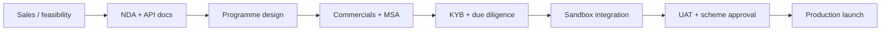

# B2B Card Issuer Stacks — Investigation

Status: `active`  
**Last updated:** 2026-06-16  
**Goal:** Compare B2B card issuing infrastructure providers — processes, pricing signals, setup, and technical fit for ChopDot Spend Cards / group capture.  
**Related:** [web3-payment-cards-non-kyc-investigation.md](./web3-payment-cards-non-kyc-investigation.md), [spend-card-model-decision-memo.md](./spend-card-model-decision-memo.md), [capture-layer-implementation-investigation.md](./capture-layer-implementation-investigation.md)

---

## Executive summary

| Finding | Implication for ChopDot |
| --- | --- |
| **No public “plug and play” pricing** for serious programmes | Budget for sales cycles + custom commercials, not a line item from a pricing page |
| **Crypto-native B2B stacks exist** (Rain, Gnosis Pay B2B, Baanx/Monavate, Bridge+Stripe) | Model B/C card paths are partner-led, not build-it-yourself |
| **Traditional issuers** (Marqeta, Lithic, Stripe Issuing, Highnote, Episode Six) work but are **not group-split-native** | You still own ledger + chapter semantics; card is spend rail only |
| **KYC is always in the chain** for Visa/Mastercard | “Non-KYC” is not a B2B option; partner handles user KYC |
| **Typical launch:** ~2–8 weeks (aggressive) to 3–6+ months (enterprise) | P1+P2 “strong launch” should assume **parallel** chapter capture + issuer sales track |

**ChopDot-relevant split:**

| Track | What you integrate | When |
| --- | --- | --- |
| **Capture (P1)** | Chapter engine + pay links — no issuer | Now |
| **L2 webhook rail** | Firma / payment partner events → `markLegPaid` | P1 fast follow |
| **Wallet launcher (P2)** | PassKit / Google Wallet → `/spend` — not issuer | P2 lite |
| **Real card programme (P3)** | One B2B issuer from matrix below | Only after Model A metrics + explicit decision |

---

## Landscape map

```text
                    ┌─────────────────────────────────────────┐
                    │         Your product (ChopDot)           │
                    │  chapterEngine · SpendSession · links    │
                    └────────────────────┬────────────────────┘
                                         │
         ┌───────────────────────────────┼───────────────────────────────┐
         │                               │                               │
         ▼                               ▼                               ▼
  Crypto-native B2B              Hybrid (stablecoin +              Traditional BaaS
  (Rain, Gnosis Pay,               Stripe Issuing)                  (Marqeta, Lithic,
   Baanx/Monavate,                 Bridge + Stripe                   Highnote, E6)
   Bridge+Stripe)                                                      │
         │                               │                               │
         └───────────────────────────────┴───────────────────────────────┘
                                         │
                                         ▼
                         Visa / Mastercard + licensed issuer bank
                                         │
                                         ▼
                              KYC/AML + programme compliance
```

### Provider categories

| Category | Examples | Best for |
| --- | --- | --- |
| **Crypto-native issuer infra** | Rain, Gnosis Pay (B2B), Baanx + Monavate | Stablecoin/self-custody spend, web3 brands |
| **Stablecoin + Stripe bundle** | Bridge + Stripe Issuing | Crypto-native teams wanting Stripe card ops |
| **Programme manager / processor** | Marqeta (Managed), Stripe Issuing (managed) | Fintechs wanting compliance bundled |
| **Processor-only / BYO bank** | Marqeta (Powered), Lithic, Highnote | Teams with own BIN sponsor / licence path |
| **Enterprise issuer processor** | Episode Six | Banks, large fintechs, multi-product ledgers |

---

## Universal setup process (all providers)

Almost every B2B card programme follows this sequence:



| Phase | Typical duration | Your deliverables |
| --- | --- | --- |
| Sales + scoping | 2–6 weeks | Use case, geo, card type, custody model, volume forecast |
| Legal + KYB | 4–12 weeks | Corporate docs, AML programme, business plan |
| Technical integration | 4–12 weeks | Webhooks, auth gateway (if JIT), cardholder UX, ledger |
| Scheme / bank approval | 2–8 weeks | Card art, disclosures, fee schedules |
| **Total (optimistic)** | **~6–10 weeks** | Rain claims some programmes <2 weeks with resourcing |
| **Total (enterprise)** | **3–9 months** | Marqeta / E6 / large bank paths |

### Technical minimums (common across stacks)

| Component | Purpose |
| --- | --- |
| **Webhook endpoint** | Auth notifications, clears, disputes — respond in &lt;3–5s for JIT |
| **Cardholder onboarding** | KYC UI or embedded partner flow (Sumsub, etc.) |
| **Ledger / balance** | Who owns float: you, partner, or JIT from user wallet |
| **Spend controls** | MCC blocks, limits, per-transaction metadata |
| **Dispute ops** | Chargeback handling — often shared with programme manager |
| **PCI scope** | Minimise PAN exposure; use tokenised card display APIs |

---

## Provider deep dives

### 1. Rain — crypto-native enterprise issuer

| | |
| --- | --- |
| **Website** | [rain.xyz](https://www.rain.xyz/) |
| **Model** | B2B stablecoin card issuing + virtual accounts; **Visa Principal Member** |
| **Custody** | Partner-managed or self-custody paths; stablecoin settlement |
| **KYC** | Built-in KYC/KYB/AML in platform |
| **Docs** | After NDA / sales engagement |

**How it works**

- Single API for cards, balances, controls, webhooks.
- Positions on **daily stablecoin settlement** with Visa vs multi-day fiat settlement.
- Supports **programmatic single-use virtual cards** (agent use cases).
- Programme types include **Rain-Managed** vs **Partner-Managed** (you own ledger/auth flow).

**Setup process** ([step guide](https://www.rain.xyz/resources/launch-a-card-program-with-rain))

1. Intro call — use case, geos, card type.  
2. Economics — **3 pricing tiers** (interchange share vs platform fees vs commitment).  
3. NDA → API docs.  
4. Contracting (scope, compliance split).  
5. Integration + launch (claims **~6 weeks** typical; some &lt;2 weeks).

**Pricing signals**

- **No public price list** — custom tiers.
- Higher tier = more interchange share, higher minimums / longer contract.
- Third-party summaries mention enterprise-only, custom pricing.

**Tech considerations**

- Strong if ChopDot later wants **global stablecoin card** without stitching regional issuers.
- Heavy enterprise sales motion — likely overkill for early P1 capture-only.
- Map `legId` / `chapterId` in auth metadata if partner supports custom fields on auth webhooks (validate in diligence).

**ChopDot fit:** **P3 / Model B** candidate if you commit to custodial/stablecoin card balance. Not needed for P1 chapter capture.

---

### 2. Gnosis Pay — white-label stablecoin Visa (B2B)

| | |
| --- | --- |
| **Website** | [gnosis.io/pay](https://www.gnosis.io/pay) |
| **Model** | White-label card + ramps; **self-custodial Safe** accounts |
| **Custody** | User-controlled via Safe smart accounts |
| **KYC** | Integrated **Sumsub**; can use your existing flow in enterprise tier |
| **Docs** | [docs.gnosispay.com](https://docs.gnosispay.com/) |

**How it works**

- Card spend pulls stablecoins from user Safe at transaction time.
- One API for signup, account, card order (`POST` auth → account → order/create).
- Fiat ramps: SEPA, Pix, multi-corridor via partner network.
- **MiCA / PSD2** positioning for EU.

**Published pricing tiers** (from marketing site, June 2026)

| Tier | Positioning | Notes |
| --- | --- | --- |
| **Pilot** | No entry barrier; launch ~14 days | Gnosis Pay branded cards; rev share |
| **Startup** | Custom pricing; up to 3 markets | White-label cards; 2yr+ agreements |
| **Enterprise** | Custom; 3+ markets | Dedicated BIN, premium cards, 3yr agreement |

**Setup process**

1. Book demo / signup via webapp or sales.  
2. Choose tier + markets.  
3. API integration (3-call card create path advertised).  
4. KYC via Sumsub iframe / API status polling (`kycStatus` on user endpoint).  
5. Go-live per market approvals.

**Tech considerations**

- Best **self-custody** story in EU/UK for web3 audiences.
- ChopDot would still own **group split state** in `chapterEngine`; Gnosis handles card auth/settlement.
- Requires users on **Safe** stack — friction for non-crypto-native dinner groups.
- Phone validation and other gates after KYC approval (per docs).

**ChopDot fit:** **P3 Model C** (delegated self-custody) or EU crypto-native wedge. Weak fit for mainstream CH Twint-first users unless bundled as optional rail.

---

### 3. Baanx + Monavate — web3 card programme stack

| | |
| --- | --- |
| **Baanx** | [baanx.com](https://www.baanx.com/) — API, wallet+card orchestration |
| **Monavate** | [monavate.com](https://www.monavate.com/) — issuer processing, BIN sponsorship, principal membership |
| **Relationship** | Baanx powers **MetaMask Card**, **1inch Card**, **Ledger CL**; Monavate is issuing/processing partner (UK/EU regulated EMI) |

**How it works (Baanx API)**

- Multi-tenant gateway: crypto wallets ↔ card payments.
- **OAuth 2.0** (API mode or hosted UI) + **custodial or non-custodial** wallets.
- Non-custodial: **blockchain delegation** (EVM/Solana) so spend authority exists without custody transfer.
- Card ops: virtual/physical issue, freeze, PIN, transaction history.

**Documented commercial model** (Seedrs / historical disclosure — verify live)

- One-time **setup fee**
- **Monthly minimum guarantee** by cards/accounts/volume
- Per-card / per-account fees
- Revenue share on load/spend (details in contract)

**Setup process** ([Baanx docs](https://docs.baanx.com/guides/introduction))

1. Contact account manager → `x-client-key` + `x-secret-key` (sandbox + prod).  
2. Choose OAuth mode + wallet model.  
3. Implement consent management (GDPR).  
4. User verification (`VERIFIED` status required before card order).  
5. Card order via API; poll status.  
6. **Go-live meeting** with account manager for production keys.

**Timeline signals**

- Baanx marketing: **~3 weeks** from signed contract to white-label mobile banking (historical).
- Implementation guides cite **~2–6 hours** for specific integration paths (developer setup only, not compliance).

**Tech considerations**

- Mature **web3 consumer card** path (proven with MetaMask).
- **MonavateOne** adds real-time on-chain spend (USDC at POS without preload — Canada/EU expansion).
- ChopDot would integrate Baanx for **card + wallet**; map spend events → `markLegPaid` via webhooks.
- Baanx corporate status: reported **acquired 2025** — confirm current contracting entity and roadmap in sales calls.

**ChopDot fit:** Strong **P3** partner if you want branded card + optional self-custody. High integration surface; not a substitute for P1 capture.

---

### 4. Bridge + Stripe Issuing — stablecoin cards via Stripe

| | |
| --- | --- |
| **Bridge** | [bridge.xyz](https://www.bridge.xyz/) — stablecoin infra, customer/KYC API |
| **Stripe** | [Stripe Issuing](https://stripe.com/issuing) + [stablecoin cards](https://docs.stripe.com/issuing/stablecoin-cards) |
| **Model** | Bridge customers + KYC; Stripe cards spending from `crypto_wallet` |

**How it works** ([Bridge docs](https://apidocs.bridge.xyz/platform/cards/overview/stripe-issuing))

- Create **Bridge Customer** (individual or business).
- Create **Stripe cardholder** (Bridge can manage this).
- Create card via **Stripe Issuing API** with `crypto_wallet` parameter:
  - `type`: `bridge_wallet` | `standard` (non-custodial e.g. Privy)
  - `chain`, `currency` (USDC etc.)
- Spend is **just-in-time** from wallet at authorisation.

**Setup process**

1. Stripe account + Bridge partnership onboarding.  
2. Bridge Customer API for end-user KYC.  
3. Stripe Issuing enablement (sales-led eligibility).  
4. Implement Stripe webhooks for auth/clearing.  
5. For non-custodial: smart-contract approvals per chain ([Stripe Bridge guide](https://docs.stripe.com/issuing/bridge-stablecoin-cards)).

**Pricing signals**

- **Stripe Issuing:** custom / interchange share; no public per-card list for production programmes.
- **Bridge:** enterprise pricing; stablecoin conversion and programme fees (contact sales).
- Stripe sandbox available without sales approval for dev.

**Tech considerations**

- Attractive if team already uses **Stripe** or wants best-in-class card ops + disputes.
- **Privy wallet** path documented — aligns with “neo-bank builder” stack from product research.
- ChopDot chapter state remains separate; link via metadata on Stripe authorisations if supported.
- Geo: expanding global consumer + commercial issuing (check CH/EU specifically in diligence).

**ChopDot fit:** **P3 Model B/C** when you want Stripe-grade ops + stablecoin/Privy wallets. Heavy stack for current non-custodial coordination thesis.

---

### 5. Marqeta — programme manager or processor

| | |
| --- | --- |
| **Website** | [marqeta.com](https://www.marqeta.com/) |
| **Models** | **Managed by Marqeta** (they handle bank, compliance, KYC) vs **Powered by Marqeta** (you bring compliance) |

**Setup process** ([programme guide](https://www.marqeta.com/docs/developer-guides/building-your-managed-card-program))

1. BD → pricing/feasibility → SOW.  
2. MSA + due diligence.  
3. Webhook endpoint + programme config APIs.  
4. Optional **JIT funding gateway** (&lt;3s auth response).  
5. Reserve funding + programme funding account at issuing bank.  
6. UAT → production.

**Pricing signals**

- Fully custom; SEC filings show periodic fee structures (redacted in public docs).
- Industry comparisons: **mid-four-figure monthly minimums** at scale for production programmes (third-party estimates — verify).

**Tech considerations**

- Gold standard for **virtual card controls** and JIT funding.
- Not crypto-native; you bring stablecoin conversion upstream if needed.
- Used by major consumer fintechs (e.g. Cash App historically).

**ChopDot fit:** Only if you pivot to full fintech card programme without crypto-native requirements. Long sales cycle.

---

### 6. Stripe Issuing (standalone, non-Bridge)

| | |
| --- | --- |
| **Docs** | [How Issuing works](https://docs.stripe.com/issuing/how-issuing-works) |
| **Models** | Full programme management vs modular issuer processing |

**Setup**

1. Contact Stripe sales for eligibility.  
2. Customize programme (network, product type).  
3. Fund Issuing balance.  
4. Create cardholders + cards via API.  
5. Set spend controls.

**Pricing**

- Custom packages; interchange revenue share possible.
- Third-party guides cite virtual card creation, active card, and transaction-based economics.
- **No setup/monthly** on standard Stripe pricing page for Issuing specifically — still sales-led for programmes.

**ChopDot fit:** Same as Bridge path but without stablecoin native layer unless you add Bridge or treasury stablecoin accounts.

---

### 7. Lithic — developer-first issuer processor

| | |
| --- | --- |
| **Website** | [lithic.com](https://lithic.com/) |
| **Model** | API-first; BYO compliance / sponsor in production |

**Pricing signals** (from public research / Contrary report — verify)

| Tier | Signal |
| --- | --- |
| **Starter** | ~$0.10/virtual card; interchange rebate ~0.2% first $100k/mo, 0.4% above |
| **Enterprise** | Custom; physical + tokenized cards |
| **Sandbox** | Free self-serve |

Third-party comparison: ~**$500/mo** platform at low scale vs higher tiers for enterprise.

**Setup**

- Sandbox: self-serve.  
- Production: signed agreement + sponsor bank relationship.

**ChopDot fit:** Good **traditional** processor if you outgrow crypto-native partners but want API ergonomics. You own compliance burden unless using managed partners.

---

### 8. Episode Six — enterprise issuer processing + ledger

| | |
| --- | --- |
| **Website** | [episodesix.com](https://episodesix.com/) |
| **Model** | Cloud-native issuer processor + ledger; API-first |

**How it works**

- Full ledger + card issuing for banks and large fintechs.
- Debit, credit, prepaid, commercial, virtual — highly configurable.
- Used behind programmes (Rain partnership announced 2025 for APAC configurability).

**Pricing / setup**

- Enterprise sales only; no public pricing.
- Timelines measured in **months** for bank-grade deployments.

**ChopDot fit:** **Poor near-term fit** — overpowered unless ChopDot becomes a licensed programme manager. Relevant only at very large scale or bank partnership.

---

### 9. Highnote — embedded finance (issuing + acquiring)

| | |
| --- | --- |
| **Website** | [highnote.com](https://highnote.com/) |
| **API** | GraphQL-first; real-time ledger |
| **Docs** | [docs.highnote.com](https://docs.highnote.com/) |

**Setup**

- Sales-led; test environment for fee schedules.
- Partner bank must approve fees and cardholder agreements before live.

**Pricing**

- No public list; fee schedules configured per card product.
- Platform can charge cardholder fees (ATM, FX, etc.) with approval.

**ChopDot fit:** Alternative to Marqeta/Stripe for US-heavy embedded finance; not crypto-native.

---

## Comparison matrix (ChopDot-oriented)

| Provider | Crypto-native | Self-custody | Public pricing | Typical launch | Compliance bundle | EU/CH focus | Best ChopDot phase |
| --- | --- | --- | --- | --- | --- | --- | --- |
| **Rain** | ✅ Strong | Optional | ❌ Custom tiers | ~6 wk claim | ✅ High | Global (verify CH) | P3 Model B |
| **Gnosis Pay B2B** | ✅ Strong | ✅ Safe | ⚠️ Pilot free; paid custom | ~14 d pilot claim | ✅ High | ✅ EU/UK | P3 Model C |
| **Baanx + Monavate** | ✅ Strong | ✅ Both | ❌ Setup + MMG | ~3–8 wk | ✅ High | ✅ UK/EU | P3 B/C |
| **Bridge + Stripe** | ✅ Strong | ✅ Privy/Bridge | ❌ Custom | Weeks–months | ✅ High | Expanding | P3 B/C |
| **Stripe Issuing** | ⚠️ Via Bridge/treasury | ⚠️ | ❌ Custom | Weeks–months | ✅ High | US/EU varies | P3 B |
| **Marqeta** | ❌ | ❌ | ❌ Custom | Months | ✅ Managed option | Global | P3 if non-crypto |
| **Lithic** | ❌ | ❌ | ⚠️ Starter signals | Sandbox fast | ⚠️ BYO | US-first | P3 alternative |
| **Episode Six** | ❌ | ❌ | ❌ | Months | ⚠️ Partner-dependent | Global | Unlikely near-term |
| **Highnote** | ❌ | ❌ | ❌ | Months | ✅ | US-first | Unlikely near-term |

**MMG** = monthly minimum guarantee (common in Baanx-style contracts).

---

## Pricing patterns (what to expect in contracts)

| Fee type | Who charges it | Typical range |
| --- | --- | --- |
| **Setup / implementation** | Baanx-style, enterprise issuers | One-time; often five figures USD |
| **Monthly minimum / platform** | Most B2B programmes | Low thousands+/month at scale |
| **Per virtual card** | Lithic starter signal | ~$0.10/card (volume discounts) |
| **Per transaction** | Processors | Few cents + network pass-through |
| **Interchange share** | Programme manager models | Custom % of interchange — primary revenue lever |
| **FX / ATM** | Card programmes | Passed to cardholder or absorbed |
| **KYC per user** | Often bundled or per-check | Sumsub-style costs inside programme |

**ChopDot economics warning:** Group dinner splits are **low interchange, high coordination value**. Do not assume card interchange funds the product — capture/chapter UX is the wedge; card is optional acceleration.

---

## Technical integration checklist (any issuer)

When evaluating any provider, confirm:

| # | Question | Why it matters for ChopDot |
| --- | --- | --- |
| 1 | Can auth webhooks include **custom metadata** (`chapterId`, `legId`, `spendSessionId`)? | Auto `markLegPaid` without user tap |
| 2 | **JIT vs prefunded** programme? | Who holds float; self-custody compatibility |
| 3 | **Single-use virtual cards** per leg? | Rain advertises this — interesting for per-share pay |
| 4 | **Apple Pay / Google Pay** tokenization | P2 wallet story |
| 5 | **Dispute/chargeback** split of responsibility | Ops headcount |
| 6 | **Geo list** for cardholders (CH, EU, UK) | Market fit |
| 7 | **Sandbox fidelity** — auth/clear webhooks | E2E before contract |
| 8 | Can you stay **non-custodial** at app layer while partner custodies card float? | Safety boundaries |
| 9 | **PCI** — card detail display via iframe/token | Security scope |
| 10 | **Rate limits + SLA** on auth path | Pay-moment latency |

---

## How this connects to ChopDot Spend Cards

```text
P1 (now)                P2 lite                  P3 (issuer path)
─────────               ─────────                ───────────────
SpendCardConfig         Wallet PASS              Partner card programme
SpendSession            → /spend?t=              + optional preload
chapterEngine           same chapterEngine       chapterEngine + issuer webhooks
Twint/bank handoff      shortcuts/widgets        JIT or custodial spend
manual confirm          L2 webhook               auto-claim + confirm
```

**Do not block P1 on issuer selection.** Run issuer diligence **in parallel** if P3 is on the roadmap.

### Suggested partner shortlist for first calls (CH/EU + web3)

| Priority | Partner | Reason |
| --- | --- | --- |
| 1 | **Gnosis Pay** | EU/self-custody; published B2B tiers; API docs public |
| 2 | **Baanx / Monavate** | Proven MetaMask/1inch; delegation model |
| 3 | **Rain** | If global stablecoin + principal issuer scale needed |
| 4 | **Bridge + Stripe** | If Privy/stablecoin + Stripe ops is the target stack |

Defer Marqeta / E6 / Highnote unless pivoting away from crypto-native positioning.

---

## Operator decision checklist (before signing any issuer)

- [ ] Model A capture metrics hit gates ([decision memo](./spend-card-model-decision-memo.md))  
- [ ] Legal/compliance owner assigned  
- [ ] Target geo confirmed (CH + which EU markets)  
- [ ] Custody stance documented (non-custodial app vs partner custodial card)  
- [ ] KYB pack ready for programme manager  
- [ ] Webhook + `legId` metadata strategy prototyped  
- [ ] Unit economics model (interchange vs subscription vs none)  
- [ ] 12-month volume forecast for commercial negotiation  
- [ ] Exit clause / programme wind-down plan  

---

## Open items for next research pass

1. **Switzerland-specific** card programme feasibility per provider (not all publish CH support).  
2. **Firma** as L2 webhook partner vs full card issuer — separate diligence track.  
3. **Privy** wallet integration cost/complexity with Bridge+Stripe path.  
4. Live **commercial quotes** from 2 shortlisted partners (requires sales calls).  
5. Confirm post-acquisition **Baanx** contracting entity and Monavate relationship.

---

## Changelog

| Date | Change |
| --- | --- |
| 2026-06-16 | Initial B2B issuer stack investigation: 9 providers, matrix, setup playbook, ChopDot fit |
