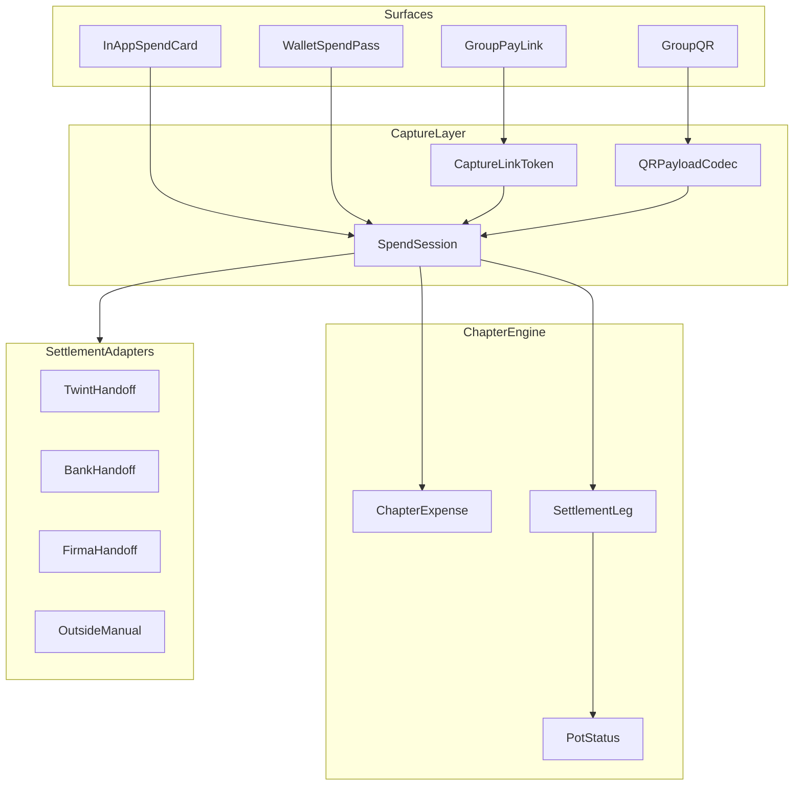
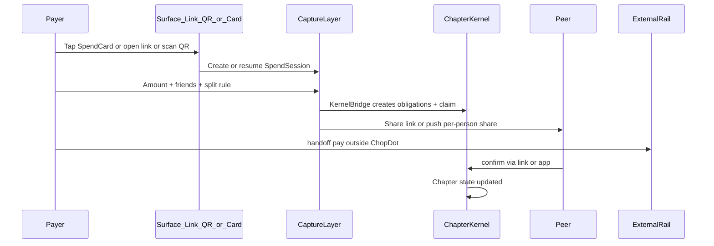

# Capture Layer — Technical Architecture

Status: `active`  
**Last updated:** 2026-06-16  
**Scope:** Spend Cards, group pay links, QR capture — architecture spec only (no implementation in this packet)  
**Strategy context:** [product-evolution-history.md](./product-evolution-history.md)  
**Product specs:** [spend-cards-spec.md](./spend-cards-spec.md), [group-pay-links-qr-spec.md](./group-pay-links-qr-spec.md)  
**Method investigation:** [capture-methods-investigation.md](./capture-methods-investigation.md)  
**Implementation investigation:** [capture-layer-implementation-investigation.md](./capture-layer-implementation-investigation.md) — repo ground truth, schema, phased plan

**Last updated:** 2026-06-16 (pay-moment law revision)

---

## Primary product law — Pay moment + 1 step

People already pay. They already reach for phone, wallet, or card. ChopDot must meet them **at that moment** with **at most one extra step**.

That one step is only worth it if it saves enough work later (no Splitwise after dinner, no WhatsApp math, no chasing confirmations).

```text
Normal pay flow:     unlock → wallet → pick card → pay          (N steps)
ChopDot promise:     same flow + ≤1 ChopDot step                 (N or N+1)
Anti-pattern:        open app → pot → expense → people → split → pay  (N+many)
```

**Hero path:** split + **payment-linked handoff** in one motion (Wallet pass tap, pay link, or QR → prefilled rail).  
**Fallback only:** intent registered without bound pay (cash, already paid) — not the marketed flow.

**Positioning:**

> Pay like you always do — one tap first so the split is already done.

---

## Purpose

Define how ChopDot captures group money events **at the pay moment** (bound to payment handoff or rail event) and maps them into the existing **chapter kernel** without holding funds.

The Capture Layer sits **above** settlement rails (Twint, bank, Firma, cash, crypto) and **below** product UX surfaces (in-app cards, wallet passes, links, QR).

---

## North star (product)

> **Pay moment + one step:** meet users when they reach for their card; one extra tap so the group split is done and they skip reconciliation later.

Competitive benchmarks (examples, not exhaustive): Twint/Swiss QR P2P, KAST payment links, [Firma](https://www.firma.cash/) instant pay, Splitwise post-hoc entry, Venmo P2P.

ChopDot does **not** try to replace national P2P networks or merchant acquirers. It owns **group chapter state** tied to the pay moment.

---

## Payment linkage levels

| Level | Description | Square one? | P1 role |
| --- | --- | --- | --- |
| **L0** | Intent only → pay anywhere → manual “I paid” | Yes | **Fallback** |
| **L1** | Split + **required** bound handoff (prefilled Twint/bank/Firma + session ref) | No (if handoff is the next step) | **Hero minimum** |
| **L2** | Pay through partner → webhook auto-`claimed` | No | **Hero target** |
| **L3** | Partner-issued wallet card with session metadata | No | P2/P3 |

P1 must ship **L1** on the happy path; pursue **L2** as fast follow. Do not ship L0 as the primary UX.

---

## Layer model

```text
┌─────────────────────────────────────────────────────────────┐
│  Surfaces: In-app Spend Card · Wallet Pass · Link · QR       │
├─────────────────────────────────────────────────────────────┤
│  Capture Layer: SpendSession · CaptureLinkToken · QR codec   │
├─────────────────────────────────────────────────────────────┤
│  Chapter Kernel: expenses + legs (open → claimed → confirmed)  │
│  (src/chapter/chapterEngine.ts — **Option B SSOT**)            │
│  Dot kernel (src/chopdot-dot/commitmentKernel.ts) — dot modes  │
├─────────────────────────────────────────────────────────────┤
│  Settlement Adapters: twint · bank · firma · cash · dot · …  │
│  (L1 handoff required on hero path; L2 webhook when available) │
├─────────────────────────────────────────────────────────────┤
│  Optional proof edge: Polkadot closeout / receipt anchor       │
│  (Track 2 — polkadot-native-cursor-handoff.md)               │
└─────────────────────────────────────────────────────────────┘
```



---

## Core entities

### SpendCard

**Technical walkthrough:** [implementation investigation § Spend Cards — technical mechanics](./capture-layer-implementation-investigation.md#spend-cards--technical-mechanics)

Chapter-scoped spend context visible to the user as a “card” (in-app or wallet pass).

| Field | Type | Notes |
| --- | --- | --- |
| `id` | string | Stable id |
| `chapterId` | string | Links to pot / `DotChapter` |
| `label` | string | e.g. `Friday Crew`, `Barcelona Trip` |
| `appearance` | object | colour, icon (UI only) |
| `defaultSplitRule` | enum | `equal`, `payer_pays_all`, `custom`, `shares` |
| `recentParticipantIds` | string[] | Last N people for quick pick |
| `settlementPreference` | enum | `outside`, `twint`, `bank`, `firma`, `dot`, … |
| `walletPassExternalId` | string? | PassKit / Google Wallet pass id if provisioned |
| `createdAt` / `lastUsedAt` | ISO datetime | For sorting and analytics |

**Not a bank card.** No PAN, no balance, no issuer id on ChopDot.

### SpendSession

Single capture event: payer + amount + participants + split → kernel obligations.

| Field | Type | Notes |
| --- | --- | --- |
| `id` | string | UUID |
| `spendCardId` | string? | Optional if created from generic chapter entry |
| `chapterId` | string | Required |
| `payerParticipantId` | string | Who is paying now |
| `participantIds` | string[] | Who shares the expense |
| `amount` | number | Total spend |
| `currency` | string | ISO 4217 |
| `splitRule` | object | Rule + per-person amounts |
| `status` | enum | See lifecycle below |
| `settlementRail` | enum | Intended rail for handoff |
| `note` | string? | e.g. `Dinner at Mesa` |
| `captureLinkTokenId` | string? | If opened via link/QR |
| `externalRef` | string? | Partner tx id when matched (v1+) |
| `expiresAt` | ISO datetime | Short TTL for open sessions |

**Status lifecycle:**

```text
draft → ready → obligations_created → handoff_started → claimed → partially_confirmed → fully_confirmed → expired | cancelled
```

- `obligations_created`: KernelBridge wrote obligations + payer claim  
- `claimed`: Payer marked paid or rail webhook matched  
- Confirmation is per-obligation in kernel, not only session-level  

### CaptureLinkToken

Signed, often short-lived token encoding deep-link intent.

| Field | Type | Notes |
| --- | --- | --- |
| `token` | string | Opaque id (lookup key) |
| `type` | enum | `join`, `spend`, `commit`, `confirm`, `pay` |
| `payload` | JSON | Type-specific (see group-pay-links-qr-spec.md) |
| `signature` | string | HMAC or JWT |
| `singleUse` | boolean | true for spend/pay/confirm |
| `expiresAt` | ISO datetime | |
| `createdByParticipantId` | string? | Revocation scope |

Store server-side (Supabase or API). QR encodes URL with token, not raw PII.

---

## Logical services (future `src/services/capture/`)

| Service | Responsibility |
| --- | --- |
| **SpendCardService** | CRUD spend cards per chapter; recent participants |
| **SpendSessionService** | Create/update sessions; expiry job; idempotency keys |
| **CaptureLinkService** | Mint, verify, consume tokens; rate limits |
| **QRPayloadCodec** | `encode(url)`, `decode(qrText)` — versioned |
| **KernelBridge** | `commitSpendSession` → `chapterEngine.addExpense` + `refreshLegs` |
| **SettlementAdapterRegistry** | Pluggable rails: `handoff()`, `matchWebhook()` |
| **DeliveryAdapter** | Share link text via [`deliverText`](../../../src/utils/delivery.ts) |

### KernelBridge (critical)

Maps `SpendSession` → [`chapterEngine.ts`](../../../src/chapter/chapterEngine.ts) ( **Option B — decided**; see [implementation investigation](./capture-layer-implementation-investigation.md#decision--option-b-chapter-engine-kernel)):

| Action | Kernel call |
| --- | --- |
| Commit capture | `addExpense` + `refreshLegs` |
| Payer paid (L0/L1) | `markLegPaid` |
| Receiver confirms | `confirmLeg` |
| Status / blockers | `buildPotStatus` |
| Close | `closeChapter` |

Dot-mode pots (`event_deposit`, `savings_circle`, etc.) may still use [`commitmentKernel.ts`](../../../src/chopdot-dot/commitmentKernel.ts) — **separate track**; do not dual-write capture legs to both kernels.

```text
payment claimed != receiver confirmed != closed
```

KernelBridge must **never** set `confirmed` without receiver action (unless explicit policy + rail proof in v1).

### SettlementAdapter interface (conceptual)

```typescript
interface SettlementAdapter {
  readonly railId: 'outside' | 'twint' | 'bank' | 'paypal' | 'firma' | 'dot' | 'usdc';
  handoff(input: {
    session: SpendSession;
    leg: { toParticipantId: string; amount: number; currency: string; reference: string };
  }): HandoffResult; // deep link, copy payload, or in-app panel
  matchWebhook?(event: unknown): MatchResult | null; // v1+
}
```

**v0 adapters:**

- `outside` — copy amount + reference; user pays manually  
- `twint` — [`TWINTForm`](../../../src/components/settlement/TWINTForm.tsx): phone + amount copy, SMS deep link (no Twint API)  
- `bank` / `paypal` — existing settle forms  
- `dot` / `usdc` — wallet flows from production app  

---

## Deep link and routing

### Existing routes (production)

| Route | Handler | Purpose |
| --- | --- | --- |
| `/join?token=` | [`useInviteFlow.ts`](../../../src/hooks/useInviteFlow.ts) | Member invite |
| `/import-pot?cid=` | [`useUrlSync.ts`](../../../src/hooks/useUrlSync.ts) | IPFS pot import (copy, not live sync) |
| `?chopdot-dot-native=1` | Chapter spike | Native session lab |

See [COMPONENT_CATALOG.md](../../../src/docs/COMPONENT_CATALOG.md) for screen map.

### Proposed Capture routes (implementation later)

| Route | Screen / action |
| --- | --- |
| `/spend?token=` | Open SpendSession (prefilled); App Clip entry |
| `/commit?token=` | Trip deposit / “I’m in” |
| `/confirm?token=` | Receiver one-tap confirm obligation |
| `/pay?token=` | Settlement handoff (leg prefilled) — lab P02 |

Extend [`nav.ts`](../../../src/nav.ts) + [`useUrlSync.ts`](../../../src/hooks/useUrlSync.ts) with token parsers; invalid/expired token → friendly error + chapter home.

---

## End-to-end flow (reference)



---

## Security and abuse

| Control | Rule |
| --- | --- |
| Token signing | HMAC-SHA256 or JWT with server secret; include `exp`, `type`, `chapterId` |
| TTL | `spend` / `pay` / `confirm`: 15–60 min default; `join`: longer |
| Single-use | Consume token on first successful action |
| Rate limit | Mint tokens per user/chapter/IP |
| QR payload | Prefer `https://app.chopdot.xyz/spend?t=…` not embedded names/phones |
| AuthZ | Confirm tokens only for `receiverId`; spend tokens for chapter members |
| Idempotency | `Idempotency-Key` on session commit |

Align with [safety-boundaries.md](./safety-boundaries.md): no custody, no auto-release.

---

## Persistence (recommended)

| Store | Contents |
| --- | --- |
| `spend_cards` | SpendCard rows per chapter |
| `spend_sessions` | Session state + kernel correlation ids |
| `capture_link_tokens` | Token metadata + consumed_at |
| Chapter kernel state | `ChapterDocument` in `pot.metadata.chapter` (Option B) |

Event log optional: `capture_events` for analytics (session_created, handoff_started, confirmed).

---

## Relationship to other tracks

| Track | Relationship |
| --- | --- |
| **Track 1 — Capture Layer** | This document; product wedge |
| **Track 2 — Polkadot native** | Optional receipt anchor at closeout; not required for capture v0 |
| **IPFS Share Pot** | Different job: read-only copy ([SHARING_VS_ADDING_MEMBERS.md](../product/SHARING_VS_ADDING_MEMBERS.md)) |
| **Group money loop lab** | P01/P02/P03 payout scenarios inform pay handoff |

---

## Implementation phases (reference)

| Phase | Deliverable |
| --- | --- |
| **P0** | Docs packet (this file + specs + investigation) |
| **P1** | In-app Spend Card + `/spend` `/pay` `/confirm` links + static QR |
| **P2** | Wallet pass launcher + App Clip + partner webhook adapter |
| **P3** | Partner-issued payment pass (optional; partner custody) |

See [capture-methods-investigation.md](./capture-methods-investigation.md) for method-level phasing.

---

## Success metrics (capture layer)

| Metric | Target (pilot) |
| --- | --- |
| Steps from pay decision → group updated | ≤ normal pay flow **+ 1** |
| % sessions on L1+ path (bound handoff or webhook) | ≥ 80% |
| Expenses captured within 5 min of payment | ≥ 80% |
| Receiver confirm within 24h without chase | ≥ 70% |
| Repeat use (same chapter, 2+ sessions/week) | TBD |

**Anti-metric:** do not optimise “obligations created” if payment was not linked (L0-only sessions).

---

## Changelog

| Date | Change |
| --- | --- |
| 2026-06-16 | Option B: KernelBridge targets chapterEngine, not commitmentKernel |
| 2026-06-16 | Pay-moment + 1-step product law; L0–L3 payment linkage; L1 hero minimum |
| 2026-06-16 | Initial architecture spec |
