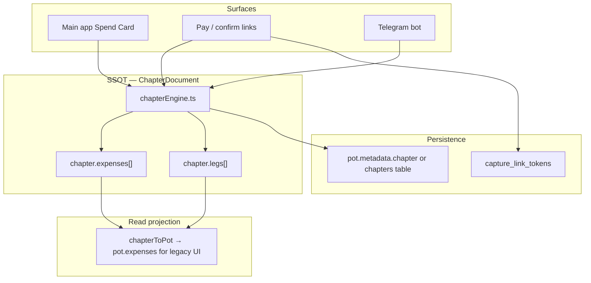
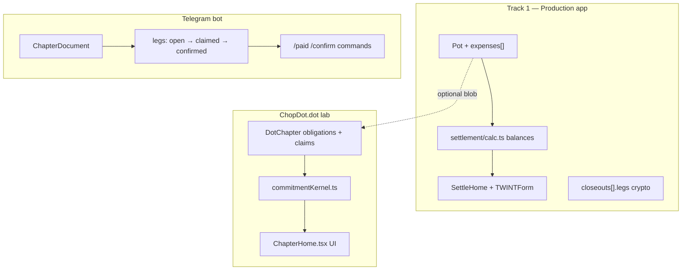
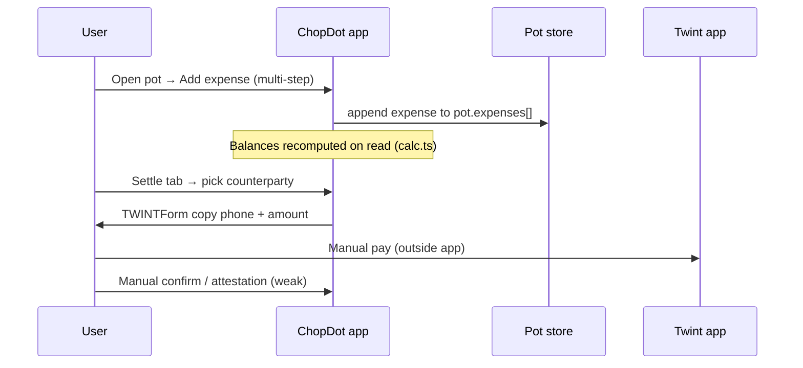
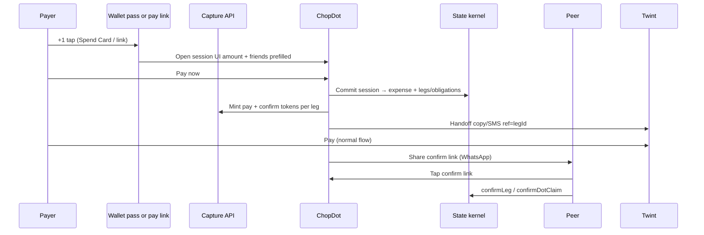

# Capture Layer — Implementation Investigation

Status: `active`  
**Last updated:** 2026-06-16 (Option B — chapter engine kernel **decided**)  
**Audience:** Product + engineering — “how would this actually work?”  
**Related:** [capture-layer-architecture.md](./capture-layer-architecture.md) (aspirational spec), [product-evolution-history.md](../product-evolution-history.md) (strategy)

---

## Executive summary — why this is hard to believe

The Capture Layer docs describe a coherent product story (**pay moment + 1 step**). The repo does **not** yet contain the machinery to deliver it. What exists today is **three separate money-state models** that are only partially connected.

| Question | Honest answer |
| --- | --- |
| Does Spend Card exist in code? | **No** — no `SpendCard`, `SpendSession`, or `CaptureLinkToken` types or tables |
| Can ChopDot detect Twint payment automatically? | **No** — no public Twint API; L1 = copy/SMS handoff only |
| Is there a `/spend` or `/pay` route? | **No** — only `/join?token=` (invites) and `?cid=` (IPFS import) are wired |
| What already does “split + pay + confirm”? | **Telegram bot** (`chapterEngine` + `markLegPaid` / `confirmLeg`) — not the main app |
| What does the main app do today? | Multi-step **Add Expense** → computed balances → **SettleHome** handoff — post-hoc, Splitwise-shaped |

**Believability verdict (today):** The wedge is **strategically sound** but **technically unproven**. It becomes believable by promoting the **chapter engine** (already proven in Telegram + lab) into the main app as the single capture kernel.

---

## Decision — Option B (chapter engine kernel)

**Status:** `decided` (2026-06-16)

Promote [`chapterEngine.ts`](../../../src/chapter/chapterEngine.ts) + [`ChapterDocument`](../../../src/chapter/types.ts) as the **canonical capture state machine** for Track 1. The main app, Spend Cards, pay links, and Telegram bot all read/write the same chapter document.

| Rejected for P1 | Why |
| --- | --- |
| **Option A** — ad-hoc `captureLegs` on pot | Duplicates leg semantics already in chapter engine |
| **Option C** — `dotChapter` / commitment kernel | Heavier model (obligations, approvals, releases); right for dot-mode pots, wrong default for dinner splits |

**What Option B gives you:**

- `addExpense` → `refreshLegs` → settlement legs with `open | claimed | confirmed`  
- `markLegPaid` / `confirmLeg` — **already implemented and tested**  
- `buildPotStatus` — next actor / blockers for UI  
- Telegram bot — **same kernel today** (`/paid`, `/confirm`)  
- `chapterToPot` — projection layer for legacy expense/settle screens during migration  



---

## 1. What exists in the repo (ground truth)

### 1.1 Three parallel state models



| Model | Primary files | Persistence | Pay/confirm loop |
| --- | --- | --- | --- |
| **Pot + Expense** | `schema/pot.ts`, `useBusinessActions.ts`, `SettleHome.tsx` | Supabase `pots` + `expenses` or `localStorage` | Balances computed on read; Twint = copy phone + amount; no per-leg state on fiat |
| **Chapter engine** | `chapter/types.ts`, `chapterEngine.ts`, `telegramBot.ts` | `.chopdot-bot-data/*.json` | **Full loop:** expense → legs → `markLegPaid` → `confirmLeg` |
| **DotChapter kernel** | `commitmentKernel.ts`, `ChapterHome.tsx` | `pot.dotChapter` JSON in pot metadata | Obligations → `claimDotContribution` → `confirmDotContributionClaim` |

**Root confusion:** Capture Layer architecture assumes a **KernelBridge** into `commitmentKernel.ts`, but the flow that already matches “pay + confirm” lives in **`chapterEngine.ts`** (Telegram). The main app never calls `markLegPaid` or `confirmLeg`.

### 1.2 Production data stores

| Store | What | Used for |
| --- | --- | --- |
| Supabase `pots` | Row + `metadata` JSON (members, expenses, closeouts, …) | Authenticated users |
| Supabase `expenses` | Normalised expense rows (migration 20260114) | Remote expense API |
| Supabase `invites` | `token`, `pot_id`, `expires_at` | **Only working deep-link tokens today** |
| `localStorage` | Full pot JSON | Guest / offline |
| `pot.dotChapter` | Unvalidated `z.any()` blob | Dot-mode pots only |

There are **no** `spend_cards`, `spend_sessions`, or `capture_link_tokens` tables.

### 1.3 What “join link” proves we can reuse

[`useInviteFlow.ts`](../../../src/hooks/useInviteFlow.ts) already:

1. Reads `?token=` or `?invite=` from **any** URL on load  
2. Calls `InviteService.getInviteByToken` (Supabase RPC/query)  
3. Opens modal → accept → navigates to pot  

Capture links can copy this pattern — but need **new tables/RPCs** and **new screens** (not invite modal).

### 1.4 What Twint handoff actually is

[`TWINTForm.tsx`](../../../src/components/settlement/TWINTForm.tsx):

- Copy `"TWINT payment: $X to +41… (Name)"`  
- Optional `sms:` link with amount in body  
- **No** `twint://` deep link, **no** payment webhook, **no** auto-claim  

L1 “bound handoff” = **prefilled copy + session reference in text**, not payment proof.

---

## 2. Proposed Capture Layer vs reality

| Proposed entity | In code? | Closest existing analogue |
| --- | --- | --- |
| `SpendCard` | No | Pot tile + `recentParticipantIds` could live in pot metadata |
| `SpendSession` | No | Ephemeral UI state; correlate via `expense.sourceRef` or session id |
| `CaptureLinkToken` | No | `invites` table pattern |
| `KernelBridge` | No | Need adapter: session → expense **or** → dotChapter **or** → chapter legs |
| `/spend`, `/pay`, `/confirm` routes | No | `useUrlSync` only knows tab routes + `?cid=` |
| `SettlementAdapterRegistry` | No | `SettleHome` payment method switch + `TWINTForm` |
| Wallet Spend Pass | No | P2; PassKit not in repo |

---

## 3. End-to-end data flow — today vs target

### 3.1 Today (main app — dinner split)



**Step count:** Pot navigation + expense form (5–10 taps) + settle navigation + Twint switch + pay. **Not pay moment + 1.**

### 3.2 Target L1 (honest — still manual payment proof)



**What changes vs today:** Split math and group notification happen **before** Twint, in one screen. Payment proof is **still manual** until L2 (Firma webhook).

### 3.3 Step budget (realistic L1, Switzerland)

| Step | Actor | Action |
| --- | --- | --- |
| 0 | Payer | Decide to pay (same as always) |
| **+1** | Payer | Tap Spend Card / pay link → confirm amount + friends |
| 1 | Payer | Tap **Pay now** → land on handoff screen |
| 2 | Payer | Copy / SMS → switch to Twint |
| 3 | Payer | Complete Twint pay |
| — | Peer | Tap confirm link when notified |
| — | Host | Tap confirm (if receiver) |

**ChopDot’s +1 is real** if steps 1–3 replace opening pot, adding expense, and re-entering amount later. **It is not** “zero extra steps” until L3 issued card.

---

## Spend Cards — technical mechanics

Product spec: [spend-cards-spec.md](./spend-cards-spec.md). This section explains **what a Spend Card is in code**, how it relates to the chapter engine (Option B), and what gets built vs what already exists.

### What it is not

A Spend Card is **not** a bank card, virtual card, balance, or payment credential. ChopDot does not sit on the card network. At L1, payment still happens entirely in Twint / bank / cash apps.

### What it is

A **Spend Card is saved launcher config + an entry route** into a group chapter. It pre-fills:

- which chapter (pot)  
- which friends to include  
- which settlement handoff rail to use (Twint, bank, …)  
- default split rule  

The **durable money state** lives on `ChapterDocument` (`expenses[]` + `legs[]`) — the same structure the Telegram bot uses today.

### Three objects — do not conflate

| Object | Lifetime | Stored where | Role |
| --- | --- | --- | --- |
| **`SpendCardConfig`** | Weeks / months | `chapter.spendCards[]` | Bookmark: label, recent friends, rail preference |
| **`SpendSession`** | Minutes | In-memory or `spend_sessions` table | Draft before commit: amount, payer, participants |
| **`ChapterDocument`** | Durable | `pot.metadata.chapter` | SSOT after **Pay now**: expense + settlement legs |

```text
SpendCardConfig  →  opens  →  SpendSession (draft)
                                   ↓ Pay now
                             ChapterDocument (committed)
                                   ↓
                             legs[] + capture link tokens
```

**Spend Card ≠ payment.** The card only **starts** a session. **Pay now** commits into `chapterEngine`.

### `SpendCardConfig` shape

```typescript
type SpendCardConfig = {
  id: string;                      // e.g. "sc_friday_crew"
  label: string;                   // "Friday Crew"
  recentParticipantIds: string[];  // ['sam', 'jordan', 'leo']
  settlementPreference: 'twint' | 'bank' | 'outside' | 'dot';
  defaultSplitRule: 'equal';
};
```

Lives on `ChapterDocument.spendCards[]` (schema `0.2.0`). One chapter may have multiple cards later (e.g. `Friday Crew` vs `Trip — food`).

### Storage layout

```text
Supabase pot row
└── metadata.chapter          ← ChapterDocument (JSON, SSOT)
    ├── members[]
    ├── expenses[]            ← committed spends (source: spend_card | pay_link | …)
    ├── legs[]                ← open → claimed → confirmed
    └── spendCards[]          ← launcher configs

capture_link_tokens (Supabase) ← ephemeral /pay and /confirm URLs (legId in payload)
spend_sessions (Supabase)      ← optional draft rows; can be client-only in v1
```

Legacy expense/settle tabs read **`chapterToPot(chapter)`** as a projection until UI migrates to `buildPotStatus(chapter)`.

### In-app flow (P1) — step by step

#### 0. Setup (once per group)

App ensures a `ChapterDocument` on the pot and writes a Spend Card config:

```json
{
  "id": "sc_friday",
  "label": "Friday Crew",
  "recentParticipantIds": ["sam", "jordan", "leo"],
  "settlementPreference": "twint",
  "defaultSplitRule": "equal"
}
```

No payment or leg state yet.

#### 1. Tap Spend Card (the “+1”)

`SpendCardScreen` loads with:

- `potId` / chapter from the card  
- `participantIds` from `recentParticipantIds`  
- amount empty or prefilled  

Client creates a **SpendSession** draft:

```typescript
{
  id: 'sess_abc',
  spendCardId: 'sc_friday',
  potId: '…',
  payerMemberId: 'alex',
  participantIds: ['alex', 'sam', 'jordan', 'leo'],
  amount: 120,
  currency: 'CHF',
  status: 'draft',
}
```

Chapter is **not** mutated until Pay now.

#### 2. Tap Pay now (commit)

`KernelBridge.commitSpendSession` calls existing engine code in [`chapterEngine.ts`](../../../src/chapter/chapterEngine.ts):

```typescript
addExpense(chapter, {
  paidByMemberId: 'alex',
  draft: { amount: 120, memo: 'Dinner', splitCount: 4 },
  source: 'spend_card',
  sourceRef: 'sess_abc',
});
// → refreshLegs → suggestSettlements + reconcileLegs
```

**After commit**, chapter contains:

```text
expenses: [
  { id: 'exp_1', amount: 120, paidBy: 'alex', splitMemberIds: [4 people], source: 'spend_card' }
]

legs: [
  { id: 'leg_sam_alex',    from: 'sam',    to: 'alex', amount: 30, state: 'open' },
  { id: 'leg_jordan_alex', from: 'jordan', to: 'alex', amount: 30, state: 'open' },
  { id: 'leg_leo_alex',    from: 'leo',    to: 'alex', amount: 30, state: 'open' },
]
```

Exact leg topology comes from [`refreshLegs`](../../../src/chapter/chapterEngine.ts) + [`reconcileLegs`](../../../src/chapter/reconcileLegs.ts) — same as the Telegram bot. Host-pays-table produces **one expense, N debtor→host legs**.

Then the app:

1. Persists `metadata.chapter` to Supabase (or localStorage for guests)  
2. Runs `chapterToPot(chapter)` to sync `pot.expenses` for legacy screens  
3. Mints `capture_link_tokens` (`type: pay` / `confirm`) per leg  
4. Opens settlement handoff — e.g. [`TWINTForm`](../../../src/components/settlement/TWINTForm.tsx) with amount + `legId` in copied reference text  
5. Updates `spendCards[].recentParticipantIds` from this session  

#### 3. Pay in external rail (L1)

User copies / SMS → Twint → pays. ChopDot **does not** receive payment proof at L1.

#### 4. Claim and confirm (existing engine)

Debtor marks paid (app, link, or Telegram `/paid`):

```typescript
markLegPaid(chapter, { payerMemberId: 'sam', legId: 'leg_sam_alex' });
// leg.state: open → claimed
```

Creditor confirms (app, `/confirm` link, or Telegram `/confirm`):

```typescript
confirmLeg(chapter, { creditorMemberId: 'alex', legId: 'leg_sam_alex' });
// leg.state: claimed → confirmed
```

`buildPotStatus(chapter)` drives “who acts next” UI.

### Sequence diagram (Spend Card → chapter)

```mermaid
sequenceDiagram
  participant User
  participant Card as SpendCardScreen
  participant Session as SpendSession
  participant Bridge as KernelBridge
  participant Engine as chapterEngine
  participant DB as pot.metadata.chapter
  participant Links as capture_link_tokens
  participant Twint as Twint app

  User->>Card: Tap Spend Card
  Card->>Session: create draft
  User->>Card: Pay now
  Card->>Bridge: commitSpendSession
  Bridge->>Engine: addExpense + refreshLegs
  Engine->>DB: save chapter + legs
  Bridge->>Links: mint /pay /confirm per leg
  Card->>Twint: handoff legId + amount
  User->>Twint: pay manually
  User->>Engine: markLegPaid
  User->>Engine: confirmLeg via link or app
```

### Wallet Spend Pass (P2) — same backend

A Wallet pass is **not** a separate product stack. PassKit stores label, colour, and a URL only:

```text
Apple / Google Wallet pass
  → https://app.chopdot.xyz/spend?t=cm_xxx
  → SpendCardScreen (chapter + card prefilled)
  → same Pay now → addExpense → legs → handoff
```

No PAN, no balance, no issuer integration until L3 (partner-issued card).

### Pay link without Spend Card

Friends who did not tap a card use the **same commit + leg machinery** via `/pay?t=`:

- Organiser commits from Spend Card → system mints per-leg pay URLs  
- Friend taps link → handoff screen → Twint → `markLegPaid` / `confirmLeg`  

Spend Card is the **organiser launcher**; pay links are the **participant launcher**.

### Build status vs repo today

| Piece | Status |
| --- | --- |
| `addExpense`, `refreshLegs`, `markLegPaid`, `confirmLeg` | **Shipped** — [`chapterEngine.ts`](../../../src/chapter/chapterEngine.ts) |
| Telegram `/paid`, `/confirm` | **Shipped** — [`telegramBot.ts`](../../../src/bot/telegramBot.ts) |
| `SpendCardConfig` on chapter | **Not built** |
| `SpendCardScreen`, `KernelBridge`, `ChapterStore` | **Not built** |
| `metadata.chapter` wired to main app | **Not built** |
| `capture_link_tokens` | **Not built** (pattern: [`invites`](../../../supabase/migrations/20251226031016_remote_schema.sql) + [`useInviteFlow`](../../../src/hooks/useInviteFlow.ts)) |
| Wallet pass | **Not built** (P2) |

Spend Cards are primarily **wiring**: launcher config + one-screen UI + deep links around engine code that already works in the bot.

### One-line summary

> **A Spend Card is a shortcut into `chapterEngine.addExpense` with friends and rail pre-filled; payment happens in Twint; `legs[]` + confirm links are the group bookkeeping.**

---

## 4. Data schema — Option B (chapter engine as SSOT)

### 4.1 Kernel choice (decided)

**`ChapterDocument` is the single source of truth.** All capture commits go through `chapterEngine` pure functions. Do not write parallel leg state on `pot.expenses` or `dotChapter` for capture flows.

```text
SpendSession commit  →  chapterEngine.addExpense (+ refreshLegs)
Pay now handoff      →  markLegPaid (payer) — optional at handoff time
Confirm link         →  confirmLeg (creditor)
Close chapter        →  closeChapter (blockers if open legs)
```

Legacy app screens that still expect `Pot.expenses` consume **`chapterToPot(chapter)`** as a read projection until migrated to `buildPotStatus(chapter)`.

### 4.2 ChapterDocument extensions (P1)

Current schema is Telegram-centric. Minimal changes for app + capture:

```typescript
// src/chapter/types.ts — proposed deltas

export type CatchSource =
  | 'chat_nl'
  | 'receipt_vision'
  | 'manual'
  | 'spend_card'      // NEW
  | 'pay_link'        // NEW
  | 'qr';             // NEW

export type ChapterMember = {
  id: string;
  name: string;
  telegramUserId?: string;
  userId?: string;              // NEW — Supabase auth uid when linked
};

export type ChapterDocument = {
  schemaVersion: typeof CHOPDOT_CHAPTER_SCHEMA;
  id: string;
  name: string;
  currency: BaseCurrency;
  chapterState: ChapterState;
  potId?: string;               // NEW — link to Supabase pot row
  telegramChatId?: string;      // was required; optional when app-only
  members: ChapterMember[];
  expenses: ChapterExpense[];
  legs: SettlementLeg[];
  spendCards?: SpendCardConfig[];  // NEW — launcher config (in-doc or split later)
  createdAt: string;
  closedAt?: string;
};

type SpendCardConfig = {
  id: string;
  label: string;
  recentParticipantIds: string[];
  settlementPreference: 'twint' | 'bank' | 'outside' | 'dot';
  defaultSplitRule: 'equal';
};
```

Bump `CHOPDOT_CHAPTER_SCHEMA` to `0.2.0` when these fields ship; migration: default missing `telegramChatId` to `''` and treat as app-only chapter.

### 4.3 Persistence — where the chapter lives

| Layer | Recommendation |
| --- | --- |
| **Authenticated** | `pot.metadata.chapter` JSON in Supabase (same row as pot) **or** `chapters` table with `pot_id` FK — prefer **metadata first** to avoid dual-write |
| **Guest / local** | `localStorage` pot blob includes `chapter` field |
| **Telegram bot** | `FileChapterStore` today — **converge** by `potId` / shared Supabase chapter when chat is linked to a pot |
| **Deep links** | `capture_link_tokens` table (unchanged) — references `pot_id` + `legId` in payload |

```sql
-- Optional normalised chapter row (Phase 1b if metadata gets too large)
create table public.chapters (
  id uuid primary key default gen_random_uuid(),
  pot_id uuid unique not null references pots(id) on delete cascade,
  document jsonb not null,
  schema_version text not null default '0.2.0',
  updated_at timestamptz not null default now()
);
```

### 4.4 Supabase tables (capture adjunct — not the kernel)

Kernel state lives in `ChapterDocument`. These tables only handle **ephemeral capture UX**:

```sql
-- capture_link_tokens (unchanged from prior draft)
create table public.capture_link_tokens (
  id uuid primary key default gen_random_uuid(),
  token text unique not null default encode(gen_random_bytes(16), 'hex'),
  type text not null check (type in ('spend','commit','confirm','pay')),
  pot_id uuid not null references pots(id) on delete cascade,
  payload jsonb not null default '{}',  -- { legId, chapterId, receiverId, ... }
  single_use boolean not null default true,
  expires_at timestamptz not null,
  consumed_at timestamptz,
  created_by uuid references auth.users(id),
  created_at timestamptz not null default now()
);

-- spend_sessions: in-flight UI before commit to chapter
create table public.spend_sessions (
  id uuid primary key default gen_random_uuid(),
  pot_id uuid not null references pots(id) on delete cascade,
  spend_card_id text,
  status text not null,
  payer_member_id text not null,
  participant_ids jsonb not null,
  amount_minor bigint not null,
  currency_code text not null,
  split_rule jsonb not null,
  settlement_rail text not null,
  committed_expense_id text,     -- chapter expense id after commit
  expires_at timestamptz,
  created_at timestamptz not null default now()
);
```

No `captureLegs` on pot — legs live only in `chapter.legs[]`.

### 4.5 KernelBridge (Option B — concrete)

`KernelBridge.commitSpendSession` is a thin wrapper:

```typescript
function commitSpendSession(
  chapter: ChapterDocument,
  session: SpendSessionDraft,
): { chapter: ChapterDocument; expenseId: string; legs: SettlementLeg[] } {
  const withExpense = addExpense(chapter, {
    paidByMemberId: session.payerMemberId,
    draft: { amount: session.amount, memo: session.note ?? 'Spend', splitCount: session.participantIds.length },
    source: 'spend_card',
    sourceRef: session.id,
  });
  const expenseId = withExpense.expenses.at(-1)!.id;
  const newLegs = withExpense.legs.filter((leg) => leg.state === 'open');
  return { chapter: withExpense, expenseId, legs: newLegs };
}
```

After commit:

1. Mint `pay` tokens for legs where `fromMemberId !== payer` (or all debtor legs)  
2. Mint `confirm` tokens for legs where `toMemberId` is creditor  
3. Run `SettlementAdapter.handoff` for payer’s leg with `leg.id` in Twint reference  
4. Persist chapter + sync `chapterToPot` into pot metadata for legacy tabs  

**Confirm link handler:**

```typescript
confirmLeg(chapter, { creditorMemberId, legId });
```

**Pay link “I paid” (L0 fallback or after handoff):**

```typescript
markLegPaid(chapter, { payerMemberId, legId });
```

### 4.6 Worked example — Alex pays €120 dinner (4 friends)

| Step | Actor | chapterEngine call | State after |
| --- | --- | --- | --- |
| 1 | Alex | Open Spend Card (UI) | — |
| 2 | Alex | `commitSpendSession` → `addExpense` €120, split 4 | 1 expense; legs: Sam→Alex €30, Jordan→Alex €30, … (depending on reconcile) |
| 3 | Alex | `markLegPaid` for Alex’s debtor legs if any; handoff Twint to self N/A | Payer legs `claimed` if host paid all |
| 4 | System | Mint `/pay?t=` for Sam, Jordan (owe Alex) | tokens in DB |
| 5 | Sam | Opens pay link → Twint handoff `leg_abc` | — |
| 6 | Sam | Pays in Twint; taps “I paid” or host marks | `markLegPaid(chapter, { payerMemberId: 'sam', legId })` → leg `claimed` |
| 7 | Alex | Opens `/confirm?t=` | `confirmLeg(chapter, { creditorMemberId: 'alex', legId })` → leg `confirmed` |
| 8 | All | `buildPotStatus` | `openLegCount` → 0 → close allowed |

Exact leg topology comes from `refreshLegs` + `suggestSettlements` (same as bot). Host-pays-table creates **one expense, multiple debtor→host legs**.

---

## 4A. Deprecated — Option A sketch (not chosen)

<details>
<summary>Option A — pot.expenses + captureLegs (rejected)</summary>

Ad-hoc `captureLegs[]` on pot duplicated `SettlementLeg` without Telegram/app unification. Kept for historical reference only.

</details>

---

## 5. Service architecture (concrete file plan)

```text
src/services/capture/
  types.ts                 # SpendSession draft, link payloads
  ChapterStore.ts          # load/save ChapterDocument on pot (Supabase + localStorage)
  SpendSessionService.ts   # draft → commit → expire
  CaptureLinkService.ts    # mint/verify/consume (Supabase)
  KernelBridge.ts          # thin: commitSpendSession → chapterEngine.addExpense
  chapterSync.ts           # chapterToPot projection after each mutation
  SettlementAdapterRegistry.ts
  adapters/
    TwintHandoffAdapter.ts
    OutsideAdapter.ts
    BankHandoffAdapter.ts
  QRPayloadCodec.ts

src/chapter/               # EXISTING — extend types + engine, do not fork
  types.ts                 # schema 0.2.0 deltas
  chapterEngine.ts         # addExpense, markLegPaid, confirmLeg (no changes needed for core loop)

src/hooks/
  useChapterState.ts       # load chapter for potId, mutate via engine, persist
  useCaptureLinkFlow.ts    # /pay /confirm /spend token routing
  useSpendSession.ts       # UI draft state → KernelBridge.commit

src/components/screens/
  SpendCardScreen.tsx      # one screen → Pay now
  CaptureHandoffScreen.tsx # Twint handoff + legId
  CaptureConfirmScreen.tsx # confirmLeg + token consume
  ChapterStatusPanel.tsx   # buildPotStatus(chapter) — next actor UI

src/bot/store/
  fileChapterStore.ts      # later: delegate to ChapterStore when potId linked
```

**API surface:** Either Supabase Edge Functions (`mint-capture-link`, `consume-capture-link`) or PostgREST + RLS with security definer RPCs — same as invites.

---

## 6. Routing and deep links

### Today

| URL | Handler |
| --- | --- |
| `?token=` / `?invite=` | `useInviteFlow` → invite modal |
| `?cid=` | `import-pot` screen |
| `/pots`, `/activity`, … | Tab sync |

### P1 additions

| URL | Handler | Auth |
| --- | --- | --- |
| `/pay?t=` | `useCaptureLinkFlow` → `CaptureHandoffScreen` | Optional; confirm needs identity |
| `/confirm?t=` | One-tap confirm leg | Must match `toMemberId` |
| `/spend?t=` | `SpendCardScreen` prefilled | Member of pot |
| `/commit?t=` | Trip deposit (phase 1.5) | Member |

**Vite:** SPA fallback already serves `index.html` — `/pay` works if `useUrlSync` or a top-level `App.tsx` effect parses pathname + dispatches screen (join currently ignores pathname; only query params).

---

## 7. Re-assessment — does the wedge survive contact with reality?

### What is genuinely differentiated

1. **Split before pay** — friends’ stated pain; not Splitwise-after  
2. **Per-leg share links** — KAST-style distribution without custody  
3. **Confirm gate** — `claimed != confirmed` already in kernel + bot  
4. **Chapter-scoped habit** — Spend Card as launcher, not one-off link  

### What is not differentiated (without L2+)

1. **Twint execution** — same manual app switch as copying from Messages  
2. **Payment proof** — honour system until webhook  
3. **Merchant tap-to-pay** — out of scope (D6 in method matrix)  

### Falsifiers (kill or pivot)

| Signal | Threshold |
| --- | --- |
| Users abandon at handoff | >50% drop at Twint copy step |
| +1 feels slower than “just pay then Splitwise” | Median time-to-split > 30s |
| Confirm chase rate | <50% confirms within 24h |
| L0 becomes default | >30% sessions without handoff |

### Strategic recommendation

| Track | Action |
| --- | --- |
| **Kernel** | **Option B decided** — `ChapterDocument` + `chapterEngine` as SSOT |
| **Prove loop first** | Pay link + confirm link on chapter legs before Wallet pass |
| **Unify surfaces** | App Spend Card and Telegram bot share `ChapterStore` via `potId` |
| **Legacy projection** | `chapterToPot` keeps expense/settle tabs working during migration |
| **Defer** | `dotChapter` capture path, Wallet pass, Firma L2 until app chapter loop ships |

---

## 8. Implementation plan (phased)

### Phase 0 — Investigation (this doc) ✅

Deliverable: shared understanding of gaps and schema choice.

### Phase 1a — Vertical slice (chapter kernel)

**Goal:** One dinner, 4 friends, CH Twint; **chapter engine is SSOT**.

| # | Task | Output |
| --- | --- | --- |
| 1 | Extend `ChapterDocument` schema `0.2.0` (`potId`, `userId`, catch sources) | Types + migration |
| 2 | `ChapterStore` — load/save `metadata.chapter` on pot | Persistence |
| 3 | `useChapterState` hook wrapping engine mutations | App integration |
| 4 | `capture_link_tokens` migration + RPCs | Mint/consume tokens |
| 5 | `KernelBridge.commitSpendSession` → `addExpense` + `refreshLegs` | Commit path |
| 6 | `SpendCardScreen` + `CaptureHandoffScreen` | Pay now UX |
| 7 | `useCaptureLinkFlow` — `/pay` `/confirm` → `markLegPaid` / `confirmLeg` | Peer flows |
| 8 | `chapterSync` — `chapterToPot` after each save | Legacy tabs work |
| 9 | E2E: spend → legs → handoff → confirm | Proof |

**Out of scope:** Wallet pass, separate `chapters` table, dotChapter bridge.

### Phase 1b — Telegram ↔ app convergence

- Link `telegramChatId` on chapter to same `potId` as app pot  
- Bot `FileChapterStore` reads/writes via `ChapterStore` when linked  
- Spend Card config on `chapter.spendCards[]`  
- Static QR on pot home

### Phase 2 — Wallet pass + L2

- PassKit → `/spend?t=` → same `commitSpendSession`  
- Firma webhook → auto `markLegPaid`  
- App Clip shell

### Phase 3 — dotChapter relationship (unchanged)

Dot-mode pots (`dotChapter`) remain a **separate** kernel for savings/emergency/community modes. Do not merge capture legs into `commitmentKernel` unless product unifies all modes under one model.

---

## 9. Open decisions (need product call)

1. ~~**Kernel:** Pot `captureLegs` (A) vs chapter engine (B) vs dotChapter (C)?~~ → **B decided**  
2. **Guest pay links:** Can a non-user tap `/pay` and handoff without account?  
3. **Host-pays-table:** One expense + N legs to host (chapter engine default) — confirm this is the only P1 shape  
4. **Confirm authority:** Only `toMemberId`, or organiser can `confirmLeg` on behalf? (engine allows treasurer pattern in dot kernel; chapter engine is creditor-only today)  
5. **Chapter storage:** `metadata.chapter` blob vs normalised `chapters` table — start blob, split when >N KB  
6. **Telegram linking:** Auto-create pot when `/create` in chat, or manual link?

---

## 10. Read order for implementers

1. This doc (reality + plan)  
2. [§ Spend Cards — technical mechanics](./capture-layer-implementation-investigation.md#spend-cards--technical-mechanics) — code-level Spend Card walkthrough  
3. [`chapter/chapterEngine.ts`](../../../src/chapter/chapterEngine.ts) — `markLegPaid` / `confirmLeg`  
4. [`hooks/useInviteFlow.ts`](../../../src/hooks/useInviteFlow.ts) — deep link pattern  
5. [`components/settlement/TWINTForm.tsx`](../../../src/components/settlement/TWINTForm.tsx) — L1 ceiling  
6. [capture-layer-architecture.md](./capture-layer-architecture.md) — target state  
7. [group-pay-links-qr-spec.md](./group-pay-links-qr-spec.md) — token payloads  

---

## Changelog

| Date | Change |
| --- | --- |
| 2026-06-16 | Spend Cards — technical mechanics section (code walkthrough, three objects, build status) |
| 2026-06-16 | **Option B decided** — chapter engine as SSOT; schema 0.2.0 plan; worked example; phased plan revised |
| 2026-06-16 | Initial deep investigation: three models, schema, flows, phased plan, re-assessment |
