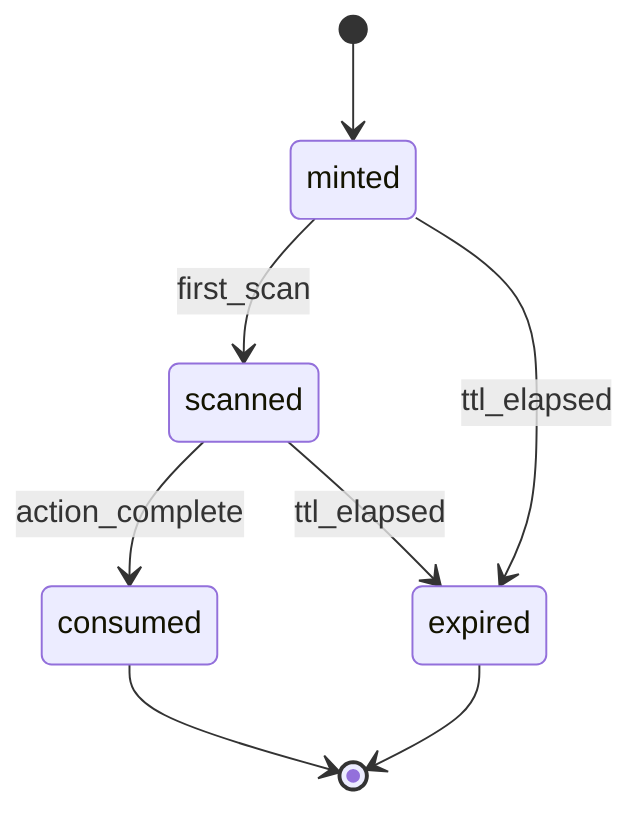

# Group Pay Links and QR — Specification

Status: `active`  
**Last updated:** 2026-06-16 (pay-moment law revision)

**Product law:** [Pay moment + 1 step](./capture-layer-architecture.md#primary-product-law--pay-moment--1-step)

---

## Purpose

Specify how ChopDot uses **signed links** and **QR codes** for group money capture at the **pay moment** — distinct from IPFS pot sharing and distinct from custodial payment links (KAST).

Design principles:

1. **Link encodes session + handoff, not money** — ChopDot records state; rails move value  
2. **Hero links land on Pay now** — `/pay` and `/spend` must open bound handoff (L1), not intent-only register  
3. **Short TTL** for spend/confirm/pay tokens  
4. **Channel-native share** — WhatsApp, iMessage, SMS, Telegram  
5. **QR = photographed link** — same token resolution as URL  

---

## Link taxonomy

| Type | Path | Status | Single-use | Typical TTL | Job |
| --- | --- | --- | --- | --- | --- |
| `join` | `/join?token=` | **Shipped** | No | 7–30 days | Add member to pot/chapter |
| `import` | `/import-pot?cid=` | **Shipped** | N/A | Permanent CID | Read-only pot copy (IPFS) |
| `spend` | `/spend?token=` | **New P1** | Yes | 30–60 min | Open prefilled spend session |
| `commit` | `/commit?token=` | **New P1** | Optional | 24h–7d | Trip deposit / “I’m in” |
| `confirm` | `/confirm?token=` | **New P1** | Yes | 24h | Receiver confirms obligation |
| `pay` | `/pay?token=` | **New P1** | Yes | 30–60 min | Settlement handoff for one leg |

Base URL: `https://app.chopdot.xyz` (or `http://localhost:5173` dev).

---

## Existing vs new (critical distinction)

| Feature | Live sync? | Use |
| --- | --- | --- |
| **Join link** ([`useInviteFlow.ts`](../../../src/hooks/useInviteFlow.ts)) | Yes — member joins pot | Collaboration |
| **IPFS share** ([`potShare.ts`](../../../src/services/sharing/potShare.ts)) | **No** — independent copy | Backup / view-only |
| **Capture links** (this spec) | Yes — chapter kernel state | Split / commit / confirm / pay handoff |

See [SHARING_VS_ADDING_MEMBERS.md](../product/SHARING_VS_ADDING_MEMBERS.md).

---

## Token format

### Storage model

Server stores `CaptureLinkToken` record; URL carries opaque `token` id only.

```text
https://app.chopdot.xyz/spend?t=cm_8f2a9b...
```

Do **not** put phone numbers, IBANs, or full names in query params.

### Signed payload (server-side)

```typescript
type CaptureLinkPayload =
  | { type: 'spend'; chapterId: string; spendSessionId: string; payerId: string }
  | { type: 'commit'; chapterId: string; obligationId: string; amount: number; currency: string }
  | { type: 'confirm'; chapterId: string; obligationId: string; claimId: string; receiverId: string }
  | { type: 'pay'; chapterId: string; legId: string; toParticipantId: string; amount: number; currency: string; rail: string };
```

Verification: HMAC-SHA256(`payload + exp`) or JWT with `aud=chopdot-capture`.

### Response codes

| Code | UX |
| --- | --- |
| 200 valid | Open target screen |
| 410 expired | “Link expired — ask [organiser] for a new one” |
| 409 consumed | “Already used” |
| 403 wrong user | “This link is for [name]” + login prompt |

---

## Link type flows

### `spend` — group split session

**Minted when:** Organiser or payer starts “split this payment” and chooses to share draft.

**Opens:** Spend session with chapter + participants + optional amount prefilled.

**Share text example:**

```text
Leo is splitting dinner on Friday Crew — tap to see your share:
https://app.chopdot.xyz/spend?t=cm_...
```

### `commit` — trip / event deposit

**Minted when:** Organiser creates deposit round.

**Opens:** Commit screen: `Committed` / `Declined` / later `Paid outside`.

**Share text example:**

```text
Barcelona Trip — €300 deposit by Friday. Tap to commit:
https://app.chopdot.xyz/commit?t=cm_...
```

### `confirm` — receiver confirmation

**Minted when:** Payer marks paid or system records claim.

**Opens:** One-tap confirm for specific `claimId` (receiver auth required).

**Share text example:**

```text
Leo marked €30 sent — tap to confirm you received it:
https://app.chopdot.xyz/confirm?t=cm_...
```

Maps to lab **P01** social rail + confirm gate ([`payout-investigation-v1.ts`](../../../src/lab/group-money-loop/scenarios/payout-investigation-v1.ts)).

### `pay` — settlement handoff (hero link)

**Minted when:** System generates per-leg pay instruction (or organiser shares “your share”).

**Opens:** **Pay now** screen with rail prefilled (Twint phone, IBAN, Firma deep link) + session ref in memo — this is the **+1** for link-only users.

**Share text example:**

```text
Your share for dinner: €30 — tap to pay Alex:
https://app.chopdot.xyz/pay?t=cm_...
```

Maps to lab **P02** deep-link pay.

---

## QR code specification

### Library

Use existing [`qrcode`](https://www.npmjs.com/package/qrcode) package ([`ReceiveQR.tsx`](../../../src/components/screens/ReceiveQR.tsx)).

### QR types

| ID | Encoded content | Printed / shown on | Mode |
| --- | --- | --- | --- |
| **QR-join** | `https://app.chopdot.xyz/join?t=…` or chapter landing | Table tent, organiser screen | Static (rotating token optional) |
| **QR-spend** | `https://app.chopdot.xyz/spend?t=…` | Payer phone for table to scan | Dynamic single-use |
| **QR-pay** | `https://app.chopdot.xyz/pay?t=…` | Per-person pay instruction | Dynamic single-use |
| **QR-confirm** | `https://app.chopdot.xyz/confirm?t=…` | Receiver scan after Twint | Dynamic single-use |
| **QR-receive-crypto** | Raw address or `polkadot:…` | You tab wallet | Shipped (crypto only) |

### QR rendering params

```typescript
{
  width: 300,
  margin: 2,
  errorCorrectionLevel: 'M',
  color: { dark: '#000000', light: '#FFFFFF' }
}
```

### Dynamic QR lifecycle



Regenerate dynamic QR on screen focus if expired (show countdown).

---

## KAST pattern comparison

| KAST | ChopDot capture link |
| --- | --- |
| Create link with amount | Create `spend` or `pay` token with amount |
| Share on WhatsApp/iMessage | [`deliverText`](../../../src/utils/delivery.ts) |
| Recipient **claims cash** | Recipient **views share / confirms receipt** |
| Custodial balance | **Non-custodial** — money on external rail |

ChopDot learns **distribution UX**, not custody model.

---

## Firma pattern comparison

| Firma | ChopDot |
| --- | --- |
| Pay @username with note | `pay` link with `note` + `legId` |
| Instant settlement | Handoff to Firma; webhook → `claimed` (P2) |
| Self-custodial wallet | ChopDot does not hold funds |

---

## Twint handoff (example rail — not exclusive)

Twint has **no public pay API** for third-party apps. ChopDot handoff:

1. `pay` link opens leg detail  
2. Show amount + counterparty phone ([`TWINTForm`](../../../src/components/settlement/TWINTForm.tsx))  
3. **Copy** formatted text or **Open SMS** with body  
4. User completes payment in Twint app  
5. Return to ChopDot → payer `I paid` / receiver `confirm` link  

Optional: QR-pay encodes same `pay` token for peer-to-peer instruction at table.

---

## Routing implementation notes (future)

Extend [`useUrlSync.ts`](../../../src/hooks/useUrlSync.ts):

```typescript
// Pseudocode
if (urlParams.get('t') && pathname === '/spend') {
  return { type: 'capture-spend', token };
}
```

New screens (future):

- `CaptureSpendScreen`  
- `CaptureCommitScreen`  
- `CaptureConfirmScreen`  
- `CapturePayHandoffScreen`  

Unauthenticated users: allow view + prompt login only for confirm/pay actions that require identity.

---

## Security checklist

- [ ] Tokens single-use where marked  
- [ ] TTL enforced server-side  
- [ ] Rate limit mint per chapter/user  
- [ ] Confirm token bound to `receiverId`  
- [ ] No PII in QR image payload  
- [ ] Revoke all tokens for chapter on closeout  
- [ ] Audit log: mint, scan, consume, expire  

---

## Share channel matrix

| Channel | Mechanism | Notes |
| --- | --- | --- |
| WhatsApp | `https://wa.me/?text=` + encoded URL | High priority CH/EU |
| iMessage | `sms:` / share sheet | |
| Telegram | `https://t.me/share/url` | Align with bot |
| Copy link | Clipboard | Universal fallback |
| In-app notify | Push / activity feed | For members already in chapter |

---

## P1 delivery checklist (product)

- [ ] Mint/consume API for `spend`, `confirm`, `pay`  
- [ ] Share sheet from Spend Card flow  
- [ ] QR display component (reuse ReceiveQR patterns)  
- [ ] QR scanner entry (optional P1.1 — use device camera)  
- [ ] Expired/consumed error screens  
- [ ] E2E: mint spend link → open → obligations visible  

---

## Changelog

| Date | Change |
| --- | --- |
| 2026-06-16 | Pay-moment law; Pay now hero on `/pay` links |
| 2026-06-16 | Initial spec |
