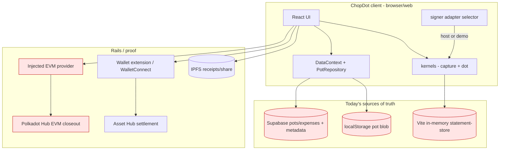
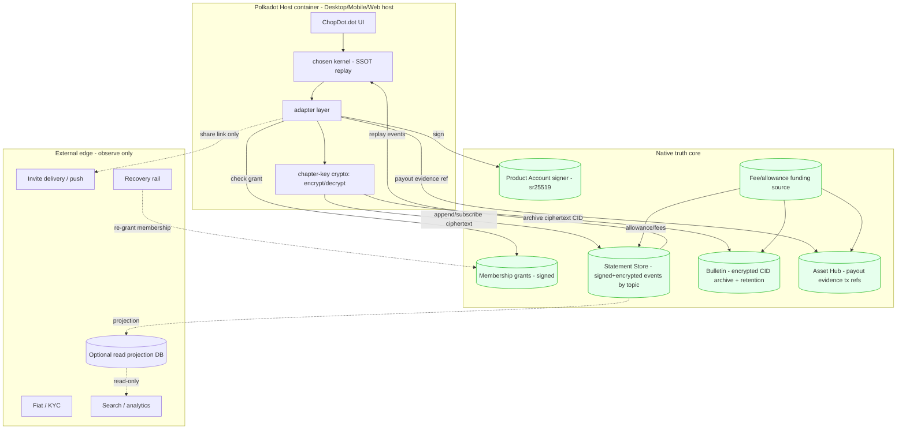
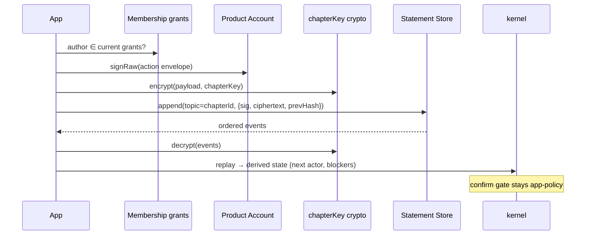
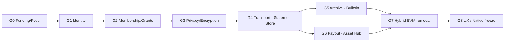

# ChopDot.dot — Path to Fully Native (Execution Roadmap)

Status: `roadmap` · **v5** (2026-06-17 — product primitive + Playground programme §18; code-grounded maturity §21; agent playbook §24 + [native-execution-playbook.md](./native-execution-playbook.md)) · v4 (deploy spike DONE) · v3 (why/should-we, §12–§17) · v2 (G0–G8, migration)
**Question answered:** not "is ChopDot.dot fully native?" but **"can we make it fully native — and exactly what changes?"**
**Scope:** Track 1 truth-core migration. Audit-only artefact; no app code changed by this doc.
**Grounded in:** verified current code (`src/chopdot-dot/polkadotSession.ts`, `src/services/wallet/capabilities.ts`, `src/services/closeout/pvmCloseout.ts`, `src/services/data/*`, `src/chapter/*`, `vite.config.ts`) and the verification review ([polkadot-native-audit-review-2026-06-16.md](./polkadot-native-audit-review-2026-06-16.md)).

> **Answer up front:** Yes — the native *truth core* is **technically achievable** with building blocks already installed (and there is a concrete deploy path to ship it under its own `.dot`, see §12). It is a **sequenced gate program**, but most gates are **unvalidated today** (§1A maturity banner; current runtime gates 1/7, with only lab UX passing). Before committing, answer the *should-we* (§1A: native likely **raises** short-term friction; main upside is trust), then the three pre-G1 questions — **(0) which kernel is native**, **(1) who funds on-chain writes**, **(2) how chapter data is encrypted** — plus **host coupling** and **Bulletin retention**. Recommended posture: **dual-track** (hybrid mainstream + native trust lane).

---

## 0. Product primitive, surfaces, and kernel strategy

### 0.1 Hero — one primitive, three surfaces (operator-aligned 2026-06-17)

**Primitive (category):** **Group commitment** — shared truth for who owes what, who acts next, and what was confirmed, without custody.

**Surfaces (entry points):**

| Surface | User job | Demo / ship posture |
| --- | --- | --- |
| **General group commitment** | Any shared chapter: obligations, expenses, closeout | `ChapterHome` + chapter pots — **live** (integrated app) |
| **Savings circle** | Recurring rounds, payout order, collective discipline | Dot lab + `savings_circle` mode — **live demo for Playground** (§18) |
| **Spend Cards** | Capture at **pay moment** + ≤1 step | Capture P1 — **positioning + next ship** ([capture-layer-build-plan.md](./cursor-brainstorm-jun-16-2026/capture-layer-build-plan.md)) |

**Listing rule:** Registry copy leads with **group commitment**; **live** demo = savings circle; Spend Cards labelled **next on the same engine** — never bait-and-switch (§18.4).

**Shared loop (all surfaces):** Catch → Show (next actor) → Move → End (trusted record).

### 0.2 Two kernels (technical reality)

| Kernel | File | Used by | State doc | Native adapters today? |
| --- | --- | --- | --- | --- |
| **Capture kernel** | `src/chapter/chapterEngine.ts` | Spend Cards, pay links, Telegram bot | `ChapterDocument` (expenses + legs) | **No** |
| **Dot kernel** | `src/chopdot-dot/commitmentKernel.ts` | Savings circle, emergency, community fund, native spike | `DotChapter` (obligations + claims) | **Yes** (`polkadotSession.ts`) |

The native spike is wired to the **dot kernel**. The capture build plan is on the **capture kernel**. They are different state docs; they share the **same product primitive** (§0.1).

### 0.3 Kernel strategy — **Option B (locked for Programme B)**

| Option | Meaning | Status |
| --- | --- | --- |
| **A — Native = dot kernel only** | Dot modes native; Spend Cards stay hybrid | **Reject as end state** — wedge would stay off native truth |
| **B — Native target = capture kernel; dot kernel = proving ground** | Prove adapters on `commitmentKernel` (lab today), then port seams to `chapterEngine` | **Locked** — native truth eventually serves Spend Cards + general commitment |
| **C — Unify first, then native** | One model, then migrate once | Defer unless B stalls on dual maintenance |

**Consequence:** Programme A (Playground) ships **dot-kernel demo** (savings circle). Programme B ports adapters to **capture kernel** after G1+G4 proof on dot kernel. Adapter interfaces are typed to `DotChapter` today — port requires new event types / bridge (§22), not drop-in rename.

### 0.4 Two programmes (do not merge acceptance bars)

| Programme | Goal | Doc |
| --- | --- | --- |
| **A — Playground ship** | Listable `.dot`, real bundle, 60s demo, `--publish` | §18 |
| **B — Native truth** | G0–G8; host Statement Store; encryption; EVM-free path | §6 |

Agent routing for skills, plugins, checklists, and **anti-drift**: [native-execution-playbook.md](./native-execution-playbook.md) · auto-enforced via `.cursor/rules/chopdot-dot-programme.mdc`

---

## 1. Definition — what "fully native" must mean

Native applies to the **truth core**; the **edge** stays composable and may never be protocol-native.

```text
┌──────────────────────── NATIVE TRUTH CORE (target: 100% native) ───────────────────────┐
│  Identity/signing · Membership/authorisation · State truth · Encrypted transport ·       │
│  Encrypted archive · Payout EVIDENCE · Confirmation semantics (app-policy, NOT on-chain) │
└──────────────────────────────────────────────────────────────────────────────────────────┘
┌──────────────────────── EXTERNAL EDGE (stays external by design) ──────────────────────┐
│  Invite delivery · Push/notifications · Fiat/KYC · Search/analytics · Support · Recovery  │
│  Invariant: the edge may OBSERVE projections; it may NEVER override signed-event truth.   │
└──────────────────────────────────────────────────────────────────────────────────────────┘
```

**Native bar (acceptance):** every truth-core write is a **signed**, **encrypted** event, authored by a Product Account signer holding a valid **membership grant**, transported via Statement Store, replayable deterministically by the kernel, archived to Bulletin, with payout *evidence* on Asset Hub — and **no Supabase / localStorage / EVM on the runtime-critical path**, and **no plaintext group financial data** on any shared store.

---

## 1A. Why / should we go native? (this doc otherwise assumes its own conclusion)

This is a **how** doc. It must not pretend the goal is settled. Decide *whether* native is worth it against the product spine — **friction down, trust up, optionality up** — before spending the gate budget.

| Spine axis | Does native help? | Honest read |
| --- | --- | --- |
| **Friction down** | ✗ likely **worse** short-term | Native adds a host app, fees, key/recovery concepts. Hybrid (Supabase/wallet) is lower-friction for mainstream users **today**. |
| **Trust up** | ✓ strongest case | Self-custody of truth, signed events, no platform that can silently rewrite group history. Real, but only matters to users who value it. |
| **Optionality up** | ✓ / mixed | Removes Supabase lock-in; **adds** Polkadot-host lock-in. Net optionality gain only if the host ecosystem grows. |

**Native vs hybrid — when each wins:**

- **Stay hybrid** if the near-term goal is mainstream adoption / lowest friction / fastest iteration. Native is overhead users don't ask for.
- **Go native** if the thesis is *witnessed, tamper-evident group truth* and/or there is a **strategic/grant reason** to be Polkadot-native, and you accept smaller initial reach.
- **Most likely correct answer: dual-track** — keep hybrid as the mainstream product, prove native on dot-mode pots as the trust-differentiated lane, converge when host reach justifies it.

**What this doc does NOT establish (still owed):** user demand for nativeness, ROI vs the engineering cost, and whether the trust gain is legible to non-crypto users. Treat "go fully native" as a **hypothesis to validate**, not a settled goal. The decision criteria are in §17.

### Maturity banner — most of this is UNVALIDATED

The gate plan reads clean, but the evidence does not yet support confidence. Per the current runtime proof report: **runtime gates 1/7**, with only UXGate passing in the lab. Several SDKs carry **prototype/experimental** warnings, and the EXT-001 blocker was even **stale** in the earlier audit. Maturity per gate:

| Gate | Maturity today | Basis |
| --- | --- | --- |
| G0 Funding | **unproven** | no funding model built |
| G1 Identity | **lab-proven** | adapter exists; host-container proof pending; EXT-001 needs recheck |
| G2 Membership | **lab-proven** | grants/keys in lab only |
| G3 Privacy | **undesigned** | encryption not applied end-to-end |
| G4 Transport | **lab-only** | Vite middleware, not host Statement Store |
| G5 Archive | **declared** | Bulletin upstream; not round-tripped from ChopDot |
| G6 Payout | **declared** | Asset Hub evidence path not built |
| G7 Hybrid removal | **blocked** | EVM still on critical path |
| G8 UX freeze | **n/a** | depends on all above |

Read every "Goal" below as **"prove that…"**, not "ship that…".

---

## 2. Current setup — ground truth (what exists today)

| Subsystem | Today | File evidence | Native? |
| --- | --- | --- | --- |
| App auth/identity | Wallet (extension / WalletConnect) + Supabase auth | `AccountContext`, `useExtensionConnect`, `useWalletConnectFlow` | Hybrid |
| Capture state (wedge) | Supabase `pots`/`expenses` or `localStorage` | `services/data/sources/*`, `chapter/chapterEngine.ts` | **No** |
| dot-mode state (spike) | Signed event replay → `DotChapter` | `commitmentKernel.ts`, `polkadotSession.ts` | Lab-native |
| Native signer | Product Account host signer + demo fallback | `ProductAccountDotSessionSignerAdapter`, `likelyInsideProductHost` (`:797,:881`) | Lab-proven |
| Membership / invites | Signed grants + chapter key (lab) | `DotInviteAccessTransportAdapter`, `membershipGrants`, `chapterKey` (`polkadotSession.ts`) | Lab only |
| Realtime transport | **Dev middleware**, in-memory | `vite.config.ts` `/__chopdot_dot_statement_store`, `StatementStoreSessionAdapter` (`:1261`) | Lab only |
| Encryption | invite/chapter-key path in lab; **not** applied to all events/archive | `polkadotSession.ts` chapterKey | **Partial / undesigned** |
| Archive/receipts | IPFS + Supabase row; cloud-storage adapter (lab) | `ProductSdkCloudStorageReceiptAdapter` (`:1465`) | Lab / non-native |
| Closeout / payout proof | **EVM** contract write | `pvmCloseout.ts`, `capabilities.ts:canCloseoutOnPolkadotHub`, `schema/pot.ts:evmAddress` | **Hybrid EVM (blocker)** |
| Settlement | Asset Hub via wallet | `capabilities.ts:canSettleOnAssetHub` | Partial-native |
| Fees / allowance | none (Supabase is free-to-write) | — | **Unsolved for native** |

### 2.1 Current data flow (as-is)



Red = must leave the runtime-critical truth path to reach "fully native".

---

## 3. Target setup — native truth core



### 3.1 The invariant

```text
write = grant-check → sign(event) → encrypt(chapterKey) → StatementStore.append(topic)
        → kernel.replay → archive(ciphertext CID) → [optional] AssetHub.evidence
confirmation stays in the kernel:   claimed ≠ confirmed ≠ closed
edge systems read projections only; they never author truth.
chapter data is never plaintext on a shared store.
```

---

## 4. Cross-cutting designs (the gaps v1 missed)

### 4.1 Funding / fees (feasibility-critical)
Native writes may need a Statement Store **allowance** + Bulletin storage fee + Asset Hub tx fee. A non-crypto user holds no tokens. Options:

| Model | How | Trade-off |
| --- | --- | --- |
| **App-sponsored allowance** | ChopDot provisions per-chapter Statement Store allowance (`statement-store-tools` pattern) | Simple UX; ChopDot bears cost; needs abuse controls |
| **Sponsored / meta-tx fees** | A sponsor account pays tx/storage fees on behalf of users | Keeps "no tokens" UX; sponsor key ops |
| **User-funded** | User funds their Product Account | Pure native; breaks non-technical UX |
| **Hybrid: app-sponsored writes, user-funded payout evidence only** | Free coordination, user pays only when moving value | Best balance; recommended starting point |

**Decision needed before G1.** Without it the "no chain jargon" copy boundary is impossible.

### 4.2 Encryption / privacy (feasibility-critical)
Statement Store and Bulletin are shared/distributed — group financials must be ciphertext.

- **Per-chapter symmetric key** (`chapterKey`, already present in lab) encrypts event payloads + archived receipts.
- **Key distribution:** chapterKey delivered to a new member encrypted to their Product Account pubkey (membership grant carries it).
- **Key rotation:** rotate chapterKey on member removal; re-encrypt forward (past ciphertext stays under old key — acceptable, or re-wrap on archive).
- **Plaintext-free rule:** topic ids may be opaque; no names/amounts in cleartext metadata.
- **Crypto-shredding:** destroying chapterKey renders archived ciphertext unreadable → this is the GDPR-erasure answer for immutable archives (see §4.6).

### 4.3 Membership / access as signed grants
Already modelled in lab (`membershipGrants`, `DotInviteAccessTransportAdapter`). Native requirements:

- Append rights to a chapter topic gated by a **signed membership grant** (issuer = organiser/creditor authority).
- Invitee receives `{ chapterKey encrypted-to-their-pubkey, grant }` via an edge delivery link (delivery is edge; the grant is truth).
- Kernel validates event author ∈ current grants at replay time (revocation = grant removal event).

### 4.4 Concurrency / event ordering
Lab uses `previousEventHash` single-chain (`DOT_SESSION_GENESIS_HASH`). Multi-device concurrent appends need a defined resolution:

- **Ordering authority:** Statement Store ordering per topic, with kernel applying a deterministic tiebreak (e.g., `(timestamp, eventHash)`).
- **Conflict policy:** commutative actions (independent legs) merge; conflicting actions on the same leg resolved by state-machine guard (e.g., can't confirm an unclaimed leg) — kernel already rejects illegal transitions.
- **Proof:** concurrent two-device append converges to identical state.

### 4.5 Account recovery / key loss
Identity = Product Account ⇒ device/host loss is a real failure mode (dossier parked recovery as edge).

- Recovery rail is **edge** (host-provided account recovery, or social re-grant).
- Truth impact: a recovered user gets a **new membership grant** re-issued by remaining authority; old events stay valid (signed by prior key). Confirm authority for in-flight legs must be re-assignable by policy.
- UX: "Lost access? Ask the group organiser to re-add you" — never expdose key material.

### 4.6 Compliance — immutability vs right-to-erasure
Immutable signed events + permanent archive conflict with deletion rights.

- **Answer:** crypto-shredding (§4.2) — delete the chapterKey, ciphertext becomes unrecoverable. Document this as the erasure mechanism.
- Keep PII out of plaintext event metadata entirely.

### 4.7 Event schema versioning & replay scale
- **Versioning:** every event carries `schemaVersion`; kernel keeps backward-compatible replay for all shipped versions (migrations are forward-only, never rewrite signed history).
- **Scale:** snapshot/checkpoint after N events so load doesn't replay full history; snapshot is a derived cache, not truth.

---

## 5. Database / state flow maps (current → target, per pillar)

### 5.1 Identity & session
| | Current | Target |
| --- | --- | --- |
| Authority | Wallet address / Supabase uid | Product Account (sr25519) via host signer |
| Keys | extension / WC / Supabase session | host key custody; ChopDot holds session pubkey |
| Record | `member.userId` | `member.productAccountAddress` + session pubkey + grant id |

### 5.2 State write (with membership + encryption)


### 5.3 Archive / History
| | Current | Target | Ceiling |
| --- | --- | --- | --- |
| Store | IPFS + Supabase row | Bulletin **encrypted** CID (`product-sdk-cloud-storage`) | **~14-day default retention** |
| Durability | external pin | renewal job / redundant copy / snapshot-on-close | retention policy required |
| Erasure | row delete | **crypto-shred chapterKey** | immutable ciphertext otherwise |

### 5.4 Payout evidence
| | Current | Target |
| --- | --- | --- |
| Mechanism | EVM write (`pvmCloseout.ts`) | Asset Hub tx ref via `product-sdk-tx` / `subxt-assets` |
| Stored | `evmAddress`, EVM hash | `assetHubTxRef` on leg/closeout |
| Semantics | EVM anchor | evidence only; **confirmation stays in kernel** |

---

## 6. Gates — ordered execution plan



### G0 — Funding / Fees model
- **Goal:** native writes work for a token-less user.
- **Change:** choose model (§4.1, recommend app-sponsored writes + user-funded payout evidence); build allowance provisioning + sponsor account ops.
- **Proof:** a user with zero balance completes catch→confirm; fees accounted to sponsor.

### G1 — IdentityGate (host signer)
- **Goal:** Product Account host signing for session-critical actions inside the host.
- **Change:** re-verify EXT-001 (`isResponse`) on a **pinned** provider in the host build (currently `needs_recheck`); promote `ProductAccountDotSessionSignerAdapter` to primary in host; replace the `new Function('specifier'…)` import shim (`:891`) with a host static import.
- **Proof:** Leo signs "Mark paid" via Product Account on Polkadot Mobile; raw sig replay-verifies; no demo secret; no SDK errors.

### G2 — MembershipGate (signed grants + key handoff)
- **Goal:** only granted members may append; invitees receive chapterKey securely.
- **Change:** promote `DotInviteAccessTransportAdapter`/`membershipGrants` to host; grant carries chapterKey encrypted-to-pubkey; revocation event support.
- **Proof:** invited member joins via edge link, decrypts chapter, appends a valid event; revoked member rejected.

### G3 — PrivacyGate (encryption)
- **Goal:** no plaintext group financials on any shared store.
- **Change:** encrypt event payloads + archived receipts with chapterKey; opaque topic metadata; key rotation on removal; crypto-shred path.
- **Proof:** raw Statement Store + Bulletin contents are ciphertext; authorised member reads; erasure = key destruction verified.

### G4 — TransportGate (host Statement Store)
- **Goal:** real multi-device convergence, replacing the Vite middleware.
- **Change:** `HostStatementStoreAdapter` (same interface as `:1261`) on `@parity/product-sdk-statement-store`, topic=chapterId; allowance from G0; ordering/tiebreak per §4.4; drop native dependence on `vite.config.ts` middleware (keep for lab).
- **Proof:** two physical devices converge; concurrent appends resolve deterministically; no shared localStorage/Supabase.

### G5 — ArchiveGate (Bulletin round-trip + retention)
- **Goal:** upload→retrieve→replay an encrypted closed-chapter receipt.
- **Change:** promote `ProductSdkCloudStorageReceiptAdapter` (`:1465`) to host; wire CID into closeout; implement chosen retention (§5.3); migrate `?cid=` import to Bulletin (IPFS stays edge).
- **Proof:** close chapter, cold-reload, fetch CID, replay to identical state; retention documented.

### G6 — PayoutGate (Asset Hub evidence, EVM-free)
- **Goal:** payout evidence on Asset Hub preserving `claimed ≠ confirmed`.
- **Change:** `AssetHubEvidenceAdapter` (`product-sdk-tx`, `subxt-assets` pattern); add `assetHubTxRef`; stop requiring `evmAddress` for proof.
- **Proof:** payout yields an Asset Hub ref; kernel still requires explicit creditor confirm.

### G7 — HybridRemovalGate (kill EVM critical path)
- **Goal:** no runtime-critical EVM dependency.
- **Change:** retire `pvmCloseout.ts` EVM write from native path; simplify `capabilities.ts` (`canCloseoutOnPolkadotHub` EVM-free on native; keep hybrid only for bridge); make `evmAddress` optional/legacy.
- **Proof:** native closeout completes with EVM provider absent.

### G8 — UX / Native Contract Freeze
- **Goal:** non-technical users finish the loop with zero chain jargon; freeze native UX contract.
- **Change:** copy + flows per §7.
- **Proof:** usability run join→catch→manage→pay→confirm→close, no chain terms surfaced.

---

## 7. UX / UI expectations & implications

### 7.1 Host-container coupling
Native Product Account signing requires running **inside** the Polkadot host. Implications:

| Area | Implication |
| --- | --- |
| Distribution | native path ships as a **host app**, not a plain web URL; reach bounded by host install base |
| Entry | launch from host; deep links resolve inside host |
| Fallback | outside host → hybrid bridge or read-only (`likelyInsideProductHost()` gates this) |
| Identity | no "connect wallet" modal — identity is the Product Account (one fewer step) |

**Posture: dual-track.** Native inside host; hybrid outside; same kernel, two adapter sets — subject to the partition rule (§8.2).

### 7.2 Screen-level expectations
| Flow | Today | Native target |
| --- | --- | --- |
| Sign-in | connect wallet + sign challenge | implicit Product Account; no wallet modal |
| Catch | form → Supabase | form → grant-check → sign → encrypt → append; optimistic local replay |
| Management | computed balances | kernel replay; "next actor" first |
| Pay handoff | Twint / Asset Hub | unchanged at edge; evidence ref native |
| Confirm | manual | **unchanged on purpose** — kernel gate; never auto from chain |
| Close | EVM closeout | Asset Hub evidence + encrypted Bulletin receipt |
| **Join** | invite link → Supabase | edge link → decrypt chapterKey → grant active |
| **Recover** | password/email | "ask organiser to re-add you" → new grant |

### 7.3 Copy boundary (hard rule)
Never show: "Product Account", "host API", "signer", "Statement Store", "Bulletin", "CID", "Asset Hub", "EVM", "allowance", "grant", or SDK errors.
Show only: `Using Leo · Mark paid · Confirm received · Group view: up to date · Saved · Syncing…`.

### 7.4 New UX states to design
- **Signing in progress** (host round-trip) — subtle, no modal spam.
- **Offline / not converged** — "Saved on this device, syncing…" (events queued for append).
- **Funding/allowance exhausted** (sponsor) — invisible to user; ops alert.
- **Member removed / key rotated** — silent re-key; no user action.
- **Outside-host bridge banner** — only on the hybrid path.

---

## 8. What we must change + migration

### 8.1 Delta table
| Subsystem | Current | Action | Native target |
| --- | --- | --- | --- |
| Kernel | two (capture + dot) | **decide §0**, then converge to one native kernel | single native kernel |
| Signer | demo fallback default | promote | Product Account host signer primary |
| Import shim | `new Function('specifier'…)` (`:891`) | remove on native build | static host import |
| Membership | lab grants | promote + revocation | signed grants gate topic writes |
| Encryption | partial/lab | **design + apply everywhere** | chapterKey encrypt events + archive |
| Transport | Vite middleware | replace | `HostStatementStoreAdapter` |
| State SSOT | Supabase | demote to edge projection | signed events + kernel replay |
| Guest store | localStorage | demote | session replay cache (not truth) |
| Archive | IPFS + Supabase | replace native, keep IPFS edge | encrypted Bulletin CID + retention |
| Closeout | `pvmCloseout.ts` EVM | retire from native | Asset Hub evidence ref |
| Capabilities | EVM-gated closeout | split | native EVM-free; hybrid keeps EVM |
| Fees | none | **add funding model** | sponsored writes / user-funded payout |
| Schema | `evmAddress` required | make optional | `productAccountAddress`, `grantId`, `assetHubTxRef`, `bulletinCid`, `schemaVersion` |
| EXT-001 | `needs_recheck` | pin + verify | resolved provider in host build |

### 8.2 Native-XOR-hybrid partition rule (prevents dual-truth)
- A chapter is **either** native (truth = signed events) **or** hybrid (truth = Supabase) — **never both at once**.
- Promotion is **one-way**: hybrid → native via §8.3; no native → hybrid except controlled rollback re-projection.
- A flag on the chapter records its truth store; adapters refuse cross-writes.

### 8.3 Forward data migration (legacy → native)
You **cannot** retroactively obtain Product Account signatures for historical Supabase events. Therefore:
- **Genesis-snapshot migration:** snapshot current pot state → one signed "import" genesis event (signed by organiser) → subsequent events are native and signed. History before migration is attested by the organiser, not per-actor signed (documented as such).
- **Or new-chapters-only:** native is opt-in for new chapters; legacy pots stay hybrid until closed. Lowest risk.
- **Recommendation:** new-chapters-only first; genesis-snapshot as an explicit opt-in later.

### 8.4 Rollback
Truth = replayable signed events ⇒ native→hybrid rollback re-projects the same events into the legacy store; no data-model fork. Encryption keys must be retained for any chapter that might roll back.

### 8.5 Adapter seams already in place (reuse)
`DotSessionSignerAdapter`, `DotSessionTransportAdapter`, `DotInviteAccessTransportAdapter`, `DotReceiptArchiveAdapter` exist in `polkadotSession.ts`. Native = new implementations of the same interfaces, selected by `likelyInsideProductHost()` — minimal blast radius (after the §0 kernel decision).

---

## 9. The decisions that gate everything

| # | Decision | Blocks |
| --- | --- | --- |
| 0 | **Which kernel is native** (capture vs dot vs unify) | the whole roadmap's relevance to the wedge |
| 1 | **Funding model** for token-less writes | G0, the no-jargon UX bar |
| 2 | **Encryption design** (chapterKey, rotation, shred) | G3, compliance, privacy |
| 3 | **Host-container coupling** (dual-track vs native-only) | distribution, G1 |
| 4 | **Bulletin retention** (renew / redundant / snapshot) | G5, "native history" meaning |

---

## 10. Risks & ceilings (honest)

| Risk | Nature | Mitigation |
| --- | --- | --- |
| Two kernels never converge | architectural debt | §0 decision; single native kernel |
| Token-less UX impossible without sponsorship | feasibility | G0 funding model |
| Plaintext leak on shared store | privacy/legal | G3 encryption + crypto-shred |
| SDK maturity (prototype warnings) | timing | pin; gate program; keep hybrid bridge |
| Statement Store churn / ordering | reliability/correctness | G4 load test + deterministic tiebreak |
| Bulletin ~14d retention | durability | retention policy |
| Host reach limits distribution | strategic | dual-track until host base grows |
| Concurrency conflicts | correctness | state-machine guards + tiebreak |
| Key loss | trust/UX | edge recovery + re-grant |

None overturn feasibility; they shape **scope, schedule, and cost**.

---

## 11. Open questions

1. §0 kernel decision — capture, dot, or unify-first?
2. Funding model + who operates the sponsor account?
3. Encryption: rotate-and-forward vs re-wrap on archive?
4. Dual-track or native-only? Minimum host versions supported?
5. Retention policy (renew / redundant / snapshot)?
6. Migration: new-chapters-only vs genesis-snapshot — and what we tell users about pre-migration history authenticity?
7. Does the read-projection DB stay (search/analytics) or do we drop relational reads?
8. Telegram bot — onto Statement Store, or stays edge?
9. Native vs hybrid: is nativeness a validated user need or a thesis bet? (see §1A, §17)
10. Mainnet timing — **confirmed testnet-only**: `@parity/polkadot-app-deploy@0.11.0 --list-environments` offers only `paseo-next-v2` + `summit` (both testnet). When does a mainnet environment ship?

---

## 12. Distribution & shipping the native app (`.dot` via DotNS, `browse.paseo.li`)

The native app is a **static web app uploaded to the Bulletin Chain and named via DotNS**, loaded inside the Polkadot host browser (`browse.paseo.li`) / Polkadot Mobile. ChopDot already hard-codes `dotNsIdentifier: 'chopdot.dot'` (`polkadotSession.ts:808`), which aligns with this path.

```sh
# one-time: sign in so you OWN the name (no mnemonic on disk)
npx -y @parity/polkadot-app-deploy login        # scan QR with Polkadot Mobile
# build, then deploy to Bulletin + register the .dot name via DotNS
npm run build
npx -y @parity/polkadot-app-deploy ./dist chopdot.dot --js-merkle   # alias: pad
# → served at https://chopdot.dot.li and resolvable inside browse.paseo.li
```

| Fact | Detail |
| --- | --- |
| Tooling (verified) | **`@parity/polkadot-app-deploy` v0.11.0** on npm (bins `pad` / `polkadot-app-deploy`). Verified runnable: `--version`, `--list-environments` work; lists `paseo-next-v2` (default) + `summit`. Repos: [`polkadot-app-deploy`](https://github.com/paritytech/polkadot-app-deploy), [`playground-cli`](https://github.com/paritytech/playground-cli) (both real). **Note:** the bare `polkadot-app-deploy` / `playground-cli` npm names are *not* the Parity tool — use the `@parity/…` scope |
| Naming | **DotNS** (on-chain). Note: community [PNS (`pns.link`)](https://app.pns.link/) is a separate system — use DotNS for host-app deploys |
| Default network | `paseo-next-v2` **testnet**; mainnet not offered by the CLI (only `paseo-next-v2` + `summit`, both testnet) |
| Account needs | funded Asset Hub account for the DotNS registration price/deposit; **Bulletin uploads need no funds** (quota/authorisation, not fees). Testnet "zero-signature" flow uses a dev worker that registers + uploads then transfers the name to your logged-in account |
| Content addressing | IPFS Kubo optional — **`--js-merkle`** does it in pure JS (no native dep). Kubo is **not** installed here, so `--js-merkle` is required locally |
| Gateway | `*.dot.li` (gateway role, like `eth.limo` for ENS); native resolution inside the host |
| Registry (optional) | `--publish` lists the domain in the on-chain Publisher registry |

**Distribution reality (the honest ceiling):** native reach = the Polkadot host install base (Desktop/Mobile/`browse.paseo.li`). If that base is small, native is a **niche/trust-differentiated lane**, not the mainstream channel — which is exactly why dual-track (hybrid mainstream + native lane) is the recommended posture. **Action:** before committing, get a real number for host MAU/installs in target geographies.

---

## 13. Cost, time & people (sizing — currently unestimated)

The roadmap has no sizing; that is a gap. Rough shape (to be refined into a real estimate):

| Gate | Skill needed | Rough effort band | Risk to estimate |
| --- | --- | --- | --- |
| G0 Funding | chain ops + economics | M | high (no precedent in repo) |
| G1 Identity | Product SDK + host | S–M | medium (EXT-001 unknown) |
| G2 Membership | crypto + kernel | M | medium |
| G3 Privacy | applied crypto | M–L | high (key rotation/shred) |
| G4 Transport | Statement Store + distributed | L | high (concurrency proof) |
| G5 Archive | Bulletin + retention ops | M | medium |
| G6 Payout | Asset Hub tx | M | medium |
| G7 Hybrid removal | refactor closeout | M | medium |
| G8 UX | product/design | M | low |

Bands are S/M/L (not weeks) on purpose — converting to a calendar needs a named team and a spike on G1+G4 first. **Owner + headcount are unassigned.** Do not present this as schedulable until G1/G4 spikes return real effort signals.

### 13.1 Economics framework (`paseo-next-v2`, **confirmed by live deploy 2026-06-17**)
A real deploy of `chopdotxx00.dot` (NoStatus label) completed end-to-end, confirming the source-derived numbers. `nativeToEthRatio: 1e8` ⇒ native token has **10 decimals** (Paseo PAS).

| Driver | Unit | Value (`paseo-next-v2`) | Source |
| --- | --- | --- | --- |
| DotNS name **price** | one-off per name | oracle **10 PAS** → **paid 11 PAS** (×1.10 buffer) for NoStatus | **live tx `0xe38c…`** |
| Bulletin storage | per CID | **0 fees** — quota-gated, paid by an authorised pool account, not the registrant | **live (2.68 KB / 2 chunks)** |
| DotNS registration **storage deposit** | one-off per name | `registerStorageDeposit: 2e12` base = **200 PAS** in config; **not observed as charged** on this NoStatus reg (only 11 PAS was paid) — likely reserved/locked separately or PoP-tier-dependent | source + live (unobserved) |
| Asset Hub tx fees | per tx | dust (commitment + register + contenthash-link = 3 txs); not separately itemised | live |
| Bulletin retention | renewal interval | re-deploy is incremental (only changed chunks); renewal cadence still to confirm | open |

**Bottom line (live):** registering a NoStatus name cost **11 PAS + dust**, content upload **free**. The 200-PAS `registerStorageDeposit` did **not** show as charged for NoStatus — treat the "~211 PAS" estimate as an upper bound until confirmed for Lite/Full tiers. Get PAS from [faucet.polkadot.io](https://faucet.polkadot.io/).

**Personhood tiers (live-confirmed via PopOracle):** the DotNS `POP_RULES` price/gate scales with label shape — `chopdot.dot` (7-char base) ⇒ **ProofOfPersonhoodFull**; `chopdot00.dot` (9-char, 2 trailing digits) ⇒ **ProofOfPersonhoodLite**; `chopdotxx00.dot` (11-char, 2 trailing digits) ⇒ **NoStatus**. So the clean `chopdot.dot` cannot be registered by an unverified account — it needs a PoP-Full grant (§13.3).

**Still open (needs further live txs):** refundability of the storage deposit, exact gas, Bulletin renewal cost, and Statement Store allowance pricing (not exposed by this CLI — lives in the Product SDK path).

### 13.2 Deploy spike — DONE (infra proof) ✓
Completed 2026-06-17 against `paseo-next-v2`:
- **`chopdotxx00.dot`** registered + content linked + verified. Live at `https://chopdotxx00.dot.li`
- **Root CID** `bafybeicjd7uwtlokhhiftzt7ltc7o2ebbaivupfsb7iwcl27faqnhrcfru`; register tx `0xe38c…`; contenthash tx `0x959c…`; P2P retrieval ✓ 557ms
- **Transferred** to operator Talis account `Talijev-ETH` / `0xad43DBB3B41FCabc0335fD5DBBB22Fbf229916D2` — tx `0x1b1a0ebe7cffafcebc72118b0e35ee098d5aee4de317be3e0e2445e6de7593cc`
- **Important:** `dist-dotspike/` used **`--js-merkle`** (broken on public gateway per playground-cli). Programme A Wave 1 redeploy uses **Kubo path**.

**Wave 1 slim bundle redeploy — 2026-06-18 (`chopdotws01.dot`, dot-lab entry):**
- **Root CID** `bafybeibxwkaks6s2g7eeew4pozjky46etjrcqczuajzz7zt3yjxyqxmjqq`
- **Contenthash** tx `0xd9ca1b578fc2cc0b4ea836018e34ca46d23012bac38bfc134935a3a9057e18bc` (incremental; ~9.5 MB saved vs full SPA)
- **Build** `npm run build:dot-host` → thin `dot-lab-main` entry (~230 KB JS)
- **Live URL** `https://chopdotws01.dot.li` — pad P2P ✓; public gateway / host still **504 / can't be reached** at verify (see §G operator checklist: try Paseo Next V2 network)

**Wave 1 full SPA deploy — 2026-06-18 (superseded):**
- **Root CID** `bafybeicmvehgl4j2fgidl4e3nrcbs7zdjnstjjmyei5cae4gn736tes64q`
- **Register** tx `0xd55a4a59a2cdcc18790894bde319a18b48df3d7504457b790eb8f5bb9e10c11a` (11 PAS)
- **Contenthash** tx `0x20962ed4dba56cb813bd408238ef504e2b69d565030415d3ec135bb11000081e`
- **Commitment** tx `0x4845fdbf62fc2cae2b338d72d9d8f17a0f932786221db77155952b5d93c875a6`
- **Owner** dev pool `0x35Cdb23fF7fc86E8DCcd577CA309bFEA9c978D20`
- **Live URL** `https://chopdotws01.dot.li` — pad P2P ✓ at deploy; public `paseo-ipfs` / `.dot.li` host **504 / Reaching out** at verify (propagation — see BulletinStorage P3 retry discipline)
- **Operator UI archive (2026-06-18):** [summit-playground-operator-reference-2026-06-18.md](./summit-playground-operator-reference-2026-06-18.md) — host error screens, Settings/Diagnostics panel, Playground quest copy verbatim; documents summit-only Polkadot Mobile access constraint

### 13.3 Path to the clean `chopdot.dot` (PoP-Full — async)
`chopdot.dot` requires **ProofOfPersonhoodFull** on the signing account (7-char base). Steps:
1. PoP grant requested: [paritytech/dotns#190](https://github.com/paritytech/dotns/issues/190) for Talis H160 above on `paseo-next-v2`
2. Once granted: `pad ./dist-dot-host chopdot.dot --js-merkle` then `pad transfer chopdot.dot --to 0xad43…16D2` if dev-worker registers
3. **`pad login`** requires **Polkadot Mobile** (`polkadotapp://`) — Nova/Talis cannot pair; dev-worker + transfer path works without Mobile

---

## 14. Testing strategy (host-in-the-loop)

The native path can't run in a normal browser/CI, but it **is** testable without physical devices:

- Use [`@parity/host-api-test-sdk`](https://github.com/paritytech/host-api-test-sdk) (from `paritytech/polkadot-apps`) to run the app inside a **simulated host container** under Playwright — exercises real Host API signing, chain, storage, and statement-store paths.
- Repo spike: `npm run e2e:host-sim` (serves `dist-dot-host/` via `preview:dot-host`, embeds in test host). See `tests/e2e/host-sim/`.
- Keep the existing lab Statement Store middleware (`vite.config.ts`) for fast unit/integration loops; add a host-simulated e2e suite for gate proofs.
- Each gate's proof artefact lands under `artifacts/polkadot-native/` (host-simulated where physical host is unavailable; physical-device run before promotion).

This closes the v1/v2 "how do we test this" gap.

---

## 15. Operations, abuse & threat model

| Concern | Risk | Control |
| --- | --- | --- |
| Sponsor account drain (G0) | attacker mints writes on our dime | per-chapter/user allowance caps, rate limits, anomaly alerts |
| Topic spam / griefing | junk events on a chapter topic | grant-gated append (G2); kernel rejects unauthorised authors; allowance throttling |
| Key/grant compromise | impersonation | rotate chapterKey on suspicion; revoke grant; signatures bound to Product Account |
| Replay/forgery | duplicate or forged events | `previousEventHash` chain + signature verify + nonce |
| Sponsor key custody | single point of failure | HSM/managed signer, rotation, runbook |
| Incident response | who acts when native breaks | on-call owner + rollback to hybrid (§8.4) |

**Ownership is unassigned** — name an operator for the sponsor account and key custody before G0 ships.

---

## 16. Fit with the rest of ChopDot

This doc is **dot-scoped**. Relationship to the wider product:

- **Main app (non-dot)** stays hybrid; native is opt-in for dot-mode pots (and, per §0, possibly the capture wedge later).
- **Capture layer / Spend Cards** ([capture-layer-build-plan.md](./cursor-brainstorm-jun-16-2026/capture-layer-build-plan.md)) is on the **capture kernel**; native currently targets the **dot kernel** — the §0 decision governs whether they converge.
- **Polkadot audit programme** ([polkadot-native-cursor-handoff.md](./polkadot-native-cursor-handoff.md)) supplies the gate evidence model; this roadmap is the build counterpart.
- **Non-custody invariant** is shared across all: ChopDot records/coordinates/proves; rails move money.

---

## 17. How to decide (criteria, owners, timing)

Turn the open decisions into a gated decision process rather than a standing list.

| Decision | Decide by | Owner | Go-native criterion |
| --- | --- | --- | --- |
| §0 Kernel | before any build | product + eng lead | wedge needs native truth → B; else dot-only A; converge → C |
| Native vs hybrid (§1A) | before G0 | product | evidence of user demand for tamper-evident truth **or** explicit strategic/grant mandate |
| Funding (G0) | before G1 | eng + finance | a model keeps "no tokens / no jargon" UX intact at acceptable burn |
| Host coupling | before G1 | product | host install base in target geo ≥ threshold (TBD), or accept niche lane |
| Retention | before G5 | eng | a policy meets "history" promise at acceptable cost |

**Suggested sequence:** validate the *should-we* (§1A) → **Programme A ship** (§18) in parallel with G1+G4 spikes → commit full Programme B only after host proof + economics.

---

## 18. Programme A — Playground / summit ship (separate bar from G0–G8)

**Goal:** Listable, honest, runnable **group commitment** demo on `.dot` before native truth gates complete.

### 18.1 Acceptance bar

| Criterion | Required |
| --- | --- |
| Real React bundle deployed (not `dist-dotspike` stub) | Yes |
| Demo completes savings-circle loop in ~60s | Yes |
| Registry metadata matches **live** demo | Yes |
| Spend Cards in copy as **next**, not live | Yes |
| `npx tsc --noEmit` + demo Playwright path green | Yes |

### 18.2 Demo script (60s)

1. Open app on `chopdotxx00.dot.li` or `chopdot.dot` inside Playground / host  
2. Banner: **“Savings circle live · Spend Cards next — same commitment engine”**  
3. User: contribute or mark paid → UI shows **next actor**  
4. Creditor: **confirm** (never auto from chain)  
5. Optional: native sync badge if host transport available

**Preferred URLs today:**

| URL | Use when |
| --- | --- |
| `/?chopdot-dot-lab=1&mode=savings_circle` | Fastest stable bundle (no auth) |
| `/pots` → open savings circle pot | “Full app” look (guest auth) |

### 18.3 Listing metadata (Playground “List in Apps”)

| Field | Draft |
| --- | --- |
| **Name** | ChopDot.dot |
| **Description** | Group commitment for shared money — savings circles live; split at the pay moment with Spend Cards next. Non-custodial. |
| **Tags** | Social, Utility |
| **Publish** | `pad ./dist-dot-host <name>.dot --js-merkle --publish` (after PoP/name ready) |

### 18.4 Anti-bait-and-switch

First screen or registry description must state what is **runnable today** (savings circle / chapter coordination) vs **roadmap** (Spend Cards capture wedge).

### 18.5 Build tasks (implementation — see playbook)

1. `VITE_BUILD_PROFILE=dot-host` — relax or bake Supabase env for static host; slim entry  
2. Output `dist-dot-host/` (or flagged `dist/`)  
3. Redeploy to owned `.dot`; `--publish` when ready  
4. Agent checklist: [native-execution-playbook.md](./native-execution-playbook.md) §7

---

## 19. Host build profile (`dot-host`)

| Issue | Today | Target |
| --- | --- | --- |
| Build fails without Supabase vars | `vite.config.ts` `validateEnvPlugin` L189–196 | Dot-host profile: dummy keys or skip gate |
| Boot throws without Supabase | `main.tsx` `requireValidEnvironment()` | Same bypass or baked vars for static bundle |
| Full hybrid SPA in bundle | WalletConnect, EVM closeout, crust | Code-split or exclude from dot-host entry |
| No `build:dot` script | `package.json` | Add `build:dot-host` |
| Entry | Full `App.tsx` auth wall | Default `?chopdot-dot-lab=1` or dedicated `dot.html` |

---

## 20. Interim identity & signing matrix

| Method | Works today? | Use for |
| --- | --- | --- |
| **Talis / H160 on Paseo** | Yes — owns `chopdotxx00.dot` | Name ownership, `pad transfer --to` |
| **Dev-worker deploy + transfer** | Yes — zero Mobile signatures | Programme A deploy |
| **`pad login` (QR)** | **No** without Polkadot Mobile | Future operator session |
| **Nova / WalletConnect** | **No** for `polkadotapp://` pairing | Not Product SDK SSO |
| **Demo signers** (`ChapterHome` lab) | Yes — per-person secrets | Dev/e2e only |
| **Product Account host signer** | Lab only; **one address for all `participantId`** (`polkadotSession.ts` L815–820) | G1 fix required for real multi-user |

---

## 21. Code-grounded maturity (supplements §1A)

Evidence from repo read 2026-06-17 — overrides vague “lab-proven” where weaker:

| Gate | Maturity | Code evidence |
| --- | --- | --- |
| G0 Funding | unproven | No sponsor model in repo |
| G1 Identity | **partial** | Host signer returns same address per participant; e2e uses demo fallback |
| G2 Membership | lab-only | Grants in `polkadotSession.ts`; not on capture kernel |
| G3 Privacy | **partial** | Claim sidecars encrypted; statement store middleware stores **plaintext JSON** |
| G4 Transport | lab-only | `@parity/product-sdk-statement-store` in `package.json` — **zero `src/` imports**; Vite middleware only |
| G5 Archive | stub | `BulletinReceiptAdapter` hash-only lab |
| G6 Payout | stub default | `AssetHubReferenceAdapter` finalized without tx unless configured |
| G7 Hybrid removal | blocked | `pvmCloseout.ts` EVM path |
| G8 UX | lab | `ChapterHome` + dot lab only |

---

## 22. Doc & wedge reconciliation

| ID | Issue | Resolution |
| --- | --- | --- |
| W1 | README `event_deposit` vs Spend Cards wedge | **Primitive §0.1** supersedes single-mode wedge labels; update README modes table |
| W2 | `replacement-matrix` defers deploy; v4 spike live | Spike = **infra proof** (§13.2); Programme A = product redeploy |
| W3 | Audit 6 gates vs path G0–G8 | Same work; path is superset — map in gate proofs |
| W4 | Capture P1 not in native path | Track 1 runs **parallel**; Spend Cards hybrid OK until capture adapters exist |

**External dependencies:**

| Dep | Status |
| --- | --- |
| [dotns#190](https://github.com/paritytech/dotns/issues/190) PoP-Full for `chopdot.dot` | Open / triage |
| Polkadot Mobile app | Conference release |
| Playground `--publish` | Not yet run |

---

## 23. Deploy truth — spike vs app

| Artefact | What it is | Product demo? |
| --- | --- | --- |
| `dist-dotspike/index.html` | Placeholder HTML (“pipeline verification”) | **No** |
| `npm run build:dot-host` → `dist-dot-host/` | Full hybrid ChopDot SPA (dot-host profile) | **Yes** — built + deployed 2026-06-18 |
| `chopdotws01.dot.li` (Wave 1) | Real bundle on-chain; host resolution pending | **Partial** — A4/A5 verify when gateway serves |
| `chopdotxx00.dot.li` (legacy spike) | Prior `--js-merkle` CID | **No** |
| Incremental `pad` redeploy | Changed chunks only | Use for updates post-first real deploy |

---

## 24. Agent execution — skills, plugins, implementation

**Full routing:** [native-execution-playbook.md](./native-execution-playbook.md)

**Summary:**

| Phase | Superpowers | ChopDot skills | Reviewers |
| --- | --- | --- | --- |
| Plan / doc comprehensive | `brainstorming` | product-judgment, engineering-judgment | ce-coherence-reviewer |
| Programme A implement | `writing-plans` → `executing-plans` | webapp-testing | review-and-ship, verification-before-completion |
| Programme B gate | `writing-plans` per gate | engineering-judgment | ce-security-reviewer (G2/G3), correctness-reviewer |
| Large diff | — | — | code-reviewer subagent, ce-adversarial-reviewer (≥50 lines) |

**Implementation plans save to:** `docs/superpowers/plans/YYYY-MM-DD-<programme>-<name>.md` (per superpowers writing-plans skill).

**Progress checkpoint (single scoreboard):** [Master plan](../superpowers/plans/2026-06-17-chopdot-dot-master-execution.md) — **§ PRODUCT END STATE** (full outcome) + **§ STATUS BOARD** (milestone progress).

**Verification before any “done” claim:** `npx tsc --noEmit`, `npm run build`, relevant Playwright spec, `validate-chopdot-dot-native-map.mjs` if evidence files change.

---

## Changelog

| Date | Change |
| --- | --- |
| 2026-06-17 | **v5**: §0 rewritten — **group commitment** primitive + three surfaces (general / savings circle / Spend Cards); Option B locked; Programme A vs B split (§0.4). Added §18 Playground ship, §19 dot-host build, §20 identity matrix, §21 code-grounded maturity, §22 doc reconciliation, §23 deploy truth, §24 agent routing + [native-execution-playbook.md](./native-execution-playbook.md). §13.2/§13.3 updated (Talis ownership, dotns#190). Hero: ship savings circle demo, tell full primitive |
| 2026-06-17 | **v4**: Paseo deploy spike **executed live**. Deployed `chopdotxx00.dot` (NoStatus label) end-to-end on `paseo-next-v2`: root CID `bafybeicjd7…cfru`, register tx `0xe38c…`, live at `chopdotxx00.dot.li`. **Confirmed** price oracle 10 → paid 11 PAS (×1.10 buffer), Bulletin upload free (quota/pool account), 200-PAS deposit *not* charged for NoStatus. **Discovered** personhood tiers: `chopdot`=Full, `chopdot00`=Lite, `chopdotxx00`=NoStatus → clean `chopdot.dot` needs a PoP-Full grant on a Paseo account (§13.3; mainnet identity does not carry over). Verified CLI `@parity/polkadot-app-deploy@0.11.0` (`--list-environments` → `paseo-next-v2`+`summit`, both testnet); `--js-merkle` removes the Kubo dep (Kubo absent locally). Corrected §12 (scoped npm name; bare names unrelated). Confirmed mainnet not yet offered (§11.10) |
| 2026-06-17 | **v3**: closed honest gaps — why/should-we + per-gate maturity banner (§1A); DotNS/`browse.paseo.li` shipping with verified tooling (§12); cost/time/people + economics framework (§13); host-in-the-loop testing via `host-api-test-sdk` (§14); ops/abuse threat model (§15); fit with rest of ChopDot (§16); decision process with owners/criteria (§17); softened up-front answer to "technically achievable but mostly unvalidated" |
| 2026-06-16 | **v2**: added G0 funding, G2 membership, G3 privacy gates; kernel-coherence decision (§0); funding/encryption/membership/concurrency/recovery/compliance/versioning designs (§4); forward-migration + native-XOR-hybrid partition (§8); expanded decisions/risks/open-questions |
| 2026-06-16 | v1: definition, current vs target flow maps, 6-gate plan, UX implications, change deltas |
