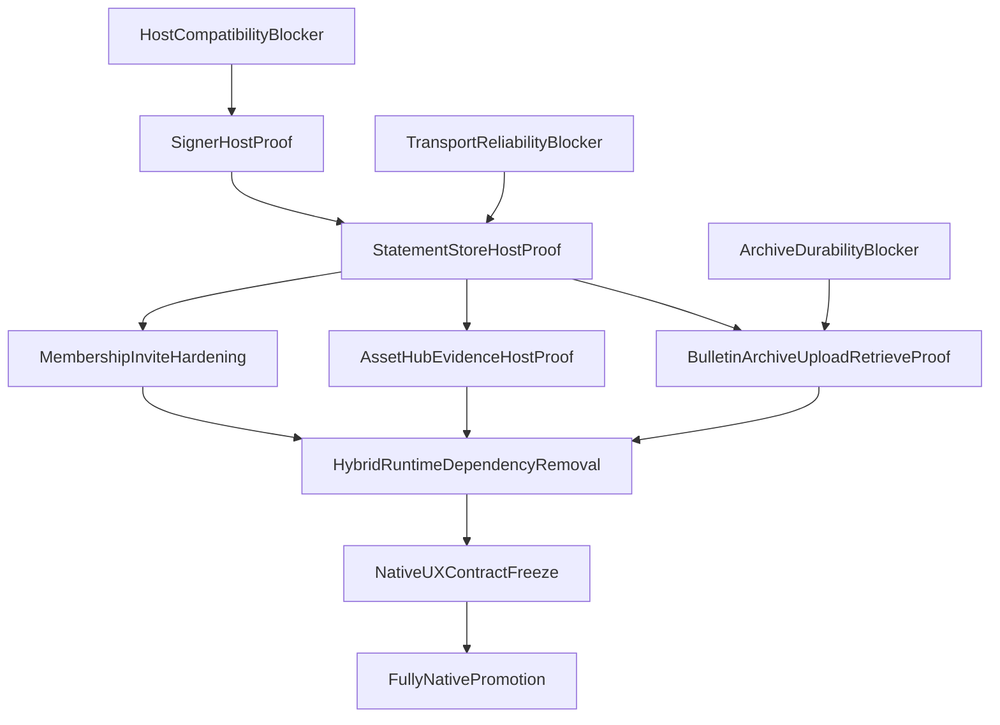

# Polkadot Native Audit Dossier

Status: `active`
Evidence confidence model: `proven | lab_proven | declared | unknown`
Last updated: 2026-06-16

## Purpose

This dossier is the evidence-first source of truth for "fully native Polkadot" migration decisions in ChopDot.
It is designed to prevent over-claiming and keep protocol capability separate from product/SaaS operations.

## Repo Coverage Method

### Coverage input
- Full `paritytech` org inventory exported via GitHub API (`698` repositories).
- Inventory enrichment with descriptions/topics and update metadata.
- Source-level review focus applied to repos relevant to ChopDot capability lanes.

### Inclusion rules
- Include repos that directly impact: identity/signing, host API contract, realtime transport, storage/archive, chain tx evidence, deployment/runtime assumptions.
- Include non-Parity dependencies when they are runtime blockers or interface dependencies for included repos.
- Exclude unrelated repos only with explicit rationale in evidence ledger.

### Confidence taxonomy
- `proven`: validated by ChopDot code/tests and observed behaviour in this repo.
- `lab_proven`: validated in spikes/lab paths, not yet host-production equivalent.
- `declared`: capability is documented upstream but not yet proven in ChopDot path.
- `unknown`: insufficient evidence to classify.

### Certainty boundary
- This dossier is high-confidence and evidence-led, not a claim of perfect certainty.
- Several critical upstream repos explicitly state prototype/experimental/unaudited status.

## Source Audit Cards (Parity/Polkadot)

### PAR-001: `paritytech/product-sdk`
- Capability: signer, tx lifecycle, chain client, statement store, cloud storage, keys/crypto.
- Evidence: upstream README package table and docs links.
- Maturity signal: prototype/reference implementation warning.
- ChopDot impact: central dependency for native signer/transport/archive/evidence.
- Confidence: `declared` (upstream) + `lab_proven` (adapter seams in ChopDot).

### PAR-002: `paritytech/truapi`
- Capability: host-product protocol contract (typed API surface).
- Evidence: README, generated TS client model, versioned protocol notes.
- Maturity signal: prototype warning.
- ChopDot impact: hard boundary for host integration correctness.
- Confidence: `declared`.

### PAR-003: `paritytech/triangle-js-sdks`
- Capability: host wrappers, host container, statement-store helpers, bulletin/product adapters.
- Evidence: package list and architecture in repo README.
- Maturity signal: prototype warning.
- ChopDot impact: likely root of host/signer integration realities and compatibility constraints.
- Confidence: `declared`.

### PAR-004: `paritytech/statement-store-tools`
- Capability: allowance provisioning and latency benchmark tooling.
- Evidence: README benchmark and setup workflow.
- Maturity signal: operational tool, not a product SDK contract by itself.
- ChopDot impact: useful for transport readiness and reliability gates.
- Confidence: `declared`.

### PAR-005: `paritytech/polkadot-bulletin-chain`
- Capability: distributed storage/retrieval, authorization model, retention and renewal semantics.
- Evidence: README architecture and storage model.
- Maturity signal: experimental/unaudited warning.
- ChopDot impact: critical for History archive and receipt retrieval expectations.
- Confidence: `declared`.

### PAR-006: `paritytech/playground-app-template`
- Capability: host-aware app template using product-account signing and host APIs.
- Evidence: README flow and stack declaration.
- Maturity signal: prototype warning.
- ChopDot impact: reference for host deployment assumptions and product-account UX patterns.
- Confidence: `declared`.

### PAR-007: `paritytech/polkadot-sdk`
- Capability: core runtime/protocol substrate, XCM ecosystem, chain foundations.
- Evidence: upstream project scope and SDK docs references.
- Maturity signal: mature core ecosystem project.
- ChopDot impact: indirect foundational dependency.
- Confidence: `declared` for ChopDot-specific claims unless mapped through tested adapters.

### PAR-008: `paritytech/smoldot`
- Capability: light client for substrate-based chains.
- Evidence: repo scope and ecosystem references.
- ChopDot impact: potential client/runtime topology option, not current hard blocker.
- Confidence: `declared`.

### PAR-009: `paritytech/asset-transfer-api` + `paritytech/subxt-assets`
- Capability: asset interaction/transfer tooling around Asset Hub flows.
- Evidence: repo descriptions and package intent.
- ChopDot impact: payout evidence rail support options.
- Confidence: `declared`.

## External Dependency Audit Cards (Non-Parity)

### EXT-001: `@polkadot-api/json-rpc-provider`
- Capability: JSON-RPC transport/provider layer used by host stacks.
- Evidence: referenced in ChopDot signer spike blockers.
- ChopDot impact: direct blocker for host signer integration stability.
- Confidence: `proven` (as blocker existence), `unknown` (long-term compatibility stability).

### EXT-002: Wallet ecosystems (extension + WalletConnect stacks)
- Capability: account connection/session continuity.
- Evidence: ChopDot runtime architecture and existing wallet hooks.
- ChopDot impact: onboarding and runtime auth continuity during migration.
- Confidence: `lab_proven`.

### EXT-003: Indexing/search/analytics stacks
- Capability: query acceleration, BI, product analytics.
- Evidence: outside core protocol scope.
- ChopDot impact: non-native SaaS parity requirements.
- Confidence: `proven` (need exists), `unknown` (final tooling choice).

### EXT-004: Messaging/delivery rails (email/chat/push)
- Capability: invite distribution and user notification.
- Evidence: no native equivalent in reviewed protocol stack.
- ChopDot impact: Catch adoption and coordination.
- Confidence: `proven`.

### EXT-005: Fiat/compliance providers
- Capability: KYC/AML and fiat settlement operations.
- Evidence: outside Polkadot protocol scope.
- ChopDot impact: optional market expansion; not required for native trust core.
- Confidence: `proven`.

## Capability SSOT Matrix

| Capability | Native Coverage | Key Repos/Packages | External Required | Confidence | ChopDot Impact |
| --- | --- | --- | --- | --- | --- |
| Authentication (cryptographic identity) | Native signer path exists | product-sdk, truapi, triangle-js-sdks | Recovery/support rails | lab_proven | Core for Catch |
| Authorisation (action rights) | Kernel + signed grants model | ChopDot kernel/session + product-sdk crypto | Admin backoffice only | proven | Core trust boundary |
| State truth/database | Event-sourced truth is native-capable | ChopDot session/kernel + statement-store direction | Projection/read DB | lab_proven | Central to migration |
| Realtime shared sync | Native path exists, host proof pending | product-sdk statement-store, statement-store-tools | Invite/push delivery | lab_proven | Top blocker |
| Archive/storage history | Native archive path exists, durability limits open | bulletin-chain, product-sdk cloud-storage | Redundant long-retention copy | declared | Critical for History |
| Crypto payout evidence | Asset Hub evidence path plausible | product-sdk tx, asset-transfer-api, subxt-assets | Fiat rails | lab_proven | Important for Payout |
| Confirmation semantics | Must remain app-policy, not chain-only | ChopDot kernel invariants | None for core | proven | Prevents semantic errors |
| Search/analytics | Not core-native | external indexing ecosystem | Yes | proven | SaaS completeness |
| Observability/ops | Partial chain telemetry only | sdk ecosystem + app stack | Yes | declared | Production readiness |
| Compliance/legal operations | Not native protocol product capability | external providers | Yes | proven | Outside native core |

## Critical Dependency Graph

## Strict Native vs External Boundary

### Native truth core
- Signed event envelopes.
- Deterministic kernel-derived chapter state.
- Native signer/session authority.
- Native event transport and replay.
- Optional native payout evidence references.

### External edge only
- Invite delivery and notifications.
- Fiat/compliance operations.
- Long-term archive redundancy and support tooling.
- Search/analytics and incident operations.

### Invariant
- External systems cannot override kernel truth.

## Evidence Gates for "Fully Native" Status

1. Identity gate: host signer path proven for session-critical actions.
2. Transport gate: real multi-device convergence proven with host transport.
3. Archive gate: live upload/retrieve/replay proven with retention policy documented.
4. Payout gate: chain evidence lifecycle proven while preserving `claimed != confirmed`.
5. Hybrid removal gate: no runtime-critical EVM closeout dependency.
6. UX gate: non-technical users can complete full loop without chain-jargon dependence.

## Open Unknowns

- Stability of host contract boundaries across protocol/package revisions.
- Statement Store behaviour under high churn and intermittent connectivity.
- Bulletin retention and renewal sufficiency for long-lived group histories.
- Practical fee/UX profile for low-value recurring payout evidence.
- Minimum external ops stack that preserves native-truth integrity.

## Out of Scope for Native-Core Claim

- KYC/AML provider architecture.
- Full support/moderation process design.
- Enterprise BI/search platform decisions.

## Native Coverage Estimate (Evidence-Bounded)

- Estimated native coverage today: **58% - 72%**.
- Lower bound: counts only `proven + lab_proven`.
- Upper bound: includes promotable `declared` capabilities after host validation.
- Excludes external edge capabilities by design.

## 99% Due Diligence Programme Artefacts

- [polkadot-native-audit-scope.json](./polkadot-native-audit-scope.json) — frozen in-scope repo list and scoring model
- [polkadot-native-evidence-ledger.json](./polkadot-native-evidence-ledger.json) — machine-readable audit cards with module refs
- [polkadot-native-external-deps-audit.md](./polkadot-native-external-deps-audit.md) — non-Parity blocker forensics
- [polkadot-native-runtime-proof-report.md](./polkadot-native-runtime-proof-report.md) — six gate pass/fail record
- [polkadot-native-verification-signoff.md](./polkadot-native-verification-signoff.md) — adversarial second-pass review
- [polkadot-native-risk-register.md](./polkadot-native-risk-register.md) — scored residual risks
- [polkadot-native-99-scorecard.md](./polkadot-native-99-scorecard.md) — current 99% readiness scores

**Current overall 99% ready: NO** (runtime gates and Tier A blockers remain open). See scorecard for details.
