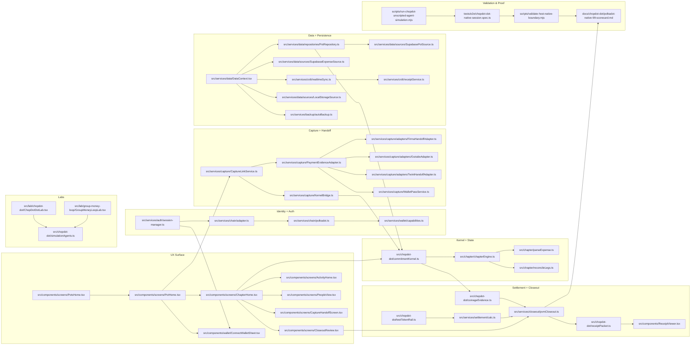

# Tool Offerers & Full Path Connectivity Map (2026-06-22)

This is the cleaned, saved index of **verified paths** that participate in tool integrations, product flow, validation, and research evidence.

Use this when learning where a decision, proof path, or action comes from.

### 0) Source control and governance
- `/Users/devinsonpena/ChopDot/.cursor/rules/chopdot-dot-programme.mdc`
- `/Users/devinsonpena/ChopDot/.knowns/tasks`
- `/Users/devinsonpena/ChopDot/AGENTS.md`
- `/Users/devinsonpena/ChopDot/docs/AGENTOPS_TASK_QUEUE.md`
- `/Users/devinsonpena/ChopDot/.local-private/CHOPDOT_CONCRETE_SPINE.md`

## 1) Runtime Tool Offerer Families

### 1.1 Identity, session, signer, auth
- `/Users/devinsonpena/ChopDot/src/chopdot-dot/polkadotSession.ts`
- `/Users/devinsonpena/ChopDot/src/services/auth/session-manager.ts`
- `/Users/devinsonpena/ChopDot/src/services/auth/session-cleanup.ts`
- `/Users/devinsonpena/ChopDot/src/services/auth/session-cleanup.test.ts`
- `/Users/devinsonpena/ChopDot/src/services/auth/guest-login.ts`
- `/Users/devinsonpena/ChopDot/src/services/auth/oauth-login.ts`
- `/Users/devinsonpena/ChopDot/src/services/auth/wallet-login.ts`
- `/Users/devinsonpena/ChopDot/src/services/chain/adapter.ts`
- `/Users/devinsonpena/ChopDot/src/services/chain/address.ts`
- `/Users/devinsonpena/ChopDot/src/services/chain/config.ts`
- `/Users/devinsonpena/ChopDot/src/services/chain/index.ts`
- `/Users/devinsonpena/ChopDot/src/services/chain/polkadot.ts`
- `/Users/devinsonpena/ChopDot/src/services/chain/remark.ts`
- `/Users/devinsonpena/ChopDot/src/services/chain/sim.ts`
- `/Users/devinsonpena/ChopDot/src/services/chain/sim.test.ts`
- `/Users/devinsonpena/ChopDot/src/services/chain/utils.ts`
- `/Users/devinsonpena/ChopDot/src/services/chain/walletconnect.ts`
- `/Users/devinsonpena/ChopDot/src/services/wallet/capabilities.ts`
- `/Users/devinsonpena/ChopDot/src/utils/authPersistence.ts`
- `/Users/devinsonpena/ChopDot/src/utils/polkadot-config.ts`
- `/Users/devinsonpena/ChopDot/src/utils/walletAuth.ts`

### 1.2 Coordination kernel + chapter state
- `/Users/devinsonpena/ChopDot/src/chopdot-dot/commitmentKernel.ts`
- `/Users/devinsonpena/ChopDot/src/chopdot-dot/commitmentKernel.test.ts`
- `/Users/devinsonpena/ChopDot/src/chopdot-dot/chapterPotTemplates.ts`
- `/Users/devinsonpena/ChopDot/src/chopdot-dot/testTokenRail.ts`
- `/Users/devinsonpena/ChopDot/src/chopdot-dot/testTokenRail.test.ts`
- `/Users/devinsonpena/ChopDot/src/chopdot-dot/receiptPacket.ts`
- `/Users/devinsonpena/ChopDot/src/chopdot-dot/receiptPacket.test.ts`
- `/Users/devinsonpena/ChopDot/src/chopdot-dot/coinageEvidence.ts`
- `/Users/devinsonpena/ChopDot/src/chopdot-dot/coinageEvidence.test.ts`
- `/Users/devinsonpena/ChopDot/src/chapter/chapterEngine.ts`
- `/Users/devinsonpena/ChopDot/src/chapter/chapterEngine.test.ts`
- `/Users/devinsonpena/ChopDot/src/chapter/migrateChapter.ts`
- `/Users/devinsonpena/ChopDot/src/chapter/migrateChapter.test.ts`
- `/Users/devinsonpena/ChopDot/src/chapter/parseExpense.ts`
- `/Users/devinsonpena/ChopDot/src/chapter/reconcileLegs.ts`
- `/Users/devinsonpena/ChopDot/src/chapter/types.ts`

### 1.3 Settlement, payouts, and closeout
- `/Users/devinsonpena/ChopDot/src/services/settlement/calc.ts`
- `/Users/devinsonpena/ChopDot/src/services/settlement/calc.test.ts`
- `/Users/devinsonpena/ChopDot/src/services/closeout/pvmCloseout.ts`
- `/Users/devinsonpena/ChopDot/src/services/closeout/pvmCloseout.test.ts`
- `/Users/devinsonpena/ChopDot/src/services/closeout/trackedRecovery.ts`
- `/Users/devinsonpena/ChopDot/src/services/closeout/trackedRecovery.test.ts`
- `/Users/devinsonpena/ChopDot/src/components/settlement/DotSettlementPanel.tsx`
- `/Users/devinsonpena/ChopDot/src/components/settlement/PayPalForm.tsx`
- `/Users/devinsonpena/ChopDot/src/components/settlement/BankForm.tsx`
- `/Users/devinsonpena/ChopDot/src/components/settlement/TWINTForm.tsx`
- `/Users/devinsonpena/ChopDot/src/components/SettlementConfirmModal.tsx`
- `/Users/devinsonpena/ChopDot/src/components/SettleSheet.tsx`
- `/Users/devinsonpena/ChopDot/src/components/screens/SettleHome.tsx`
- `/Users/devinsonpena/ChopDot/src/components/screens/SettleHome.test.ts`
- `/Users/devinsonpena/ChopDot/src/components/screens/SettleSelection.tsx`
- `/Users/devinsonpena/ChopDot/src/components/screens/SettlementConfirmation.tsx`
- `/Users/devinsonpena/ChopDot/src/components/screens/SettlementHistory.tsx`

### 1.4 Storage, backup, and sync rail
- `/Users/devinsonpena/ChopDot/src/services/storage/getWalletAddress.ts`
- `/Users/devinsonpena/ChopDot/src/services/storage/ipfs.ts`
- `/Users/devinsonpena/ChopDot/src/services/storage/ipfsAuth.ts`
- `/Users/devinsonpena/ChopDot/src/services/storage/ipfsWithOnboarding.ts`
- `/Users/devinsonpena/ChopDot/src/services/storage/receipt.ts`
- `/Users/devinsonpena/ChopDot/src/services/storage/userIndex.ts`
- `/Users/devinsonpena/ChopDot/src/services/backup/autoBackup.ts`
- `/Users/devinsonpena/ChopDot/src/services/backup/backupService.ts`
- `/Users/devinsonpena/ChopDot/src/services/backup/crustBackup.ts`
- `/Users/devinsonpena/ChopDot/src/services/crdt/automergeUtils.ts`
- `/Users/devinsonpena/ChopDot/src/services/crdt/checkpointManager.ts`
- `/Users/devinsonpena/ChopDot/src/services/crdt/membershipService.ts`
- `/Users/devinsonpena/ChopDot/src/services/crdt/receiptService.ts`
- `/Users/devinsonpena/ChopDot/src/services/crdt/realtimeSync.ts`
- `/Users/devinsonpena/ChopDot/src/services/crdt/types.ts`
- `/Users/devinsonpena/ChopDot/src/services/restore/autoRestore.ts`
- `/Users/devinsonpena/ChopDot/src/services/bridge/hyperbridge.ts`
- `/Users/devinsonpena/ChopDot/src/services/bridge/hyperbridge.test.ts`

### 1.5 Data layer + repositories
- `/Users/devinsonpena/ChopDot/src/services/data/DataContext.tsx`
- `/Users/devinsonpena/ChopDot/src/services/data/api/ApiClient.ts`
- `/Users/devinsonpena/ChopDot/src/services/data/errors/index.ts`
- `/Users/devinsonpena/ChopDot/src/services/data/repositories/ExpenseRepository.ts`
- `/Users/devinsonpena/ChopDot/src/services/data/repositories/ExpenseRepository.test.ts`
- `/Users/devinsonpena/ChopDot/src/services/data/repositories/MemberRepository.ts`
- `/Users/devinsonpena/ChopDot/src/services/data/repositories/MemberRepository.test.ts`
- `/Users/devinsonpena/ChopDot/src/services/data/repositories/PotRepository.ts`
- `/Users/devinsonpena/ChopDot/src/services/data/repositories/PotRepository.test.ts`
- `/Users/devinsonpena/ChopDot/src/services/data/repositories/SettlementRepository.ts`
- `/Users/devinsonpena/ChopDot/src/services/data/services/ActionFlows.test.ts`
- `/Users/devinsonpena/ChopDot/src/services/data/services/ExpenseService.ts`
- `/Users/devinsonpena/ChopDot/src/services/data/services/ExpenseService.test.ts`
- `/Users/devinsonpena/ChopDot/src/services/data/services/MemberService.ts`
- `/Users/devinsonpena/ChopDot/src/services/data/services/MemberService.test.ts`
- `/Users/devinsonpena/ChopDot/src/services/data/services/PotService.ts`
- `/Users/devinsonpena/ChopDot/src/services/data/services/PotService.test.ts`
- `/Users/devinsonpena/ChopDot/src/services/data/services/SettlementService.ts`
- `/Users/devinsonpena/ChopDot/src/services/data/services/SettlementService.test.ts`
- `/Users/devinsonpena/ChopDot/src/services/data/services/MajorFlows.test.ts`
- `/Users/devinsonpena/ChopDot/src/services/data/sources/HttpSource.ts`
- `/Users/devinsonpena/ChopDot/src/services/data/sources/LocalStorageSource.ts`
- `/Users/devinsonpena/ChopDot/src/services/data/sources/expense-row-mapper.ts`
- `/Users/devinsonpena/ChopDot/src/services/data/sources/pot-row-mapper.ts`
- `/Users/devinsonpena/ChopDot/src/services/data/sources/supabase-auth-helper.ts`
- `/Users/devinsonpena/ChopDot/src/services/data/sources/supabase-utils.ts`
- `/Users/devinsonpena/ChopDot/src/services/data/sources/SupabaseExpenseSource.ts`
- `/Users/devinsonpena/ChopDot/src/services/data/sources/SupabasePotSource.ts`
- `/Users/devinsonpena/ChopDot/src/services/data/sources/SupabaseSource.ts`
- `/Users/devinsonpena/ChopDot/src/services/data/types/dto.ts`
- `/Users/devinsonpena/ChopDot/src/services/data/types/index.ts`
- `/Users/devinsonpena/ChopDot/src/services/data/types/supabase.ts`
- `/Users/devinsonpena/ChopDot/src/services/data/utils/amounts.ts`
- `/Users/devinsonpena/ChopDot/src/services/InviteService.ts`
- `/Users/devinsonpena/ChopDot/src/services/InviteService.test.ts`
- `/Users/devinsonpena/ChopDot/src/services/sharing/potShare.ts`

### 1.6 Capture / handoff rails
- `/Users/devinsonpena/ChopDot/src/services/capture/ChapterStore.ts`
- `/Users/devinsonpena/ChopDot/src/services/capture/KernelBridge.ts`
- `/Users/devinsonpena/ChopDot/src/services/capture/KernelBridge.test.ts`
- `/Users/devinsonpena/ChopDot/src/services/capture/CaptureLinkService.ts`
- `/Users/devinsonpena/ChopDot/src/services/capture/CaptureLinkService.test.ts`
- `/Users/devinsonpena/ChopDot/src/services/capture/PaymentEvidenceAdapter.ts`
- `/Users/devinsonpena/ChopDot/src/services/capture/PaymentEvidenceAdapter.test.ts`
- `/Users/devinsonpena/ChopDot/src/services/capture/QRPayloadCodec.ts`
- `/Users/devinsonpena/ChopDot/src/services/capture/QRPayloadCodec.test.ts`
- `/Users/devinsonpena/ChopDot/src/services/capture/SettlementAdapterRegistry.ts`
- `/Users/devinsonpena/ChopDot/src/services/capture/WalletPassService.ts`
- `/Users/devinsonpena/ChopDot/src/services/capture/WalletPassService.test.ts`
- `/Users/devinsonpena/ChopDot/src/services/capture/SpendSessionService.ts`
- `/Users/devinsonpena/ChopDot/src/services/capture/captureRoutes.ts`
- `/Users/devinsonpena/ChopDot/src/services/capture/captureWebhookTestHarness.ts`
- `/Users/devinsonpena/ChopDot/src/services/capture/chapterSync.ts`
- `/Users/devinsonpena/ChopDot/src/services/capture/firmaWebhookClaim.ts`
- `/Users/devinsonpena/ChopDot/src/services/capture/firmaWebhookClaim.test.ts`
- `/Users/devinsonpena/ChopDot/src/services/capture/types.ts`
- `/Users/devinsonpena/ChopDot/src/services/capture/types/settlementAdapter.ts`
- `/Users/devinsonpena/ChopDot/src/services/capture/adapters/FirmaHandoffAdapter.ts`
- `/Users/devinsonpena/ChopDot/src/services/capture/adapters/OutsideAdapter.ts`
- `/Users/devinsonpena/ChopDot/src/services/capture/adapters/TwintHandoffAdapter.ts`
- `/Users/devinsonpena/ChopDot/src/components/capture/CaptureFlowGuide.tsx`
- `/Users/devinsonpena/ChopDot/src/components/capture/CapturePotHomeSection.tsx`
- `/Users/devinsonpena/ChopDot/src/components/capture/CaptureChapterPanel.tsx`
- `/Users/devinsonpena/ChopDot/src/components/capture/CaptureQRModal.tsx`
- `/Users/devinsonpena/ChopDot/src/components/capture/CaptureShareActions.tsx`
- `/Users/devinsonpena/ChopDot/src/components/capture/AddToWalletButton.tsx`
- `/Users/devinsonpena/ChopDot/src/components/capture/SettlementHandoffPanel.tsx`
- `/Users/devinsonpena/ChopDot/src/components/screens/CaptureHandoffScreen.tsx`
- `/Users/devinsonpena/ChopDot/src/components/screens/CaptureConfirmScreen.tsx`

### 1.7 Simulation and scenario lab offerers
- `/Users/devinsonpena/ChopDot/src/chopdot-dot/simulationAgents.ts`
- `/Users/devinsonpena/ChopDot/src/chopdot-dot/simulationAgents.test.ts`
- `/Users/devinsonpena/ChopDot/src/lab/chopdot-dot/ChopDotDotLab.tsx`
- `/Users/devinsonpena/ChopDot/src/lab/chopdot-dot/ChopDotDotLab.css`
- `/Users/devinsonpena/ChopDot/src/lab/chopdot-dot/useDotLabState.ts`
- `/Users/devinsonpena/ChopDot/src/lab/chopdot-dot/dotLabScenarios.ts`
- `/Users/devinsonpena/ChopDot/src/lab/group-money-loop/GroupMoneyLoopLab.tsx`
- `/Users/devinsonpena/ChopDot/src/lab/group-money-loop/ValidationTmaShell.tsx`
- `/Users/devinsonpena/ChopDot/src/lab/group-money-loop/LabMockPanel.tsx`
- `/Users/devinsonpena/ChopDot/src/lab/group-money-loop/MockGroupChat.tsx`
- `/Users/devinsonpena/ChopDot/src/lab/group-money-loop/scenarios/catch-investigation-v1.ts`
- `/Users/devinsonpena/ChopDot/src/lab/group-money-loop/scenarios/management-investigation-v1.ts`
- `/Users/devinsonpena/ChopDot/src/lab/group-money-loop/scenarios/payout-investigation-v1.ts`
- `/Users/devinsonpena/ChopDot/src/lab/group-money-loop/scenarios/history-investigation-v1.ts`
- `/Users/devinsonpena/ChopDot/src/lab/group-money-loop/scenarios/trip-chapter-v1.ts`
- `/Users/devinsonpena/ChopDot/src/lab/group-money-loop/scenarios/index.ts`
- `/Users/devinsonpena/ChopDot/src/lab/group-money-loop/types.ts`

### 1.8 Product shells and route surfaces
- `/Users/devinsonpena/ChopDot/src/App.tsx`
- `/Users/devinsonpena/ChopDot/src/main.tsx`
- `/Users/devinsonpena/ChopDot/src/nav.ts`
- `/Users/devinsonpena/ChopDot/src/dot-lab-main.tsx`
- `/Users/devinsonpena/ChopDot/src/sandbox.tsx`
- `/Users/devinsonpena/ChopDot/src/components/AppRouter.tsx`
- `/Users/devinsonpena/ChopDot/src/components/TopBar.tsx`
- `/Users/devinsonpena/ChopDot/src/components/BottomTabBar.tsx`
- `/Users/devinsonpena/ChopDot/src/components/app/AppLayout.tsx`
- `/Users/devinsonpena/ChopDot/src/components/app/AppOverlays.tsx`
- `/Users/devinsonpena/ChopDot/src/components/screens/PotsHome.tsx`
- `/Users/devinsonpena/ChopDot/src/components/screens/PotHome.tsx`
- `/Users/devinsonpena/ChopDot/src/components/screens/ChapterHome.tsx`
- `/Users/devinsonpena/ChopDot/src/components/screens/CreatePot.tsx`
- `/Users/devinsonpena/ChopDot/src/components/screens/AddMember.tsx`
- `/Users/devinsonpena/ChopDot/src/components/screens/AddExpense.tsx`
- `/Users/devinsonpena/ChopDot/src/components/screens/AddContribution.tsx`
- `/Users/devinsonpena/ChopDot/src/components/screens/AddPaymentMethod.tsx`
- `/Users/devinsonpena/ChopDot/src/components/screens/RequestPayment.tsx`
- `/Users/devinsonpena/ChopDot/src/components/screens/ExpenseDetail.tsx`
- `/Users/devinsonpena/ChopDot/src/components/screens/PeopleHome.tsx`
- `/Users/devinsonpena/ChopDot/src/components/screens/PeopleView.tsx`
- `/Users/devinsonpena/ChopDot/src/components/screens/ActivityHome.tsx`
- `/Users/devinsonpena/ChopDot/src/components/screens/CloseoutReview.tsx`
- `/Users/devinsonpena/ChopDot/src/components/screens/SettingsTab.tsx`
- `/Users/devinsonpena/ChopDot/src/components/screens/NotificationCenter.tsx`
- `/Users/devinsonpena/ChopDot/src/components/screens/CrustStorage.tsx`
- `/Users/devinsonpena/ChopDot/src/components/screens/CrustAuthSetup.tsx`
- `/Users/devinsonpena/ChopDot/src/components/screens/SignInScreen.tsx`
- `/Users/devinsonpena/ChopDot/src/components/screens/AuthScreen.tsx`
- `/Users/devinsonpena/ChopDot/src/components/screens/SignUpScreen.tsx`
- `/Users/devinsonpena/ChopDot/src/components/screens/ResetPasswordScreen.tsx`
- `/Users/devinsonpena/ChopDot/src/components/WalletConnectionSheet.tsx`
- `/Users/devinsonpena/ChopDot/src/components/ReceiptViewer.tsx`
- `/Users/devinsonpena/ChopDot/src/components/HyperbridgeBridgeSheet.tsx`
- `/Users/devinsonpena/ChopDot/src/components/auth/SignInComponents.tsx`
- `/Users/devinsonpena/ChopDot/src/components/auth/AuthFooter.tsx`
- `/Users/devinsonpena/ChopDot/src/components/auth/SignInThemes.ts`
- `/Users/devinsonpena/ChopDot/src/components/auth/DevToggles.tsx`
- `/Users/devinsonpena/ChopDot/src/components/auth/MobileWalletConnectPanel.tsx`
- `/Users/devinsonpena/ChopDot/src/components/auth/EmailLoginDrawer.tsx`
- `/Users/devinsonpena/ChopDot/src/components/auth/panels/WalletLoginPanel.tsx`
- `/Users/devinsonpena/ChopDot/src/components/auth/panels/EmailLoginPanel.tsx`
- `/Users/devinsonpena/ChopDot/src/components/auth/panels/SignupPanel.tsx`
- `/Users/devinsonpena/ChopDot/src/components/auth/hooks/useEmailAuth.ts`
- `/Users/devinsonpena/ChopDot/src/components/auth/hooks/useWalletAuth.ts`
- `/Users/devinsonpena/ChopDot/src/components/auth/hooks/useLoginState.ts`
- `/Users/devinsonpena/ChopDot/src/components/auth/hooks/useSignInHandlers.ts`
- `/Users/devinsonpena/ChopDot/src/components/auth/hooks/useThemeHandler.ts`
- `/Users/devinsonpena/ChopDot/src/components/wallet/ConnectWalletSheet.tsx`
- `/Users/devinsonpena/ChopDot/src/components/wallet/WalletConnectQRModal.tsx`
- `/Users/devinsonpena/ChopDot/src/components/wallet/ConnectedAccountMenu.tsx`
- `/Users/devinsonpena/ChopDot/src/components/wallet/ExtensionSelectorModal.tsx`
- `/Users/devinsonpena/ChopDot/src/components/polkadot/ConnectWallet.tsx`
- `/Users/devinsonpena/ChopDot/src/components/polkadot/BalanceDisplay.tsx`

## 2) Execution, tests, and validation offerers

- `/Users/devinsonpena/ChopDot/scripts/run-chopdot-unscripted-agent-simulation.mjs`
- `/Users/devinsonpena/ChopDot/scripts/smoke-five-flows.cjs`
- `/Users/devinsonpena/ChopDot/scripts/smoke-guest-invite-guard.cjs`
- `/Users/devinsonpena/ChopDot/scripts/run-smoke-suite.cjs`
- `/Users/devinsonpena/ChopDot/scripts/verify-dot-deploy.mjs`
- `/Users/devinsonpena/ChopDot/scripts/prepare-dot-host-deploy.mjs`
- `/Users/devinsonpena/ChopDot/scripts/preflight-dot-host-deploy.mjs`
- `/Users/devinsonpena/ChopDot/scripts/validate-chopdot-dot-coverage.mjs`
- `/Users/devinsonpena/ChopDot/scripts/validate-chopdot-dot-native-map.mjs`
- `/Users/devinsonpena/ChopDot/scripts/validate-auth-provider-proof.mjs`
- `/Users/devinsonpena/ChopDot/scripts/validate-auth-provider-proof-run-packet.mjs`
- `/Users/devinsonpena/ChopDot/scripts/validate-friend-pilot-script.mjs`
- `/Users/devinsonpena/ChopDot/scripts/validate-friend-pilot-run-packet.mjs`
- `/Users/devinsonpena/ChopDot/scripts/validate-friend-pilot-results.mjs`
- `/Users/devinsonpena/ChopDot/scripts/validate-host-native-boundary.mjs`
- `/Users/devinsonpena/ChopDot/scripts/validate-use-case-9-scorecard.mjs`
- `/Users/devinsonpena/ChopDot/scripts/ui-audit-live-browser.cjs`
- `/Users/devinsonpena/ChopDot/scripts/ui-audit-ux-metrics.cjs`
- `/Users/devinsonpena/ChopDot/scripts/ui-audit-screenshots.cjs`
- `/Users/devinsonpena/ChopDot/scripts/ui-audit-extended.cjs`
- `/Users/devinsonpena/ChopDot/scripts/ui-audit-confidence.cjs`
- `/Users/devinsonpena/ChopDot/scripts/ui-audit-cross-browser.cjs`
- `/Users/devinsonpena/ChopDot/scripts/run-telegram-bot.ts`
- `/Users/devinsonpena/ChopDot/scripts/verify-agent-delivery.sh`
- `/Users/devinsonpena/ChopDot/scripts/verify-mvp-inventory.mjs`
- `/Users/devinsonpena/ChopDot/scripts/ci-smoke-targeted.cjs`
- `/Users/devinsonpena/ChopDot/scripts/verify-edge-functions.sh`
- `/Users/devinsonpena/ChopDot/scripts/audit-v2-b1-b2-b3.cjs`
- `/Users/devinsonpena/ChopDot/scripts/audit-v2-b4-failure-modes.cjs`
- `/Users/devinsonpena/ChopDot/scripts/generate-crust-token.ts`
- `/Users/devinsonpena/ChopDot/scripts/smoke-pvm-closeout.cjs`
- `/Users/devinsonpena/ChopDot/scripts/ui-audit-axe.cjs`
- `/Users/devinsonpena/ChopDot/scripts/ui-audit-axe-dark.cjs`
- `/Users/devinsonpena/ChopDot/scripts/ui-audit-content-stress.cjs`
- `/Users/devinsonpena/ChopDot/scripts/ui-audit-keyboard-modals.cjs`
- `/Users/devinsonpena/ChopDot/scripts/ui-audit-axe-flows.cjs`
- `/Users/devinsonpena/ChopDot/scripts/check-file-size.sh`
- `/Users/devinsonpena/ChopDot/scripts/generate-opengov-preflight.py`
- `/Users/devinsonpena/ChopDot/scripts/generate-cypress-mvp-spec.mjs`
- `/Users/devinsonpena/ChopDot/scripts/pad-login-scannable-qr.mjs`
- `/Users/devinsonpena/ChopDot/scripts/visual-demo.mjs`
- `/Users/devinsonpena/ChopDot/scripts/test-supabase-source.ts`
- `/Users/devinsonpena/ChopDot/scripts/verify-schema.sh`

### Playwright and e2e suite
- `/Users/devinsonpena/ChopDot/tests/e2e/chopdot-dot-a5-demo.spec.ts`
- `/Users/devinsonpena/ChopDot/tests/e2e/chopdot-dot-lab.spec.ts`
- `/Users/devinsonpena/ChopDot/tests/e2e/chopdot-dot-native-session.spec.ts`
- `/Users/devinsonpena/ChopDot/tests/e2e/capture-spend-loop.spec.ts`
- `/Users/devinsonpena/ChopDot/tests/e2e/capture-firma-webhook.spec.ts`
- `/Users/devinsonpena/ChopDot/tests/e2e/capture-pay-confirm-link.spec.ts`
- `/Users/devinsonpena/ChopDot/tests/e2e/capture-wallet-pass-spend.spec.ts`
- `/Users/devinsonpena/ChopDot/tests/e2e/chopdot-escrow-atomicity.spec.ts`
- `/Users/devinsonpena/ChopDot/tests/e2e/chopdot-escrow-agent-devices.spec.ts`
- `/Users/devinsonpena/ChopDot/tests/e2e/guest-activity-settle.spec.ts`
- `/Users/devinsonpena/ChopDot/tests/e2e/email-auth-provider.spec.ts`
- `/Users/devinsonpena/ChopDot/tests/e2e/login-smoke.spec.ts`
- `/Users/devinsonpena/ChopDot/tests/e2e/savings-record-routes.spec.ts`
- `/Users/devinsonpena/ChopDot/tests/e2e/import-pot-smoke.spec.ts`
- `/Users/devinsonpena/ChopDot/tests/e2e/host-sim/setup.ts`
- `/Users/devinsonpena/ChopDot/tests/e2e/host-sim/smoke.spec.ts`

## 3) Documentation, decision, and research map

- `/Users/devinsonpena/ChopDot/docs/chopdot-dot/native-execution-playbook.md`
- `/Users/devinsonpena/ChopDot/docs/chopdot-dot/path-to-fully-native.md`
- `/Users/devinsonpena/ChopDot/docs/chopdot-dot/capture-native-lane-map.md`
- `/Users/devinsonpena/ChopDot/docs/chopdot-dot/capture-layer/README.md`
- `/Users/devinsonpena/ChopDot/docs/chopdot-dot/polkadot-native-build-map.md`
- `/Users/devinsonpena/ChopDot/docs/chopdot-dot/polkadot-native-audit-dossier.md`
- `/Users/devinsonpena/ChopDot/docs/chopdot-dot/polkadot-native-runtime-proof-report.md`
- `/Users/devinsonpena/ChopDot/docs/chopdot-dot/polkadot-native-audit-review-2026-06-16.md`
- `/Users/devinsonpena/ChopDot/docs/chopdot-dot/polkadot-native-external-deps-audit.md`
- `/Users/devinsonpena/ChopDot/docs/chopdot-dot/polkadot-native-audit-scope.json`
- `/Users/devinsonpena/ChopDot/docs/chopdot-dot/polkadot-native-verification-signoff.md`
- `/Users/devinsonpena/ChopDot/docs/chopdot-dot/polkadot-adapter-map.md`
- `/Users/devinsonpena/ChopDot/docs/chopdot-dot/polkadot-native-replacement-matrix.json`
- `/Users/devinsonpena/ChopDot/docs/chopdot-dot/polkadot-native-risk-register.md`
- `/Users/devinsonpena/ChopDot/docs/chopdot-dot/savings-circle-spec.md`
- `/Users/devinsonpena/ChopDot/docs/chopdot-dot/emergency-pot-spec.md`
- `/Users/devinsonpena/ChopDot/docs/chopdot-dot/community-fund-spec.md`
- `/Users/devinsonpena/ChopDot/docs/chopdot-dot/mode-map.md`
- `/Users/devinsonpena/ChopDot/docs/chopdot-dot/ux-brief.md`
- `/Users/devinsonpena/ChopDot/docs/chopdot-dot/safety-boundaries.md`
- `/Users/devinsonpena/ChopDot/docs/chopdot-dot/friend-pilot-script-2026-06-20.md`
- `/Users/devinsonpena/ChopDot/docs/chopdot-dot/friend-pilot-run-packet-2026-06-21.md`
- `/Users/devinsonpena/ChopDot/docs/chopdot-dot/friend-pilot-results-ledger-2026-06-20.md`
- `/Users/devinsonpena/ChopDot/docs/chopdot-dot/first-time-agent-observations.md`
- `/Users/devinsonpena/ChopDot/docs/chopdot-dot/multi-device-agent-observations.md`
- `/Users/devinsonpena/ChopDot/docs/chopdot-dot/unscripted-agent-simulation-2026-06-20.md`
- `/Users/devinsonpena/ChopDot/docs/chopdot-dot/adversarial-simulation-report.md`
- `/Users/devinsonpena/ChopDot/docs/chopdot-dot/polkadot-native-99-scorecard.md`
- `/Users/devinsonpena/ChopDot/docs/chopdot-dot/host-ready-99-checklist-2026-06-20.md`
- `/Users/devinsonpena/ChopDot/docs/chopdot-dot/full-product-readiness-report-2026-06-20.md`
- `/Users/devinsonpena/ChopDot/docs/chopdot-dot/use-case-9-completeness-scorecard-2026-06-20.md`
- `/Users/devinsonpena/ChopDot/docs/chopdot-dot/auth-provider-proof-ledger-2026-06-20.md`
- `/Users/devinsonpena/ChopDot/docs/chopdot-dot/auth-provider-proof-run-packet-2026-06-21.md`
- `/Users/devinsonpena/ChopDot/docs/chopdot-dot/coinage-payment-evidence-source-map-2026-06-21.md`
- `/Users/devinsonpena/ChopDot/docs/chopdot-dot/parity-w3s-payment-native-research-lane-2026-06-21.md`
- `/Users/devinsonpena/ChopDot/docs/chopdot-dot/w3s-native-adoption-checklist-2026-06-21.md`
- `/Users/devinsonpena/ChopDot/docs/chopdot-dot/product-account-signer-spike-report.md`
- `/Users/devinsonpena/ChopDot/docs/chopdot-dot/paseo-dot-deploy-readiness-2026-06-21.md`
- `/Users/devinsonpena/ChopDot/docs/chopdot-dot/real-paseo-token-trial-2026-06-20.md`
- `/Users/devinsonpena/ChopDot/docs/chopdot-dot/escrow-atomicity-lab-progress-2026-06-20.md`
- `/Users/devinsonpena/ChopDot/docs/chopdot-dot/summit-playground-operator-reference-2026-06-18.md`
- `/Users/devinsonpena/ChopDot/docs/chopdot-dot/polkadot-docs-mcp.json`
- `/Users/devinsonpena/ChopDot/docs/chopdot-dot/mcp/polkadot-docs.json`
- `/Users/devinsonpena/ChopDot/docs/chopdot-dot/mcp/playwright-extension.example.json`
- `/Users/devinsonpena/ChopDot/docs/chopdot-dot/mcp/chopdot-dot-full.example.json`
- `/Users/devinsonpena/ChopDot/docs/chopdot-dot/mcp/supabase.example.json`
- `/Users/devinsonpena/ChopDot/docs/chopdot-dot/mcp/polkadot-onchain.example.json`
- `/Users/devinsonpena/ChopDot/docs/chopdot-dot/mcp/chopdot-dot-phase-a.json`

## 4) `.local-private/chopdot-tech-adapter-atlas` deep map

- `/Users/devinsonpena/ChopDot/.local-private/chopdot-tech-adapter-atlas/taxonomy/adapter_capability_taxonomy.json`
- `/Users/devinsonpena/ChopDot/.local-private/chopdot-tech-adapter-atlas/taxonomy/stack_module_card_schema.json`
- `/Users/devinsonpena/ChopDot/.local-private/chopdot-tech-adapter-atlas/taxonomy/tech_card_schema.json`
- `/Users/devinsonpena/ChopDot/.local-private/chopdot-tech-adapter-atlas/stack-modules/README.md`
- `/Users/devinsonpena/ChopDot/.local-private/chopdot-tech-adapter-atlas/stack-modules/asset_hub_dot_usdc_settlement.json`
- `/Users/devinsonpena/ChopDot/.local-private/chopdot-tech-adapter-atlas/stack-modules/agent_operator_tools.json`
- `/Users/devinsonpena/ChopDot/.local-private/chopdot-tech-adapter-atlas/stack-modules/commitment_chapter_kernel.json`
- `/Users/devinsonpena/ChopDot/.local-private/chopdot-tech-adapter-atlas/stack-modules/current_evm_ethers_closeout_proof.json`
- `/Users/devinsonpena/ChopDot/.local-private/chopdot-tech-adapter-atlas/stack-modules/data_context_supabase_local_persistence.json`
- `/Users/devinsonpena/ChopDot/.local-private/chopdot-tech-adapter-atlas/stack-modules/future_backend_command_api.json`
- `/Users/devinsonpena/ChopDot/.local-private/chopdot-tech-adapter-atlas/stack-modules/ipfs_crust_receipt_storage.json`
- `/Users/devinsonpena/ChopDot/.local-private/chopdot-tech-adapter-atlas/stack-modules/manual_payment_rails.json`
- `/Users/devinsonpena/ChopDot/.local-private/chopdot-tech-adapter-atlas/stack-modules/product_account_host_signing_lab.json`
- `/Users/devinsonpena/ChopDot/.local-private/chopdot-tech-adapter-atlas/stack-modules/product_sdk_tx_address_contracts_lab.json`
- `/Users/devinsonpena/ChopDot/.local-private/chopdot-tech-adapter-atlas/stack-modules/react_vite_app_surface.json`
- `/Users/devinsonpena/ChopDot/.local-private/chopdot-tech-adapter-atlas/stack-modules/smoke_qa_security_gates.json`
- `/Users/devinsonpena/ChopDot/.local-private/chopdot-tech-adapter-atlas/stack-modules/supabase_auth_wallet_links_identity.json`
- `/Users/devinsonpena/ChopDot/.local-private/chopdot-tech-adapter-atlas/stack-modules/telegram_mini_app_bot_surface.json`
- `/Users/devinsonpena/ChopDot/.local-private/chopdot-tech-adapter-atlas/stack-templates/local_first_proof_limited_receipt_stack.json`
- `/Users/devinsonpena/ChopDot/.local-private/chopdot-tech-adapter-atlas/stack-templates/p2p_private_archive_stack.json`
- `/Users/devinsonpena/ChopDot/.local-private/chopdot-tech-adapter-atlas/stack-templates/web2_payment_reference_baseline_stack.json`
- `/Users/devinsonpena/ChopDot/.local-private/chopdot-tech-adapter-atlas/stack-templates/web3_attestation_smart_account_stack.json`
- `/Users/devinsonpena/ChopDot/.local-private/chopdot-tech-adapter-atlas/generated/stack-audit/current_stack_inventory.md`
- `/Users/devinsonpena/ChopDot/.local-private/chopdot-tech-adapter-atlas/generated/stack-audit/module_swap_matrix.md`
- `/Users/devinsonpena/ChopDot/.local-private/chopdot-tech-adapter-atlas/generated/matrices/capability_matrix_v0_1.md`
- `/Users/devinsonpena/ChopDot/.local-private/chopdot-tech-adapter-atlas/generated/matrices/capability_matrix_v0_1.csv`
- `/Users/devinsonpena/ChopDot/.local-private/chopdot-tech-adapter-atlas/generated/obsidian-vault/INDEX.md`
- `/Users/devinsonpena/ChopDot/.local-private/chopdot-tech-adapter-atlas/reports/stack_audit_report.json`
- `/Users/devinsonpena/ChopDot/.local-private/chopdot-tech-adapter-atlas/reports/stack_audit_report.csv`
- `/Users/devinsonpena/ChopDot/.local-private/chopdot-tech-adapter-atlas/reports/tech_adapter_atlas_validation_report_v0_1.json`
- `/Users/devinsonpena/ChopDot/.local-private/chopdot-tech-adapter-atlas/reports/tech_adapter_atlas_validation_report_v0_1.csv`
- `/Users/devinsonpena/ChopDot/.local-private/chopdot-tech-adapter-atlas/reports/atlas_adjudication_implications_v0_1.csv`
- `/Users/devinsonpena/ChopDot/.local-private/chopdot-tech-adapter-atlas/reports/atlas_adjudication_implications_v0_1.json`
- `/Users/devinsonpena/ChopDot/.local-private/chopdot-tech-adapter-atlas/reports/ATLAS_ADJUDICATION_IMPLICATIONS_V0_1.md`
- `/Users/devinsonpena/ChopDot/.local-private/chopdot-tech-adapter-atlas/relationships/relationship_graph.json`
- `/Users/devinsonpena/ChopDot/.local-private/chopdot-tech-adapter-atlas/scripts/validate_atlas.mjs`
- `/Users/devinsonpena/ChopDot/.local-private/chopdot-tech-adapter-atlas/scripts/validate_stack_modules.mjs`
- `/Users/devinsonpena/ChopDot/.local-private/chopdot-tech-adapter-atlas/scripts/compose_stack_candidates_v0_1.mjs`
- `/Users/devinsonpena/ChopDot/.local-private/chopdot-tech-adapter-atlas/scripts/generate_atlas_views.mjs`
- `/Users/devinsonpena/ChopDot/.local-private/chopdot-tech-adapter-atlas/techs/polkadot.json`
- `/Users/devinsonpena/ChopDot/.local-private/chopdot-tech-adapter-atlas/techs/ethereum.json`
- `/Users/devinsonpena/ChopDot/.local-private/chopdot-tech-adapter-atlas/techs/solana.json`
- `/Users/devinsonpena/ChopDot/.local-private/chopdot-tech-adapter-atlas/techs/sui.json`
- `/Users/devinsonpena/ChopDot/.local-private/chopdot-tech-adapter-atlas/techs/ipfs_filecoin.json`
- `/Users/devinsonpena/ChopDot/.local-private/chopdot-tech-adapter-atlas/techs/eas.json`
- `/Users/devinsonpena/ChopDot/.local-private/chopdot-tech-adapter-atlas/techs/w3c_vc_sd_jwt.json`
- `/Users/devinsonpena/ChopDot/.local-private/chopdot-tech-adapter-atlas/techs/x402.json`
- `/Users/devinsonpena/ChopDot/.local-private/chopdot-tech-adapter-atlas/techs/a402.json`
- `/Users/devinsonpena/ChopDot/.local-private/chopdot-tech-adapter-atlas/techs/cosmos_ibc.json`
- `/Users/devinsonpena/ChopDot/.local-private/chopdot-tech-adapter-atlas/techs/safe.json`
- `/Users/devinsonpena/ChopDot/.local-private/chopdot-tech-adapter-atlas/techs/l402.json`
- `/Users/devinsonpena/ChopDot/.local-private/chopdot-tech-adapter-atlas/techs/hedera.json`
- `/Users/devinsonpena/ChopDot/.local-private/chopdot-tech-adapter-atlas/techs/web2_payment_api_baseline.json`
- `/Users/devinsonpena/ChopDot/.local-private/chopdot-tech-adapter-atlas/techs/stripe_style_payment_api.json`
- `/Users/devinsonpena/ChopDot/.local-private/chopdot-tech-adapter-atlas/techs/ceramic_composedb.json`
- `/Users/devinsonpena/ChopDot/.local-private/chopdot-tech-adapter-atlas/techs/wise_style_transfer_rail.json`
- `/Users/devinsonpena/ChopDot/.local-private/chopdot-tech-adapter-atlas/techs/anoma_intents.json`
- `/Users/devinsonpena/ChopDot/.local-private/chopdot-tech-adapter-atlas/techs/xmtp.json`
- `/Users/devinsonpena/ChopDot/.local-private/chopdot-tech-adapter-atlas/techs/paypal_style_payment_api.json`
- `/Users/devinsonpena/ChopDot/.local-private/chopdot-tech-adapter-atlas/techs/logos_waku_codex.json`
- `/Users/devinsonpena/ChopDot/.local-private/chopdot-tech-adapter-atlas/usefulness/reports/atlas_usefulness_report_v0_1.csv`
- `/Users/devinsonpena/ChopDot/.local-private/chopdot-tech-adapter-atlas/usefulness/reports/atlas_usefulness_report_v0_1.json`
- `/Users/devinsonpena/ChopDot/.local-private/chopdot-tech-adapter-atlas/usefulness/reports/atlas_usefulness_report_v0_1.csv`
- `/Users/devinsonpena/ChopDot/.local-private/chopdot-tech-adapter-atlas/usefulness/reports/atlas_usefulness_report_v0_1.json`
- `/Users/devinsonpena/ChopDot/.local-private/chopdot-tech-adapter-atlas/usefulness/reports/atlas_v0_2_stack_and_bases_report.json`
- `/Users/devinsonpena/ChopDot/.local-private/chopdot-tech-adapter-atlas/priority-deepening/reports/priority_adapter_boundary_deepening_report_v0_1.json`
- `/Users/devinsonpena/ChopDot/.local-private/chopdot-tech-adapter-atlas/priority-deepening/reports/priority_adapter_boundary_deepening_matrix_v0_1.csv`
- `/Users/devinsonpena/ChopDot/.local-private/chopdot-tech-adapter-atlas/stack-composition/reports/atlas_stack_composition_report_v0_1.json`
- `/Users/devinsonpena/ChopDot/.local-private/chopdot-tech-adapter-atlas/stack-composition/reports/atlas_stack_composition_report_v0_1.csv`
- `/Users/devinsonpena/ChopDot/.local-private/chopdot-tech-adapter-atlas/stack-composition/reports/atlas_derived_stack_scorecard_report_v0_1.json`
- `/Users/devinsonpena/ChopDot/.local-private/chopdot-tech-adapter-atlas/stack-composition/reports/atlas_derived_stack_scorecard_report_v0_1.csv`
- `/Users/devinsonpena/ChopDot/.local-private/chopdot-tech-adapter-atlas/workflow-trap-pressure/atlas_workflow_trap_pressure_cases_v0_1.json`
- `/Users/devinsonpena/ChopDot/.local-private/chopdot-tech-adapter-atlas/workflow-trap-pressure/reports/atlas_workflow_trap_pressure_matrix_v0_1.csv`
- `/Users/devinsonpena/ChopDot/.local-private/chopdot-tech-adapter-atlas/workflow-trap-pressure/reports/atlas_workflow_trap_pressure_report_v0_1.json`
- `/Users/devinsonpena/ChopDot/.local-private/chopdot-tech-adapter-atlas/workflow-trap-pressure/atlas_workflow_trap_pressure_runner_v0_1.mjs`

### Contract path cluster
- `/Users/devinsonpena/ChopDot/scripts/polkadot-contract-lab/README.md`
- `/Users/devinsonpena/ChopDot/scripts/polkadot-contract-lab/package.json`
- `/Users/devinsonpena/ChopDot/scripts/polkadot-contract-lab/package-lock.json`
- `/Users/devinsonpena/ChopDot/scripts/polkadot-contract-lab/hardhat.config.ts`
- `/Users/devinsonpena/ChopDot/scripts/polkadot-contract-lab/contracts/ChopDotEscrowVault.sol`
- `/Users/devinsonpena/ChopDot/scripts/polkadot-contract-lab/contracts/ChopDotMockToken.sol`
- `/Users/devinsonpena/ChopDot/scripts/polkadot-contract-lab/contracts/Storage.sol`
- `/Users/devinsonpena/ChopDot/scripts/polkadot-contract-lab/contracts/CloseoutRegistry.sol`
- `/Users/devinsonpena/ChopDot/scripts/polkadot-contract-lab/scripts/run-escrow-public-scenarios.mjs`
- `/Users/devinsonpena/ChopDot/scripts/polkadot-contract-lab/scripts/deploy-escrow-direct.mjs`
- `/Users/devinsonpena/ChopDot/scripts/polkadot-contract-lab/scripts/chain-health.mjs`
- `/Users/devinsonpena/ChopDot/scripts/polkadot-contract-lab/test/ChopDotEscrowVault.ts`
- `/Users/devinsonpena/ChopDot/scripts/polkadot-contract-lab/test/CloseoutRegistry.ts`
- `/Users/devinsonpena/ChopDot/scripts/polkadot-contract-lab/test/CloseoutRegistry.ts`
- `/Users/devinsonpena/ChopDot/scripts/polkadot-contract-lab/ignition/modules/ChopDotEscrowVault.ts`
- `/Users/devinsonpena/ChopDot/scripts/polkadot-contract-lab/ignition/modules/ChopDotMockUSDC.ts`
- `/Users/devinsonpena/ChopDot/scripts/polkadot-contract-lab/ignition/modules/CloseoutRegistry.ts`
- `/Users/devinsonpena/ChopDot/scripts/polkadot-contract-lab/ignition/modules/Storage.ts`
- `/Users/devinsonpena/ChopDot/scripts/polkadot-contract-lab/typechain-types/ChopDotEscrowVault.sol/ChopDotEscrowVault.ts`
- `/Users/devinsonpena/ChopDot/scripts/polkadot-contract-lab/typechain-types/ChopDotMockToken.ts`
- `/Users/devinsonpena/ChopDot/scripts/polkadot-contract-lab/typechain-types/Storage.ts`
- `/Users/devinsonpena/ChopDot/scripts/polkadot-contract-lab/typechain-types/CloseoutRegistry.ts`

### 5) Dependency family map
- `/Users/devinsonpena/ChopDot/package.json`

Top external families:
- `@parity/*` (host, signer, statement store, tx, cloud storage)
- `@polkadot/*`
- `@walletconnect/*`
- `@supabase/supabase-js`
- `@automerge/automerge`
- `@crustio/type-definitions`
- `ethers`, `ipfs-http-client`

## 6) Massive connectivity map

## 7) Offerer connectivity matrix (what each cluster drives)

- Identity + session offerers
  - Drive: sign-in, wallet state, session continuity, and permission checks.
  - Connect into: `src/services/capture/KernelBridge.ts`, `src/services/data/DataContext.tsx`, `src/chapter/chapterEngine.ts`.

- Kernel + chapter offerers
  - Drive: obligations, obligations state transitions, closeout eligibility rules.
  - Connect into: `src/services/capture/PaymentEvidenceAdapter.ts`, `src/services/closeout/pvmCloseout.ts`, `src/components/screens/CloseoutReview.tsx`.

- Settlement + closeout offerers
  - Drive: payment math, release behavior, receipt packet generation.
  - Connect into: `src/components/ReceiptViewer.tsx`, `tests/e2e/chopdot-dot-native-session.spec.ts`, `docs/chopdot-dot/polkadot-native-99-scorecard.md`.

- Storage + sync offerers
  - Drive: local/offchain source selection, backup, CRDT merge, and receipt recovery.
  - Connect into: `src/services/data/repositories/PotRepository.ts`, `src/services/crdt/receiptService.ts`, `tests/e2e/host-sim/smoke.spec.ts`.

- Tools + validation offerers
  - Drive: smoke/adversarial/test coverage, script checks, and scenario output.
  - Connect into: `docs/chopdot-dot/first-time-agent-observations.md`, `docs/chopdot-dot/polkadot-native-runtime-proof-report.md`.

- Atlas + evidence offerers (`.local-private`)
  - Drive: capability comparisons, replacement planning, and modular swap gating.
  - Connect into: `docs/chopdot-dot/capture-native-lane-map.md`, `docs/chopdot-dot/polkadot-native-audit-review-2026-06-16.md`, plan status board updates.

## 8) Save point and quality rule
- This file is now the canonical "organized paths + connected map" artifact for tool-offerer learning.
- If you add/remove tooling, update this file first, then sync with:
  - `docs/chopdot-dot/CHOPDOT_MODULAR_STACK_AUDIT_SCHEMA_*.md` (schema side artifacts)
  - `.local-private/chopdot-tech-adapter-atlas` generated views
  - the corresponding e2e and script validation surfaces
- Keep this as a living artifact: any time a path is added/removed, update sections 1-6 immediately.
- Re-run a path existence check before tagging any path map update as authoritative.

## 9) Why this map exists
- This is your "how it is connected" artifact for onboarding, debugging, and plan reviews.
- It answers: where behavior starts, who enforces truth, and where proof outputs are produced.
