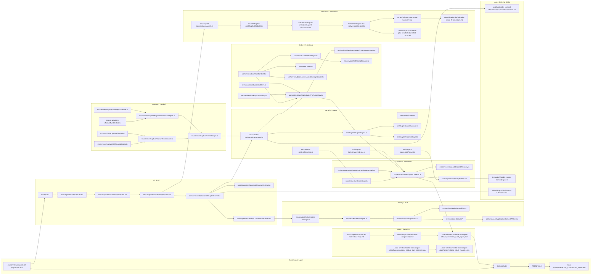

# Tool Offerer Visual Atlas (2026-06-22)

```mermaid
flowchart LR
  subgraph G1["Governance Layer"]
    G_RULES[".cursor/rules/chopdot-dot-programme.mdc"]
    G_TASKS[".knowns/tasks"]
    G_AGENTS["AGENTS.md"]
    G_SPINE[".local-private/CHOPDOT_CONCRETE_SPINE.md"]
  end

  subgraph G2["UX Shell"]
    S_APP["src/App.tsx"]
    S_ROUTER["src/components/AppRouter.tsx"]
    S_POTS["src/components/screens/PotsHome.tsx"]
    S_POT["src/components/screens/PotHome.tsx"]
    S_CHAPTER["src/components/screens/ChapterHome.tsx"]
    S_SET["src/components/screens/CloseoutReview.tsx"]
    S_WALLET["src/components/wallet/ConnectWalletSheet.tsx"]
  end

  subgraph G3["Identity + Auth"]
    I_SESSION["src/services/auth/session-manager.ts"]
    I_CHAIN["src/services/chain/adapter.ts"]
    I_POLK["src/services/chain/polkadot.ts"]
    I_CAPS["src/services/wallet/capabilities.ts"]
    I_SIGNIN["src/components/auth/*"]
    I_WALLET["src/components/polkadot/ConnectWallet.tsx"]
  end

  subgraph G4["Kernel + Chapter"]
    K_KERNEL["src/chopdot-dot/commitmentKernel.ts"]
    K_ENGINE["src/chapter/chapterEngine.ts"]
    K_CHAPTER["src/chapter/types.ts"]
    K_PARSE["src/chapter/parseExpense.ts"]
    K_REC["src/chapter/reconcileLegs.ts"]
    K_TOKEN["src/chopdot-dot/testTokenRail.ts"]
    K_COIN["src/chopdot-dot/coinageEvidence.ts"]
    K_RECEIPT["src/chopdot-dot/receiptPacket.ts"]
  end

  subgraph G5["Capture + Handoff"]
    C_LINK["src/services/capture/CaptureLinkService.ts"]
    C_BRIDGE["src/services/capture/KernelBridge.ts"]
    C_EVID["src/services/capture/PaymentEvidenceAdapter.ts"]
    C_ADAPTERS["capture adapters (Firma/Twint/Outside)"]
    C_WALLETPASS["src/services/capture/WalletPassService.ts"]
    C_QR["src/services/capture/QRPayloadCodec.ts"]
    C_HOOKS["src/hooks/useCaptureLinkFlow.ts"]
  end

  subgraph G6["Data + Persistence"]
    D_CTX["src/services/data/DataContext.tsx"]
    D_POT_REPO["src/services/data/repositories/PotRepository.ts"]
    D_EXP_REPO["src/services/data/repositories/ExpenseRepository.ts"]
    D_SUPA["Supabase sources"]
    D_LOCAL["src/services/data/sources/LocalStorageSource.ts"]
    D_SYNC["src/services/crdt/realtimeSync.ts"]
    D_BACKUP["src/services/backup/autoBackup.ts"]
    D_RECEIPT["src/services/crdt/receiptService.ts"]
    D_API["src/services/data/api/ApiClient.ts"]
  end

  subgraph G7["Closeout + Settlement"]
    CL_CALC["src/services/settlement/calc.ts"]
    CL_PVM["src/services/closeout/pvmCloseout.ts"]
    CL_RECOVERY["src/services/closeout/trackedRecovery.ts"]
    CL_VIEW["src/components/ReceiptViewer.tsx"]
    CL_DOT_UI["src/components/settlement/DotSettlementPanel.tsx"]
  end

  subgraph G8["Validation + Simulation"]
    V_SIM["src/chopdot-dot/simulationAgents.ts"]
    V_LAB["src/lab/chopdot-dot/ChopDotDotLab.tsx"]
    V_SCRIPT["scripts/run-chopdot-unscripted-agent-simulation.mjs"]
    V_TEST["tests/e2e/chopdot-dot-native-session.spec.ts"]
    V_VALIDATOR["scripts/validate-host-native-boundary.mjs"]
    V_GATE["docs/chopdot-dot/polkadot-native-99-scorecard.md"]
    V_REPORT["docs/chopdot-dot/friend-pilot-results-ledger-2026-06-20.md"]
  end

  subgraph G9["Atlas + Evidence"]
    A_TAX[".local-private/chopdot-tech-adapter-atlas/taxonomy/stack_module_card_schema.json"]
    A_MAP["docs/chopdot-dot/polkadot-adapter-map.md"]
    A_PATH["docs/chopdot-dot/capture-native-lane-map.md"]
    A_REPORT[".local-private/chopdot-tech-adapter-atlas/reports/stack_audit_report.json"]
    A_VALIDATION[".local-private/chopdot-tech-adapter-atlas/scripts/validate_stack_modules.mjs"]
  end

  subgraph G10["Labs + External Spike"]
    E_CONTRACT["scripts/polkadot-contract-lab/contracts/ChopDotEscrowVault.sol"]
    E_SPEC["tests/e2e/chopdot-escrow-atomicity.spec.ts"]
    E_HOST["docs/chopdot-dot/path-to-fully-native.md"]
  end

  S_APP --> S_ROUTER --> S_POTS --> S_POT --> S_CHAPTER
  S_CHAPTER --> S_SET
  S_CHAPTER --> S_WALLET

  S_WALLET --> I_SESSION
  I_SESSION --> I_CHAIN --> I_POLK --> I_CAPS
  I_POLK --> I_SIGNIN
  I_SIGNIN --> I_WALLET

  S_CHAPTER --> K_KERNEL
  C_LINK --> C_BRIDGE --> K_KERNEL
  C_EVID --> C_BRIDGE
  C_ADAPTERS --> C_EVID
  C_WALLETPASS --> C_EVID
  C_QR --> C_LINK
  C_HOOKS --> C_LINK

  K_KERNEL --> K_ENGINE
  K_ENGINE --> K_PARSE
  K_ENGINE --> K_REC
  K_ENGINE --> CL_PVM
  K_TOKEN --> CL_CALC
  K_COIN --> CL_PVM
  K_RECEIPT --> CL_VIEW
  K_KERNEL --> D_POT_REPO

  D_CTX --> D_POT_REPO --> D_EXP_REPO
  D_CTX --> D_SUPA
  D_CTX --> D_LOCAL
  D_CTX --> D_SYNC
  D_SYNC --> D_RECEIPT
  D_BACKUP --> D_POT_REPO
  D_API --> D_POT_REPO
  D_POT_REPO --> K_ENGINE

  CL_CALC --> CL_PVM
  CL_PVM --> CL_RECOVERY
  CL_PVM --> CL_VIEW
  CL_DOT_UI --> CL_PVM

  S_POT --> V_SIM
  V_SIM --> V_LAB
  V_LAB --> V_SCRIPT
  V_SCRIPT --> V_TEST
  V_TEST --> V_VALIDATOR
  V_VALIDATOR --> V_GATE
  V_TEST --> V_REPORT

  CL_PVM --> A_REPORT
  A_TAX --> A_VALIDATION
  A_MAP --> A_REPORT
  A_PATH --> A_MAP

  K_KERNEL --> E_CONTRACT
  CL_VIEW --> E_SPEC
  S_CHAPTER --> E_HOST

  G_RULES --> G_TASKS --> G_AGENTS --> G_SPINE
  G_RULES --> S_APP
  A_REPORT --> G_TASKS
```
