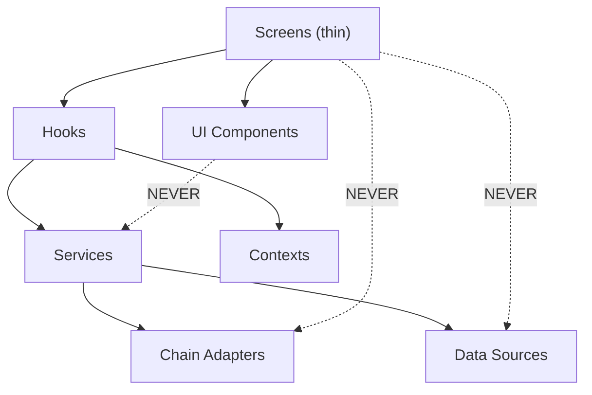

# ChopDot Modularity: Deep Review, Remediation Plan, and Prevention Strategy

---

## Part 1 -- Root-Cause Analysis: How Did We Get Here?

The codebase followed a common React anti-pattern: **screens grew into orchestrators**. Each screen started as a simple view, then accumulated:

1. **Data fetching + transformation** -- instead of hooks or services
2. **Business logic** -- settlement execution, fee estimation, balance checks inline in handlers
3. **Cross-cutting concerns** -- clipboard copy, toast feedback, haptic triggers, all duplicated per-file
4. **Layout + routing** -- `App.tsx` became a "god component" that wires 40+ actions into `AppRouter`, which itself re-shapes data in every `case` branch

The prior refactoring (extracting `useBusinessActions`, `usePotState`, `useDerivedData`, etc.) was a good start but stopped at the orchestration layer. The screen layer was left untouched, so the debt migrated downward.

**Why it kept happening (the behavioural root cause):**

- No file size limit was enforced in CI or review. A 400-line file grew to 600, then 800, then 1000 -- each PR adding 30-50 lines felt reasonable in isolation.
- No dependency direction rule existed. Screens imported chain services directly, so "just add the logic here" was always the path of least resistance.
- Decomposition was seen as a future task ("we'll refactor later") rather than a prerequisite for adding features.
- AI agents, when given a large file and asked to add a feature, default to appending to the existing file. Without explicit rules (`.cursor/rules/modularity.mdc`), they amplify the problem.

---

## Part 1b -- Gaps in the Previous Analysis

The original plan missed:

1. **SignInScreen.tsx (907 lines)** and **AuthContext.tsx (693 lines)** -- two files the developer actively works in, both over threshold. SignInScreen was partially decomposed (10 auth sub-modules exist under `src/components/auth/`) but the main file is still 907 lines, and `SignInComponents.tsx` is 545 lines -- the decomposition just shifted the bulk.
2. **Zero unit test coverage for hooks** -- only 1 of 15 hooks has a test (`useClientDevice`). Extracting logic into hooks without tests trades one problem (tangling) for another (untested shared logic).
3. **No migration safety strategy** -- "extract X into Y" with no verification gate per phase.
4. **Performance implications** -- more hooks can mean more re-renders without proper memoisation.
5. **Data layer migration collision** -- `PotHome` is mid-migration between old props and new data layer (`usePot`, `useData`).
6. **Circular dependency risk** -- splitting files without structural enforcement can create import cycles.
7. **Process/behavioural prevention** -- the root cause is partly tooling (no CI check) and partly habits (no PR size awareness).

These are now addressed in the updated plan below.

---

## Part 2 -- The 10 God Files

### 2.1 App.tsx (954 lines) -- The Orchestrator

**Problem:** 25+ distinct concerns. Owns tab logic, FAB state, overlay handlers, screen validation, layout, and passes 40+ actions to `AppRouter`.

**Extraction targets:**


| Extract to                 | What moves                                                                                                 |
| -------------------------- | ---------------------------------------------------------------------------------------------------------- |
| `useTabNavigation` hook    | `getActiveTab`, `handleTabChange`, `shouldShowTabBar`, `canSwipeBack` (lines 223-391)                      |
| `useFabState` hook         | `getFabState` -- 86-line callback with complex branching (lines 292-378)                                   |
| `useScreenValidation` hook | Screen guard/redirect effect (lines 520-597)                                                               |
| `AppLayout` component      | `SwipeableScreen` + `BottomTabBar` + `AppOverlays` composition (lines 631-749)                             |
| Collapse overlay handlers  | Move 20 event handlers into `useOverlayState` itself, returning ready-made handlers instead of raw setters |


**Net effect:** `AppContent` shrinks from ~950 to ~250 lines (context setup + hook composition + render).

---

### 2.2 AppRouter.tsx (1134 lines) -- The Routing God

**Problem:** 24-case switch with inline data transformation, business logic, and callback wiring in every branch.

**Extraction targets:**


| Extract to                                    | What moves                                                                                                                                                   |
| --------------------------------------------- | ------------------------------------------------------------------------------------------------------------------------------------------------------------ |
| Per-screen prop factory                       | Each `case` body becomes a function in `src/routing/screenProps/<screen>.ts` that takes `(data, userState, uiState, actions, flags)` and returns typed props |
| `useScreenProps` hook or `getScreenProps` map | Single dispatch that calls the correct factory, replacing the switch                                                                                         |
| Remove inline computation                     | `potSummaries`, `reMappedSettlements`, `insightsMonthlyData` become `useMemo` in their respective screens                                                    |


**Net effect:** `AppRouter` becomes a thin `<Suspense>` + lazy-component lookup (~100 lines). Each screen owns its own prop preparation.

---

### 2.3 SettleHome.tsx (1051 lines) -- Settlement God

**Problem:** Fee estimation, fiat-to-DOT conversion, transaction execution, clipboard copy, and 7 payment method forms all in one component.

**Extraction targets:**


| Extract to                                                             | What moves                                                                                                                     | Lines saved |
| ---------------------------------------------------------------------- | ------------------------------------------------------------------------------------------------------------------------------ | ----------- |
| `useFeeEstimate(from, to, amountDot, enabled)` hook                    | `estimateNetworkFee` + its effect + state (lines 178-240)                                                                      | ~70         |
| `useDotPrice(enabled)` hook                                            | Price fetch effect (lines 146-159)                                                                                             | ~15         |
| `useFiatToDot(totalFiat, dotPriceUsd)` util                            | Duplicated conversion (lines 192-196, 289-302, 313-316)                                                                        | ~30         |
| `useSettlementTx` hook                                                 | `handleConfirm` / `performSettlement` -- wallet check, balance validation, `sendDot`, toasts, `refreshBalance` (lines 257-406) | ~150        |
| `BankForm`, `PayPalForm`, `TWINTForm`, `DotSettlementPanel` components | Method-specific UI (lines 491-1000)                                                                                            | ~500        |
| Shared `copyWithToast` util                                            | 5 duplicated clipboard blocks                                                                                                  | ~50         |


**Net effect:** SettleHome becomes ~250 lines of layout, tab selection, and hook composition.

---

### 2.4 ExpensesTab.tsx (841 lines) -- Dashboard God

**Problem:** Balance calc, settlement execution, activity generation, expense grouping, and 5 UI sections in one file.

**Extraction targets:**


| Extract to                                                                               | What moves                                                                                |
| ---------------------------------------------------------------------------------------- | ----------------------------------------------------------------------------------------- |
| `usePotBalances(expenses, members, potId, baseCurrency)` hook                            | Pot schema conversion + `computeBalances` + `suggestSettlements` + budget (lines 147-213) |
| `useActivityFeed(expenses, attestations, contributions)` hook                            | Activity generation + `formatActivityTime` (lines 288-357)                                |
| `useExpenseGroups(expenses)` hook                                                        | Date grouping (lines 264-286)                                                             |
| `useSettlementTx` hook (shared with SettleHome)                                          | `handleSettleConfirm` (lines 359-384)                                                     |
| `HeroDashboard`, `SettlementSuggestions`, `RecentSettlements`, `QuickActions` components | UI sections                                                                               |


**Net effect:** ExpensesTab becomes ~200 lines of hook composition + section layout.

---

### 2.5 PotHome.tsx (940 lines) -- Data Merge God

**Extraction targets:**


| Extract to                       | What moves                                                                     |
| -------------------------------- | ------------------------------------------------------------------------------ |
| `usePotDataMerge` hook           | DL/props merge logic (lines 172-241)                                           |
| `usePotSummary` hook             | `myExpenses`, `totalExpenses`, `myShare`, budget, `quickPicks` (lines 342-412) |
| `useCheckpointState` hook        | Hash comparison, backup CID, checkpoint history (lines 283-402)                |
| `PotCheckpointSection` component | Checkpoint UI (currently disabled, lines 447-579)                              |


---

### 2.6 YouTab.tsx (868 lines) -- Settings Monolith

**Extraction targets:**


| Extract to                              | What moves                                            |
| --------------------------------------- | ----------------------------------------------------- |
| `useEmailUpdate` hook                   | Form state, validation, Supabase call (lines 116-149) |
| `usePasswordUpdate` hook                | Form state, validation, Supabase call (lines 150-203) |
| `ProfileCard` component                 | Avatar, name, action buttons (lines 204-281)          |
| `GeneralSettingsSection` component      | Currency, language, theme, brand (lines 318-410)      |
| `NotificationSettingsSection` component | Toggle rows (lines 430-434)                           |
| `SecuritySettingsSection` component     | Email/password forms, export, Crust (lines 436-531)   |
| `AdvancedSettingsSection` component     | Dev mode, clear cache, version (lines 533-578)        |


---

### 2.7 SupabaseSource.ts (986 lines) -- Data Access Monolith

**Extraction targets:**


| Extract to                                                     | What moves                                                        |
| -------------------------------------------------------------- | ----------------------------------------------------------------- |
| `supabase-auth-helper.ts`                                      | `isGuestSession`, `getOptionalUserId`, `requireAuthenticatedUser` |
| `pot-row-mapper.ts`                                            | `mapRow`, `buildMetadata`                                         |
| `expense-row-mapper.ts`                                        | `mapExpenseRow`                                                   |
| Split into `SupabasePotSource.ts` / `SupabaseExpenseSource.ts` | CRUD operations by entity                                         |


---

### 2.8 AccountMenu.tsx (741 lines) -- Wallet Connection God

**Extraction targets:**


| Extract to                         | What moves                                            |
| ---------------------------------- | ----------------------------------------------------- |
| `useExtensionConnect` hook         | Extension discovery, account selection (lines 95-205) |
| `useWalletConnectFlow` hook        | URI, QR, mobile deep links (lines 206-294)            |
| `ExtensionSelectorModal` component | Extension picker (lines 428-441)                      |
| `WalletConnectQRModal` component   | QR / mobile wallet sheet (lines 444-534)              |
| `ConnectedAccountMenu` component   | Connected state menu (lines 336-421)                  |


---

### 2.9 SignInScreen.tsx (907 lines) -- Auth Orchestrator (Partially Decomposed)

**Current state:** Already has 10 sub-modules under `src/components/auth/`:

- Hooks: `useLoginState` (89), `useWalletAuth` (221), `useEmailAuth` (210), `useThemeHandler` (98)
- Panels: `WalletLoginPanel` (228), `EmailLoginPanel` (138), `SignupPanel` (210)
- Shared: `SignInComponents` (545), `SignInThemes` (276), `AuthFooter` (65)

**Problem:** Despite the decomposition, the main file is still 907 lines because it owns all handler wiring, theme configuration dispatch, and the wallet option config array. `SignInComponents.tsx` at 545 lines is itself a god file.

**Extraction targets:**

- Move wallet option config array (`walletOptionConfigs`) into a separate `src/components/auth/wallet-options.ts` data file
- Break `SignInComponents.tsx` (545 lines) into individual components: `ChopDotMark`, `ViewModeToggle`, `LoginVariantToggle`, `WalletConnectModalToggle`
- Move the `handleWalletConnectModal` dual-chain flow (currently ~60 lines) into `useWalletAuth` where it belongs
- Move theme dispatch logic into `useThemeHandler` (it already exists but SignInScreen still does theme selection)

**Net effect:** SignInScreen shrinks to ~300 lines (layout + hook composition). SignInComponents splits into 4 focused files under 100 lines each.

---

### 2.10 AuthContext.tsx (693 lines) -- Auth State Monolith

**Problem:** Contains user mapping, session management, 6 login methods, OAuth redirect handling, wallet auth verification, profile upsert, token refresh, and logout -- all in one context.

**Extraction targets:**

- `mapSupabaseSessionUser` is a pure function (lines 33-68) -- move to `src/utils/auth-mapping.ts`
- `loginWithWallet` logic (signature verification via edge function) -- move to `src/services/auth/wallet-login.ts`
- `loginWithOAuth` + `handleOAuthCallback` -- move to `src/services/auth/oauth-login.ts`
- `loginAsGuest` (anonymous sign-in) -- move to `src/services/auth/guest-login.ts`
- Session listener + token refresh -- move to `src/services/auth/session-manager.ts`

**Net effect:** AuthContext becomes a thin provider (~200 lines) that composes auth services and exposes state + actions.

---

## Part 3 -- Cross-Cutting Deduplication

### 3.1 Clipboard (22+ call sites, 18 files, zero shared helper)

Create `src/utils/clipboard.ts`:

```typescript
export async function copyWithToast(
  text: string,
  successMessage: string,
  showToast: (msg: string) => void
): Promise<void> {
  try {
    await navigator.clipboard.writeText(text);
    showToast(successMessage);
    triggerHaptic('light');
  } catch {
    showToast('Failed to copy');
  }
}
```

### 3.2 Settlement Execution (duplicated in SettleHome + ExpensesTab)

Create `src/hooks/useSettlementTx.ts`:

```typescript
interface UseSettlementTxParams {
  account: AccountState;
  showToast: ShowToastFn;
  onSuccess?: () => void;
}

export function useSettlementTx(params: UseSettlementTxParams) {
  return useCallback(async (settlement: SettlementRequest) => {
    // wallet check, balance validation, sendDot/sendUsdc,
    // pushTxToast, refreshBalance, PotHistory creation
  }, [params]);
}
```

### 3.3 Fee Estimation (duplicated in SettleHome + SettlementConfirmModal)

Create `src/hooks/useFeeEstimate.ts` wrapping `chain.estimateFee` + DOT price + fiat conversion.

### 3.4 DOT Price (direct call in SettleHome vs currencyService)

Standardise on `currencyService.getDotPriceInFiat` everywhere. Remove direct `getDotPrice` calls from components.

### 3.5 Relative Time Formatting (duplicated in ExpensesTab + elsewhere)

Create `src/utils/formatRelativeTime.ts`.

---

## Part 4 -- Guardrails to Prevent Regression

### 4.1 File Size Lint Rule

Add an ESLint rule (or a simple CI script) that fails when any `.tsx` or `.ts` file exceeds 400 lines:

```bash
# scripts/check-file-size.sh
find src -name '*.ts' -o -name '*.tsx' | while read f; do
  lines=$(wc -l < "$f")
  if [ "$lines" -gt 400 ]; then
    echo "FAIL: $f has $lines lines (max 400)"
    exit 1
  fi
done
```

Add to `package.json` scripts and CI pipeline.

### 4.2 Component Responsibility Rule in `.cursor/rules/modularity.mdc`

A rule file agents will read before modifying any component:

```
---
description: Modularity guardrails for all components and hooks
globs: src/components/**/*.tsx, src/hooks/**/*.ts
---

## File Size
- Max 400 lines per file. If approaching, extract before adding.

## Single Responsibility
- A component renders UI. It does not call chain services, build transactions, or compute settlements.
- A hook manages one concern: one data fetch, one piece of state, or one side effect.
- Business logic (settlement, fee estimation, balance calc) lives in hooks or services, never inline in JSX.

## Cross-Cutting Concerns
- Clipboard: use `copyWithToast` from `utils/clipboard.ts`
- Toasts: use `useTxToasts` or `showToast` from context
- Haptics: use `triggerHaptic` (already centralised)

## New Features
- Every new chain/payment/settlement feature MUST be implemented as a hook + thin component, not added to an existing screen.
```

### 4.3 PR and Process Guardrails

- **PR size awareness:** Any PR that touches a file already over 300 lines should include a comment explaining why it's not being split. This is a human/agent habit, not a hard gate.
- **"Extract before extend" rule:** Before adding a new feature to a file over 300 lines, extract an existing concern first. This keeps the line count stable or shrinking.
- **One extraction = one PR:** Each phase should land as a separate branch/PR so regressions are isolated to that phase.

### 4.4 Architectural Decision Records

Add a lightweight ADR in `docs/adr/` for each significant extraction, so future developers (and agents) understand *why* the boundary exists.

### 4.5 Circular Dependency Detection

Add `madge` (or a simple script) to CI that detects circular imports:

```bash
npx madge --circular --extensions ts,tsx src/
```

This catches the most common side-effect of file splitting: A imports B, B imports A.

### 4.6 Dependency Direction Enforcement

Establish and document the dependency DAG:




**Rule:** Screens never import from `services/chain/`* or `services/data/`* directly. They go through hooks.

---

## Part 5 -- Benefits

### 5.1 Developer Velocity

- **Smaller files load faster** in editors and AI context windows. A 400-line file fits entirely in context; a 1000-line file forces fragmented reads and missed connections.
- **Parallel work** becomes possible. Two developers (or agents) can modify `BankForm` and `DotSettlementPanel` without merge conflicts in a 1000-line `SettleHome`.
- **Code review quality** improves. Reviewing a 50-line hook is 10x faster than reviewing the same logic buried in a 1000-line screen.

### 5.2 Testability

- Extracted hooks like `useSettlementTx` and `useFeeEstimate` can be unit-tested with mock chain services. Currently, testing settlement logic requires rendering the entire `SettleHome` screen.
- Pure utilities (`copyWithToast`, `formatRelativeTime`, `fiatToDot`) get trivial unit tests.
- Integration tests narrow: instead of testing "click Confirm in SettleHome and verify the chain call", you test the hook directly.
- **Current gap:** Only 1 of 15 hooks has a unit test. This plan requires writing tests alongside each extraction (not after).

### 5.3 Roadmap Unblocking

- **Batch settlement** (Utility.batchAll) needs to replace the single `sendDot` call. With `useSettlementTx` extracted, this is a single-file change. Without it, you modify `SettleHome` AND `ExpensesTab` AND risk breaking both.
- **Fee abstraction** (AssetTxPayment) changes fee estimation. With `useFeeEstimate` extracted, one hook update propagates everywhere. Without it, you update `SettleHome` and hope `SettlementConfirmModal` stays in sync.
- **XCM settlement** adds a new settlement path. With extracted hooks, it's a new hook variant. Without extraction, it's more branches in an already 1000-line file.

### 5.4 Bug Isolation

- The conversation history shows a pattern: login redirect bugs, wallet connection issues, and settlement failures were hard to diagnose because the logic was entangled with rendering. Extracted hooks have clear input/output boundaries that make debugging deterministic.

### 5.5 Agent Effectiveness

- AI agents work best with small, focused files. A 400-line file fits entirely in a single context read. A 1000-line file requires multiple reads, increasing the chance of missed dependencies and incorrect edits.
- The `.cursor/rules/modularity.mdc` file will proactively prevent agents from re-growing files.

---

### 5.6 Performance Safety

- More hooks does NOT mean more re-renders if done correctly:
  - Extracted hooks that return stable references (via `useMemo`/`useCallback`) prevent child re-renders.
  - Extracted components wrapped in `React.memo` only re-render when their props change.
  - Splitting large contexts (like `AuthContext`) into separate providers (auth state vs auth actions) eliminates cascade re-renders where a state change in one area triggers re-renders in all consumers.
- **Risk:** Naive extraction (hook returns a new object every render) makes performance worse. Each extracted hook MUST return memoised values.

### 5.7 Data Layer Alignment

- `PotHome` is mid-migration between legacy props and the new data layer (`usePot`, `useData`). Modularisation should accelerate this:
  - The `usePotDataMerge` hook becomes the single migration seam. Once the data layer is complete, this hook shrinks to just calling `usePot` -- the screens don't change.
  - Same pattern for `ExpensesTab`: `usePotBalances` wraps the data layer, so switching from prop-driven to DL-driven is a hook-internal change.

---

## Part 6 -- Execution Order (Prioritised by Roadmap Impact)

### Phase 0: Guardrails First (do this before any extraction)

**Rationale:** Guardrails prevent the problem from recurring during the refactor itself.

- Add `scripts/check-file-size.sh` + wire into `package.json` `"lint:size"` script
- Create `.cursor/rules/modularity.mdc` with file size limit, single responsibility, dependency direction rules
- Install `madge` and add `"lint:circular": "npx madge --circular --extensions ts,tsx src/"` script
- **Verify:** Run both scripts on the current codebase. They will report existing violations (expected). Baseline is documented.

### Phase 1: Cross-Cutting Utilities (low risk, high reuse)

- `src/utils/clipboard.ts` -- `copyWithToast`
- `src/utils/formatRelativeTime.ts`
- `src/utils/fiatToDot.ts`
- **Tests:** Unit tests for all three utilities (pure functions, trivial to test)
- **Migration:** Replace 22+ clipboard call sites across 18 files. Each replacement is mechanical (search-replace pattern).
- **Verify:** `npx tsc --noEmit && npm run build && npx vitest run`

### Phase 2: Settlement Hooks (unblocks batch settlement + fee abstraction)

- `src/hooks/useSettlementTx.ts` -- shared by SettleHome + ExpensesTab
- `src/hooks/useFeeEstimate.ts` -- shared by SettleHome + SettlementConfirmModal
- `src/hooks/useDotPrice.ts`
- **Tests:** Hook tests using `@testing-library/react-hooks` with mocked chain services
- **Performance:** All return values wrapped in `useMemo`/`useCallback`
- **Verify:** `npx tsc --noEmit && npm run build && npx vitest run && npx playwright test`

### Phase 3: SettleHome Decomposition (largest file on critical path)

- Extract `BankForm`, `PayPalForm`, `TWINTForm`, `DotSettlementPanel` components
- Wire to new hooks from Phase 2
- Wrap extracted components in `React.memo` where they receive stable props
- **Verify:** `SettleHome.tsx` < 300 lines. E2E: settlement flow still works. `npx playwright test`

### Phase 4: ExpensesTab Decomposition

- `usePotBalances`, `useActivityFeed`, `useExpenseGroups` hooks
- `HeroDashboard`, `SettlementSuggestions`, `RecentSettlements` components
- **Tests:** Hook tests for balance calculation and activity feed generation
- **Verify:** `ExpensesTab.tsx` < 250 lines. E2E: expenses tab renders, settlement suggestions appear.

### Phase 5: App.tsx + AppRouter Decomposition

- `useTabNavigation`, `useFabState`, `useScreenValidation` hooks
- `AppLayout` component
- Per-screen prop factories for AppRouter (under `src/routing/screen-props/`)
- **Verify:** `App.tsx` < 300 lines, `AppRouter.tsx` < 150 lines. Full E2E suite passes.

### Phase 6: SignInScreen + AuthContext (finish partial decomposition)

- Move `handleWalletConnectModal` into `useWalletAuth`
- Break `SignInComponents.tsx` (545 lines) into individual component files
- Move wallet option config into data file
- Split AuthContext: extract `mapSupabaseSessionUser`, wallet login, OAuth login, guest login, session manager into services
- **Verify:** `SignInScreen.tsx` < 300 lines, `AuthContext.tsx` < 250 lines, `SignInComponents.tsx` deleted. Login E2E passes.

### Phase 7: Remaining Files

- PotHome: `usePotDataMerge`, `usePotSummary` (align with data layer migration)
- YouTab: Section components + form hooks (`useEmailUpdate`, `usePasswordUpdate`)
- AccountMenu: Connection hooks + modal components
- SupabaseSource: Split by entity (pot, expense, auth helper, row mappers)
- **Verify:** All files < 400 lines. Full E2E suite passes.

### Phase 8: Dependency Audit + ADRs

- Run `npx madge --circular --extensions ts,tsx src/` -- fix any cycles introduced during extraction
- Write ADRs for key boundaries (why hooks don't call other hooks, why screens don't import chain services)
- Update `AGENTS.md` and `COMPONENT_CATALOG.md` to reflect new structure
- Document the dependency DAG in `.cursor/rules/modularity.mdc`
- **Final verify:** `npx tsc --noEmit && npm run build && npx vitest run && npx playwright test && npm run lint:size && npm run lint:circular`
