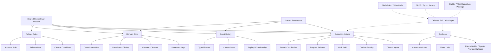
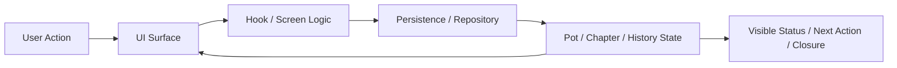

# Tech Architecture Map

## Purpose

This file maps the shared commitment thesis onto the actual ChopDot system shape.

The goal is to make it obvious:

- what the product core is
- what the current implementation base is
- what layers are active now
- what layers are future-facing
- where complexity should stay out for now

## High-level map

## Current implementation mapping

## Active now

These are the layers that should be active in the current implementation pass:

| Layer | Current reality | What to do now |
| --- | --- | --- |
| Domain core | implemented through `Pot` and related state | keep `Pot` as base, restore commitment semantics on top |
| Chapter / closeout | currently overcut on `mvp` | restore typed lifecycle and settlement legs |
| Policy / rules | lightweight and partly implicit | make release/closure conditions explicit enough for the loop |
| Event history | currently degraded on `mvp` | restore typed append-only history |
| Execution actions | partly stubbed on `mvp` | make mark-paid / confirm / close durable and real |
| Web surface | current app shell exists | keep shell, change product meaning and state exposure |

## Deferred now

These should remain deferred:

| Layer | Why deferred |
| --- | --- |
| Blockchain settlement rails | rail complexity, not current proof |
| Wallet orchestration | not needed to prove commitment semantics |
| CRDT / Automerge / IPFS | sync and backup complexity before core truth is stable |
| Builder APIs | builder packaging comes after internal validation |
| Agent execution | agents should not own money movement now |
| Deep provider integrations | category expansion before kernel proof |

## Current data flow

The current intended flow should be:

## Current UI mapping

| Current app area | Shared commitment meaning |
| --- | --- |
| Create Pot | Create Commitment |
| Pot Home | Commitment summary and current state |
| Expenses area | Obligation or contribution input |
| Members tab | Participants, roles, blockers |
| Settle flow | Chapter / closeout flow |
| Settlement history | Commitment history |
| Settings | Policy surface |

## Architecture rule

Use this rule for every design and code decision:

- keep the product opinionated at the commitment layer
- keep the rails replaceable
- keep the history typed
- keep the UI honest

## What success looks like

The architecture is clear enough when Teddy and the founder can both answer:

- what is the core object
- what is the current implementation base
- what actions move the loop forward
- what state explains the current status
- what layers are active now
- what layers are intentionally deferred
