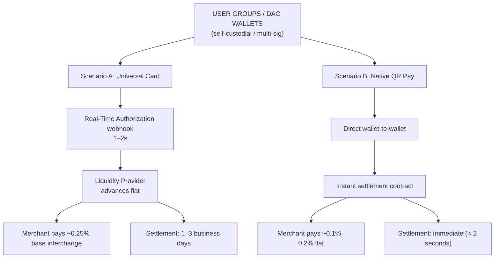
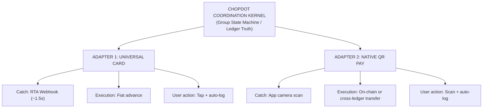

# ChopDot 10x GTM Vision

**Status:** Comprehensive reference draft (full version)  
**Date:** 2026-06-25  
**Scope:** Product strategy, architecture framing, launch sequencing, and commercialization pathway

This document is the single source for the 10x commercial and product thesis you can use to compare against long-term execution plans.

## Quick Summary

Use this as your master reference entrypoint.

### Current state

- **Vision maturity:** 5.5/10
- **Product posture:** core capture/confirmation loop exists and is being hardened.
- **Largest unresolved blockers:** live universal-card RTA integration, full native merchant QR production loop, and security/docs-to-product alignment with screenshot-backed verification.

### How to navigate this document fast

- **What are we building?**: read _Phase 1_ and _Part 20_.
- **How does it work?**: read _Phase 2_, _Process A/B_, _Part 1_, _Part 3_, _Part 4_, _Part 8_.
- **How should users experience it?**: read _Part 5_, _Product Execution Principles_, and _Part 17_.
- **What must be true to ship?**: read _Part 18_, _Part 19_, and _Part 16_.
- **Go-to-market & commercial proof:** read _Part 7_, _Part 6_, _Part 15_.
- **Compliance & risk:** read _Part 9_, _Part 10_, _Part 11_, _Part 12_, _Part 13_, and _Part 14_.

### One-page checklist by person

- **Product team:** run through _Part 3/6/7_, then close items from _Part 19_.
- **Engineers:** implement and harden from _Part 1/3/8/10/11_, validate via CI/test artifacts.
- **Founders:** build the value case from _Phase 1_, _Part 7_, _Part 15_, _Part 16_, _Part 17_.
- **Legal/ops:** align using _Part 9_, _Part 10_, _Part 12_.

## Section Index

1. [Part 1: Core State Transitions of the ChopDot Kernel](#part-1-core-state-transitions-of-the-chopdot-kernel)
2. [Part 2: PRD — Card Issuer Adapter](#part-2-product-requirements-document-prd--card-issuer-adapter)
3. [Part 3: Developer Setup Guide — Simulating the 1.5-Second RTA Loop](#part-3-developer-setup-guide--simulating-the-15-second-rta-loop)
4. [Part 4: Relational Database Schema Architecture](#part-4-relational-database-schema-architecture)
5. [Part 5: Mobile UI Screens & User Flows](#part-5-mobile-ui-screens--user-flows)
6. [Part 6: Launch Budget Matrix & Operational Costs](#part-6-launch-budget-matrix--operational-costs)
7. [Part 7: Investor Pitch Deck Script](#part-7-investor-pitch-deck-script)
8. [Part 8: Smart Contract Technical Specifications](#part-8-smart-contract-technical-specifications)
9. [Part 9: User Terms of Service (ToS) Compliance Outline](#part-9-user-terms-of-service-tos-compliance-outline)
10. [Part 10: Webhook API Security Protocol](#part-10-webhook-api-security-protocol)
11. [Part 11: Automated API Security Testing Suite](#part-11-automated-api-security-testing-suite)
12. [Part 12: Customer Support Scripts for Core Edge Cases](#part-12-customer-support-scripts-for-core-edge-cases)
13. [Part 13: GitHub Actions CI/CD Pipeline Security Gate](#part-13-github-actions-cicd-pipeline-security-gate)
14. [Part 14: Merchant API Onboarding Documentation](#part-14-merchant-api-onboarding-documentation-b2b_qr_integrationmd)
15. [Part 15: Internal Milestone Schedule (6-Month Sprint Allocation)](#part-15-internal-milestone-schedule-6-month-sprint-allocation)
16. [Part 16: Seed Fundraising Tracker](#part-16-seed-fundraising-tracker)
17. [Part 17: Net-Positive Exchange Checklist](#part-17-net-positive-exchange-checklist-why-this-is-a-no-brainer)
18. [Part 18: Conformance Matrix (Vision vs Current ChopDot Setup)](#part-18-conformance-matrix-vision--current-chopdot-setup)
19. [Part 19: What to do to move from 5.5/10 to 8/10](#part-19-what-to-do-to-move-from-55-10-to-8-10)
20. [Part 20: Unified Framework Integration](#part-20-unified-framework-integration-final-consolidation)
21. [Part 21: Multi-Surface Omnipresent Architecture](#part-21-multi-surface-omnipresent-architecture)
22. [Part 22: Unified API Payload Routing Specification](#part-22-unified-api-payload-routing-specification)
23. [Part 23: Cross-Chain Smart Contract Migration Guide](#part-23-cross-chain-smart-contract-migration-guide)
24. [Part 24: Growth & User Acquisition Playbook](#part-24-growth--user-acquisition-playbook)
25. [Part 25: Full System Blueprint Summary](#part-25-full-system-blueprint-summary)
26. [Part 26: Institutional Seed Round Term Sheet Checklist](#part-26-institutional-seed-round-term-sheet-checklist)
27. [Part 27: Core Dashboard Analytics Architecture](#part-27-core-dashboard-analytics-architecture)
28. [Original positioning anchors for comparison](#original-positioning-anchors-for-comparison)

### Suggested read sequences

- **First-read (2 min):** [Quick Summary](#quick-summary) → [Part 20](#part-20-unified-framework-integration-final-consolidation) → [Phase 1](#phase-1-core-strategy-the-10x-disruption)
- **Product pass (10 min):** [Part 20](#part-20-unified-framework-integration-final-consolidation) → [Part 1](#part-1-core-state-transitions-of-the-chopdot-kernel) → [Part 5](#part-5-mobile-ui-screens--user-flows) → [Part 17](#part-17-net-positive-exchange-checklist-why-this-is-a-no-brainer)
- **Engineering pass (10–15 min):** [Part 1](#part-1-core-state-transitions-of-the-chopdot-kernel) → [Part 3](#part-3-developer-setup-guide--simulating-the-15-second-rta-loop) → [Part 8](#part-8-smart-contract-technical-specifications) → [Part 10](#part-10-webhook-api-security-protocol) → [Part 11](#part-11-automated-api-security-testing-suite) → [Part 13](#part-13-github-actions-cicd-pipeline-security-gate)
- **Shipping-readiness pass (5 min):** [Part 18](#part-18-conformance-matrix-vision--current-chopdot-setup) → [Part 19](#part-19-what-to-do-to-move-from-55-10-to-8-10) → [Part 17](#part-17-net-positive-exchange-checklist-why-this-is-a-no-brainer)
- **Commercial pass (8 min):** [Part 7](#part-7-investor-pitch-deck-script) → [Part 6](#part-6-launch-budget-matrix--operational-costs) → [Part 15](#part-15-internal-milestone-schedule-6-month-sprint-allocation) → [Part 16](#part-16-seed-fundraising-tracker)
- **Fundraising pass (4 min):** [Part 26](#part-26-institutional-seed-round-term-sheet-checklist) → [Part 27](#part-27-core-dashboard-analytics-architecture)
- **Multi-surface execution pass (8 min):** [Part 21](#part-21-multi-surface-omnipresent-architecture) → [Part 22](#part-22-unified-api-payload-routing-specification)
- **Growth pass (6 min):** [Part 24](#part-24-growth--user-acquisition-playbook)
- **Strategy completion pass (1 min):** [Part 25](#part-25-full-system-blueprint-summary)

---

## Phase 1: Core Strategy (The 10x Disruption)

ChopDot is a high-friction-to-trust product for peer-to-peer and group commerce.

### Consumer thesis: The Splitwise killer
We remove expense homework:
- no manual typing at checkout,
- no late-night debt archaeology,
- no unclear “who paid what” status.

The flow becomes: `capture transaction -> split automatically -> collect -> confirm -> close`.

### Merchant thesis: The TWINT killer
We reduce payment friction and margin leakage by shifting the heavy transaction plumbing out of the expensive legacy rails where possible, while preserving clear user experience:
- Faster settlement where possible,
- clearer group-pay mechanics,
- fewer disputes from unclear group obligations.

---

## Phase 2: System Architecture Map

> The architecture is a map of capabilities, not user copy.



### Scenario A: Universal Card
- Any global Visa/Mastercard-like terminal path.
- Card network/issuer sends transaction details quickly.
- Core value: automatic capture and split orchestration from a known group context.

### Scenario B: Native QR Pay
- Works at partnered merchant rails.
- Core value: direct settlement path and fast payout timing.

## Foundational Framework Addendum: Coordination Kernel + Invisible Adapters

The strategic framing is: **ChopDot is a coordination state machine, not a crypto wallet product**.

- User value sits in the app’s coordination loop.
- Card and QR infrastructure are adapters that reduce friction, not the public narrative.
- This keeps the product safe from “tech branding” while still allowing advanced rails underneath.



### User outcome of this framework

- The card flow captures a spend without manual intervention: one tap at checkout can auto-log to the active group, then pushes clear personal next actions to members.
- The QR flow captures the bill context at the table and shows immediate group actions before checkout completion pressure.
- In both cases, the user-facing truth remains: who owes, who paid, who confirmed, what is open.

### Why this is now defensible for founders

- The platform’s biggest unresolved failure mode becomes “forgot to log,” not “which blockchain did we use.”
- A recurring group can drive merchant conversion:
  - capture interchange-like value through group activity,
  - open Native QR path conversations for selected merchants,
  - convert users into a repeat venue loop.
- The pitch from the product perspective is still trust and clarity, while the infrastructure strategy enables lower settlement cost over time.

### Why this is clean for engineers

- The card path runs the `Catch -> Decision -> Continue` check in the kernel.
- Asynchronous settlement can happen after user authorization and handoff.
- Adapter changes do not break the user flow if kernel states (`paid`, `confirmed`, `needs review`, `closed`) remain consistent.

### Updated one-liner summaries

- To users: “Spend together. Tap your card or scan a QR, then the group sees each person’s next action and can close with a clear record.”
- To techies: “ChopDot is a coordination kernel with pluggable RTA and QR settlement adapters.”
- To founders: “ChopDot monetizes trust and coordination at group scale while making card and settlement rails optional infrastructure upgrades.”

---

## Phase 3: Step-by-Step Transaction Processes

## Process A: Universal Card Flow (Zero-custody-first capture model)

1. **The Spend**
   - A group member uses a physical/virtual card at merchant checkout.
2. **The Interception**
   - Issuer sends an authorization payload with price, location, MCC.
3. **The Ledger Check**
   - App checks the group wallet/ledger policy before continuing.
4. **Advance + Settlement**
   - Liquidity Provider advances fiat to merchant.
   - App triggers settlement logic to release stablecoin/cash-equivalent value from shared group logic according to the group's rules.
5. **Split Completion**
   - Individual payer obligations and confirmations remain explicit.
6. **Closeout**
   - Group item moves to close state only after required statuses are satisfied or annotated.

## Process B: Native QR Code Flow (Partnered merchant path)

1. **The Scan**
   - User scans dynamic QR at merchant.
2. **The Automation**
   - App reads merchant/payment target and bill total.
   - Split is calculated from group rule and active members.
3. **The Execution**
   - One-action payment handoff or transfer path per payer.
4. **The Payout**
  - Merchant receives funds through dedicated fast settlement path.
5. **The Trust Record**
  - Group sees completed/reviewable payment statuses and closeout readiness.

---

## Part 1: Core State Transitions of the ChopDot Kernel

The ChopDot Kernel treats every expense as a state machine and keeps user-facing truth independent from settlement timing.

```text
[ 1. SWIPE / SCAN ] ────► [ 2. PENDING_APPROVAL ] ────► [ 3. ACTIVE_SPLIT ]
  • Webhook captured        • Kernel auto-approves      • Members notified
  • Ledger event created     • LP advances fiat          • Next action is visible
                                                       │
                                                       ▼
[ 5. CLOSED / SETTLED ] ◄─── [ 4. CONFIRMED ] ◄────────── [ ACKNOWLEDGED ]
  • On-chain execution       • All conditions met        • Group confirms
  • Immutable record saved    • Trigger settlement        • Share can be accepted or disputed
```

### Core State Transition Logic

#### State 1: UNINITIALIZED → PENDING_APPROVAL

Trigger event: cardholder taps a white-label card or scans a Native QR code.  
Kernel ingestion: the webhook or scan payload is parsed.

```json
{
  "transaction_id": "tx_987654321",
  "amount": 45.5,
  "currency": "CHF",
  "merchant_name": "Coop Bahnhofbrücke",
  "mcc": "5411",
  "card_id": "card_user_001"
}
```

Kernel evaluation:

- map `card_user_001` to the active group
- check off-chain cache for group allocation / collateral / wallet readiness
- enforce a ≤ 1.5s decision window

Action:

- return `APPROVED`/`DECLINE` to issuer where applicable
- proceed to next state on approval

#### State 2: PENDING_APPROVAL → ACTIVE_SPLIT

Trigger event: LP fiat advance is confirmed (or equivalent payment intent confirmation).

Kernel evaluation:

- payment confidence is established for the checkout
- coordination entry is promoted into active split state

Action:

- broadcast member notifications
- render split with one obvious next action per member

#### State 3: ACTIVE_SPLIT → ACKNOWLEDGED

Trigger event: members review the generated split.

Kernel evaluation:

- a clear action is presented (`Confirm Share: CHF 15.16` or equivalent)
- members can only confirm their own share
- disputes are allowed as a scoped sub-state without locking the full ledger

Action:

- set member-level `ACKNOWLEDGED`
- if disputed, set member-level `DISPUTED` and open an isolated exception path

#### State 4: ACKNOWLEDGED → CONFIRMED

Trigger event: all active participants are acknowledged or resolved.

Kernel evaluation:

- split sum must match ingested amount
- required members and approvals are satisfied

Action:

- lock manual edits
- prepare settlement payload for adapter layer

#### State 5: CONFIRMED → CLOSED

Trigger event: settlement execution success.

Kernel evaluation:

- adapter signs and executes settlement transfer
- verify receipt reference and status

Action:

- mark immutable closed state
- compile and store human-readable record in the group archive

---

## Part 2: Product Requirements Document (PRD) — Card Issuer Adapter

## 1. Document Overview

This PRD defines requirements for the Universal Card Adapter using European white-label BaaS and card-issuing rails. Primary target: Wallester or equivalent provider with equivalent RTA capabilities.

## 2. Core Functional Requirements

### 2.1 Virtual & Physical Card Issuance

- issue branded virtual cards instantly after user verification
- support physical card ordering via API with EU/CH address routing
- support Apple Pay and Google Wallet onboarding and configuration

### 2.2 Real-Time Authorization (RTA) Engine

- support synchronous JIT authorization webhooks
- hold transaction and query ChopDot on authorization request
- return structured APPROVE / DECLINE within 1500ms

### 2.3 Multi-Currency & Cross-Border Processing

- natively support CHF, EUR, USD at launch
- provide transparent FX behavior and anti-excessive markup monitoring
- report program-level economics (including interchange share targets) by day

## 3. Core API Architecture & JSON Specifications

### 3.1 Inbound RTA Webhook From Issuer

```json
{
  "event_type": "transaction.authorization_request",
  "timestamp": "2026-06-25T12:20:00Z",
  "data": {
    "auth_id": "auth_ch_102938",
    "card_token": "tok_wallester_882911",
    "user_id": "usr_7732_luca",
    "amount": {
      "transaction_amount": 120,
      "transaction_currency": "CHF",
      "billing_amount": 120,
      "billing_currency": "CHF"
    },
    "merchant": {
      "name": "Migros Restaurant",
      "city": "Zurich",
      "country": "CH",
      "mcc": "5812"
    }
  }
}
```

### 3.2 Outbound Authorization Response From ChopDot

```json
{
  "auth_id": "auth_ch_102938",
  "response_code": "APPROVED",
  "funding_source": {
    "type": "jit_balance_confirmed",
    "ledger_group_id": "grp_weekend_cabin_2026"
  },
  "custom_metadata": {
    "auto_split_strategy": "equal_distribution",
    "active_member_count": 4
  }
}
```

## 4. Compliance & Sandbox Constraints

### 4.1 Regulatory Umbrella Model

- ChopDot acts as program manager under the partner's regulatory umbrella.
- issuer partner provides card network participation, BIN sponsorship, KYC/AML operations, and FINMA/MiCA alignment scope.
- this posture minimizes direct in-house card issuance regulatory load in first versions.

### 4.2 Minimum Viable Sandbox Criteria

- inject webhook payloads for CHF/EUR/USD test paths
- simulate timeout paths beyond 1500ms and validate safe default behavior
- simulate decline path when collateral/balance checks fail
- verify all settlement decisions leave a stable user-facing trail

### What to Action Next

- validate this model in sandbox with a real issuer partner and provide a partner-specific adapter spec addendum before development sign-off.

---

## Part 3: Developer Setup Guide — Simulating the 1.5-Second RTA Loop

To build a working prototype without waiting on commercial card-issuing approvals, you can simulate the full Real-Time Authorization (RTA) flow locally with Node.js, TypeScript, and Ngrok.

```text
[Simulated Visa Network] ──(HTTP POST)──► [Ngrok Tunnel] ──► [Local Express Server]
          ▲                                                         │
          │                                                (Kernel Evaluation)
          └─────────────(JSON HTTP Response < 1500ms)───────────────┘
```

### Step 1: Set Up the Project Environment

```bash
mkdir chopdot-kernel-simulation
cd chopdot-kernel-simulation
npm init -y
npm install express dotenv bignumber.js
npm install --save-dev typescript @types/express @types/node ts-node
npx tsc --init
```

### Step 2: Write the ChopDot Kernel Simulator (`server.ts`)

```ts
import express, { Request, Response } from "express";
import BigNumber from "bignumber.js";
import dotenv from "dotenv";

dotenv.config();
const app = express();
app.use(express.json());
const PORT = process.env.PORT || 3000;

interface GroupLedger {
  id: string;
  name: string;
  mockStablecoinBalance: BigNumber;
  activeMembers: string[];
}

const mockGroupDb: Record<string, GroupLedger> = {
  grp_weekend_cabin_2026: {
    id: "grp_weekend_cabin_2026",
    name: "Weekend Cabin Trip",
    mockStablecoinBalance: new BigNumber("500.00"),
    activeMembers: ["usr_luca", "usr_sarah", "usr_jack"],
  },
};

app.post("/v1/rta/authorize", async (req: Request, res: Response) => {
  const startTime = Date.now();
  const payload = req.body;

  console.log(`\n[RTA INBOUND] Received swipe at: ${payload.data.merchant.name}`);

  const targetGroupId = "grp_weekend_cabin_2026";
  const group = mockGroupDb[targetGroupId];
  const txAmount = new BigNumber(payload.data.amount.transaction_amount);

  if (!group || group.mockStablecoinBalance.isLessThan(txAmount)) {
    console.log(`[RTA DECISION] DECLINED - Insufficient group funds.`);
    return res.status(200).json({
      auth_id: payload.data.auth_id,
      response_code: "DECLINED",
      reason: "INSUFFICIENT_COLLATERAL",
    });
  }

  group.mockStablecoinBalance = group.mockStablecoinBalance.minus(txAmount);

  const processingTime = Date.now() - startTime;
  console.log(`[RTA DECISION] APPROVED in ${processingTime}ms. Card terminal unlocked.`);

  res.status(200).json({
    auth_id: payload.data.auth_id,
    response_code: "APPROVED",
    funding_source: {
      type: "jit_balance_confirmed",
      ledger_group_id: targetGroupId,
    },
  });

  setImmediate(async () => {
    try {
      await triggerAsynchronousHandoff(payload, targetGroupId, txAmount);
    } catch (error) {
      console.error("[BACKGROUND ERROR] Failed to settle transaction:", error);
    }
  });
});

async function triggerAsynchronousHandoff(payload: any, groupId: string, amount: BigNumber) {
  console.log(`[KERNEL STATE] Transitioning transaction to ACTIVE_SPLIT...`);

  await new Promise((resolve) => setTimeout(resolve, 4000));

  const splitPerPerson = amount.dividedBy(3).toFixed(2);
  console.log(`[WEB3 PLUGGABLE RAILS] Background Settlement Triggered!`);
  console.log(` -> Pulled ${splitPerPerson} USDC from each member's smart contract wallet adapter.`);
  console.log(` -> Settled with Liquidity Provider. Expense state changed to CLOSED.`);
}

app.listen(PORT, () => {
  console.log(`ChopDot Kernel Engine simulation running on port ${PORT}`);
});
```

### Step 3: Run the Tunnel and Network Test

1. Run your TypeScript server:

```bash
npx ts-node server.ts
```

2. In a separate terminal, expose port 3000:

```bash
ngrok http 3000
```

3. Copy your secure `https://...ngrok-free.app` URL.
4. Execute a mock authorization request:

```bash
curl -X POST https://YOUR_NGROK_SUBDOMAIN.ngrok-free.app/v1/rta/authorize \
  -H "Content-Type: application/json" \
  -d '{
    "event_type": "transaction.authorization_request",
    "data": {
      "auth_id": "auth_sim_7712",
      "card_token": "tok_test_card",
      "amount": { "transaction_amount": 45.50, "transaction_currency": "CHF" },
      "merchant": { "name": "Coop Supermarket", "mcc": "5411" }
    }
  }'
```

5. Confirm:

- instant response under 1500ms
- asynchronous background handoff logs for split + settlement path

---

## Part 4: Relational Database Schema Architecture

This schema tracks groups, users, card adapters, and transaction states while keeping rails pluggable.

```text
 [ USERS ] ───◄ [ GROUP_MEMBERS ] ►─── [ GROUPS ]
    │                                     │
    ├───► [ CARD_ADAPTERS ]               ├───► [ EXPENSES ]
    │                                              │
    └───► [ WALLET_ADAPTERS ]                      └───► [ EXPENSE_SPLITS ]
```

### Table: users

| Column Name | Data Type | Constraints | Description |
|---|---|---|---|
| id | VARCHAR(64) | PRIMARY KEY | Unique identifier (e.g., `usr_luca`). |
| email | VARCHAR(255) | UNIQUE, NOT NULL | User's authenticated email. |
| created_at | TIMESTAMP | DEFAULT NOW() | System signup date. |

### Table: groups

| Column Name | Data Type | Constraints | Description |
|---|---|---|---|
| id | VARCHAR(64) | PRIMARY KEY | Unique identifier (e.g., `grp_weekend_2026`). |
| name | VARCHAR(128) | NOT NULL | Group context name (trip, home, fund). |
| smart_contract_address | VARCHAR(128) | NULLABLE | Optional on-chain vault address. |
| currency_denomination | VARCHAR(3) | DEFAULT 'CHF' | Base operating currency. |

### Table: group_members

| Column Name | Data Type | Constraints | Description |
|---|---|---|---|
| group_id | VARCHAR(64) | FOREIGN KEY | References `groups.id`. |
| user_id | VARCHAR(64) | FOREIGN KEY | References `users.id`. |
| split_ratio | NUMERIC(4,2) | DEFAULT 1.00 | Weighted share ratio. |
| PRIMARY KEY | (group_id, user_id) | | Compound key constraint. |

### Table: card_adapters

| Column Name | Data Type | Constraints | Description |
|---|---|---|---|
| id | VARCHAR(64) | PRIMARY KEY | Token from BaaS provider. |
| user_id | VARCHAR(64) | FOREIGN KEY | References `users.id`. |
| card_type | VARCHAR(16) | CHECK (VIRTUAL, PHYSICAL) | Issued card form factor. |
| status | VARCHAR(16) | DEFAULT 'ACTIVE' | ACTIVE, FROZEN, TERMINATED. |

### Table: expenses

| Column Name | Data Type | Constraints | Description |
|---|---|---|---|
| id | VARCHAR(64) | PRIMARY KEY | Unique expense identifier. |
| group_id | VARCHAR(64) | FOREIGN KEY | References `groups.id`. |
| initiator_user_id | VARCHAR(64) | FOREIGN KEY | User who swiped or scanned. |
| amount | NUMERIC(12,2) | NOT NULL | Exact captured amount. |
| merchant_name | VARCHAR(255) | NOT NULL | Merchant display name. |
| capture_method | VARCHAR(16) | CHECK (CARD, QR) | Capture adapter. |
| state | VARCHAR(24) | NOT NULL | PENDING_APPROVAL, ACTIVE_SPLIT, CLOSED. |
| blockchain_tx_hash | VARCHAR(128) | NULLABLE | Settlement reference when available. |

### Table: expense_splits

| Column Name | Data Type | Constraints | Description |
|---|---|---|---|
| id | VARCHAR(64) | PRIMARY KEY | Unique split entry identifier. |
| expense_id | VARCHAR(64) | FOREIGN KEY | References `expenses.id`. |
| user_id | VARCHAR(64) | FOREIGN KEY | Member assigned to share. |
| share_amount | NUMERIC(12,2) | NOT NULL | Calculated share amount. |
| status | VARCHAR(24) | DEFAULT 'PENDING' | PENDING, ACKNOWLEDGED, DISPUTED. |

### Technical Blueprint Implementation Summary

Combining the 1.5-second runtime architecture with this schema allows safe local prototyping:

- synchronous checkout authorization,
- asynchronous settlement handoff,
- explicit member-level state,
- auditable shared-history records.

## Part 5: Mobile UI Screens & User Flows

The ChopDot interface should always expose one obvious next action, reduce cognitive load, and avoid manual typing where possible.

## Screen 1: The Instant Push Notification (The Trigger)

```text
┌────────────────────────────────────────────────────────┐
│  🟢 CHOPDOT                                      12:22 │
│                                                        │
│  Luca just swiped at Coop Supermarket (CHF 45.50)      │
│  👉 Tap to verify your share of the "Weekend Cabin".   │
└────────────────────────────────────────────────────────┘
```

## Screen 2: Member Confirmation Feed (The Active State)

```text
┌────────────────────────────────────────────────────────┐
│ ❮ Weekend Cabin Trip 🌲                      ⚙️  👥  │
├────────────────────────────────────────────────────────┤
│  PENDING APPROVAL                                      │
│  🛒 Coop Supermarket (Zürich)                          │
│  Paid by: Luca (Via ChopDot Visa)                      │
│  Total: CHF 45.50                                      │
├────────────────────────────────────────────────────────┤
│  YOUR AUTOMATED SHARE                                  │
│  🧾 CHF 15.16  (Equal 1/3 Split)                      │
├────────────────────────────────────────────────────────┤
│                                                        │
│  [ ❌ Disagree / Adjust ]      [ ➔ ACKNOWLEDGE SHARE ] │
│                                                        │
├────────────────────────────────────────────────────────┤
│  GROUP PROGRESS (2/3 Confirmed)                        │
│  👤 Luca (Paid)       👤 Sarah (Waiting)   👤 Jack (✅) │
└────────────────────────────────────────────────────────┘
```

## Screen 3: Merchant POS View (Native QR Code Flow)

```text
┌────────────────────────────────────────────────────────┐
│  Migros Restaurant Cafe                      CHOPDOT  │
├────────────────────────────────────────────────────────┤
│                                                        │
│   ┌────────────────────────────────────────────────┐   │
│   │                                                │   │
│   │                  █▄▄▄▄ ▄__ ▄                   │   │
│   │                  █  ▄█ █▀▀ █                   │   │
│   │                  ██▄▄█ ▀▀▀ █                   │   │
│   │                                                │   │
│   └────────────────────────────────────────────────┘   │
│                                                        │
│  Scan with ChopDot App to Split & Settle               │
│  Total Amount: CHF 120.00                             │
│  Fee saved by using Web3 QR: CHF 2.40 🎉                │
└────────────────────────────────────────────────────────┘
```

## Part 6: Launch Budget Matrix & Operational Costs

Launching as a program-manager model with a BaaS partner (for example, Wallester) avoids direct banking license burden at first and keeps compliance under a partner umbrella.

```text
 [ PHASE 1: Build & Dev ] ───► [ PHASE 2: Live Pilot ] ───► [ PHASE 3: Scale Operations ]
  • Sandbox: Free               • Setup Fee: €5k - €15k      • Physical Cards: €3 - €7 each
  • Dev Costs Only              • Monthly Tech: €1k - €3k    • Network Gas: < €0.01 per QR
```

### 1. Implementation Costs (One-Time & Fixed Fees)

| Budget Expense Item | Cost Range (EUR/CHF) | Frequency | Operational Purpose |
|---|---|---|---|
| Developer Sandbox Access | Free to €500 | One-Time | API integration, token simulator testing, webhook optimization. |
| BaaS Setup & Implementation | €5,000 – €15,000 | One-Time | Dedicated BIN creation, legal onboarding, KYC gateway setup. |
| Custom Card Asset Design | €1,500 – €3,000 | One-Time | Visual alignment with scheme branding rules. |

### 2. Running Monthly Software Fees (Fixed Infrastructure Costs)

| Budget Expense Item | Cost Range (EUR/CHF) | Frequency | Operational Purpose |
|---|---|---|---|
| Platform Management Fee | €1,000 – €3,000 / month | Monthly | Infrastructure maintenance, portal access, audits. |
| Automated KYC Verification | €0.80 – €2.00 / user | Per Check | Digital passport validation and AML filtering. |
| Active Virtual Card Hosting | €0.10 – €0.30 / card | Monthly | Digital cards in wallets + card lifecycle operations. |

### 3. Variable Transaction Processing Fees

| Transaction Type | Fee Imposed on Startup | Fee Collected by Startup | Settlement Latency |
|---|---|---|---|
| Universal Card Swipe | ~0.10% + €0.05 processing | +0.20% to +0.25% (interchange yield) | 1 to 3 business days |
| Native QR Code Scan | €0.00 (peer-to-peer routing) | +0.10% to +0.20% (merchant fee) | Instant (< 2 seconds) |
| On-Chain Stablecoin Pull | Local gas fee (< €0.01) | €0.00 | Instant execution |

### 4. Summary Checklist for Your Tech Partner

1. The core philosophy is a coordination state machine with user state visible first.
2. The RTA runtime is a 1.5-second capture path plus asynchronous settlement handoff.
3. The relational schema captures group, cards, transactions, and split state cleanly.
4. The mobile blueprint keeps the flow clear and minimal.
5. Economics are structured around low-friction consumer tier and lower merchant routing cost.

---

## Part 7: Investor Pitch Deck Script

### Slide 1: The Hook

- **Visual:** Group chat with alerts: “Who owes what?”, “Did anyone log the grocery bill?”, “Can someone pay me back?”
- **Speaker:** “Group spending is a universal part of social life, but the administrative cleanup is broken. Whether it is flatmates, friends traveling, or teams collaborating, someone still carries all the liability on a personal card and everyone else is left with manual bookkeeping.”

### Slide 2: The Problem

- **Visual:** Complaint-style references to paywalled basics and ad-heavy workflows in current tools, plus siloed payment UX for international groups.
- **Speaker:** “Legacy group-money tools are pushing users into paywalls while still requiring manual entry. Regional payment stacks like TWINT can also create friction for cross-border groups. The outcome is manual work, mistakes, and avoidable friction.”

### Slide 3: The Solution (ChopDot)

- **Visual:** One card swipe updates multiple phones instantly.
- **Speaker:** “ChopDot is a group-money coordination engine that automates shared spending capture at the checkout moment. User-facing flow stays human, while infrastructure is handled invisibly.”

### Slide 4: The 10x User Experience

- **Visual:** 3-step flow: Swipe/Scan → Auto-Split Notification → One-Tap Acknowledgment.
- **Speaker:** “Group setup happens once. A swipe or scan creates a split, pushes clear personal actions, and closes the loop with minimal typing and low confusion.”

### Slide 5: The Pluggable Engine

- **Visual:** ChopDot kernel above adapters (RTA + QR + on-chain settlement options).
- **Speaker:** “We treat payment rails as adapters. A card swipe can route through fast approval paths, and settlement can happen through non-custodial infrastructure after user-facing confirmation logic is complete.”

### Slide 6: The Merchant Disruption (Native QR)

- **Visual:** Partner venue QR desk flow with fee/speed comparison.
- **Speaker:** “For partner venues, Native QR lets merchants receive funds quickly with lower fee drag than legacy card rails and simpler settlement coordination.”

### Slide 7: GTM & Viral Loop

- **Visual:** One active cardholder introduces a group; group usage repeatedly exposes the same local merchants.
- **Speaker:** “Groups pull in friends automatically because the workflow is useful in the first 5 minutes. Repeated use at favorite places naturally creates merchant interest.”

### Slide 8: Revenue Model

- **Visual:** Two streams: transaction volume-based startup share and merchant commission stream.
- **Speaker:** “Consumers stay simple and straightforward. Revenue is driven by group payment events and merchant adoption, not gated software licensing.”

### Slide 9: Launch Plan

- **Visual:** Timeline: Months 1–3 sandbox alpha, 4–6 closed beta, 7+ venue-first QR rollouts.
- **Speaker:** “We launch under established BaaS infrastructure to reduce compliance overhead, then expand with controlled pilot + partner-first venue growth.”

### Slide 10: The Ask

- **Visual:** Ask split across runway, engineering hires, and initial allocation.
- **Speaker:** “We are raising seed to finalize the coordination kernel, ship robust adapter layers, and grow the first paid merchant and group network.”

## Part 8: Smart Contract Technical Specifications

The group vault is not a custody layer for ChopDot; it is a pluggable settlement component for coordinated liabilities.

```text
[ External LP Wallet ] ───── (1) Claim Stablecoins ──────┐
                                                         │
[ User Wallet A ] ───────┐                                │
[ User Wallet B ] ───────┤                                │
[ User Wallet C ] ───────┘                              ▼
                                        ┌───────────────────────────┐
                                        │   CHOPDOT MULTI-SIG VAULT │
                                        └───────────────────────────┘
                                                   │
                                                   ▼
                                             [ Expense Settlement ]
```

### Core State Storage Structure

```solidity
struct GroupSpace {
    uint256 spaceId;
    address[] members;
    mapping(address => uint256) stablecoinBalances;
    uint256 totalVaultCollateral;
    bool isActive;
}

mapping(uint256 => GroupSpace) public groupSpaces;
mapping(address => bool) public authorizedCardAdapters;
```

### Function 1: initializeGroupSpace

- **Purpose:** create group execution context.
- **Inputs:** `spaceId`, `address[] members`.
- **State impact:** store members, set `isActive = true`, emit `GroupSpaceCreated`.

### Function 2: depositCollateral

- **Purpose:** add stablecoin collateral from member wallets.
- **Inputs:** `spaceId`, `amount`.
- **Checks:** caller must be member.
- **State impact:** `stablecoinBalances[msg.sender] += amount`, emit `CollateralDeposited`.

### Function 3: executeJITCardSettlement

- **Purpose:** settle approved card event into external liquidity provider path.
- **Access:** restricted to `onlyAuthorizedAdapter`.
- **Inputs:** `spaceId`, `liquidityProviderAddress`, `debtorMembers`, `shareAmounts`.
- **Checks:**
  - space is active
  - debtor list length matches share list length
  - each debtor has sufficient balance
- **State impact:** deduct per member, reduce collateral, transfer total to LP, emit `ExpenseSettledOnChain`.

### Function 4: executeNativeQRPayout

- **Purpose:** direct merchant payout without LP intermediary.
- **Access:** kernel-provided threshold-validated instruction (multisig/approval proof).
- **Inputs:** `spaceId`, `merchantWalletAddress`, `debtorMembers`, `shareAmounts`.
- **Checks:** kernel state/authorization and sufficiency per debtor.
- **State impact:** deduct balances and transfer total to merchant wallet, emit `MerchantQRSettled`.

### Design Notes

- Settlement is expected to be irreversible at the chain event layer while user-facing cancellation and dispute paths stay in the coordination kernel.
- Contract functions should fail safely with explicit reason codes, never auto-advanced beyond off-chain authorization state.

---

## Phase 4: Go-to-Market & Regulatory Strategy

```text
[ STAGE 1: Sandbox Alpha ] -> [ STAGE 2: Closed Beta ] -> [ STAGE 3: Hyper-Local QR ]
• Single region only        • White-label issuer path          • Favorite venue-first merchant loops
• Private test rail        • Virtual card pilot                • Native USD/EURC-like rails
• Friends/family validation • Compliance-safe operations          • Partner-driven growth
```

## Step 1: Sandbox Alpha (Months 1–3)

- Pick one region only.
- Build end-to-end capture + split + confirm + close around realistic merchant flows.
- Simulate settlement logic on local devnet first where needed.
- Focus metric: first-time user completes a full scenario without guidance.

## Step 2: Closed Beta (Months 4–6)

- Limit to a private tester cohort with invite-only access.
- Add virtual card handoff and stronger fail-state messaging.
- Use licensed BaaS or white-label provider structure to avoid duplicate infra licensing burden.
- Focus metric: action completion under real stress (missed payment, late confirmation, dispute edge).

## Step 3: Hyper-Local QR Expansion (Months 7+)

- Turn user groups into distribution loop via incentives and repeat venue behavior.
- Launch partner merchant campaign with a lightweight onboarding offer:
  - lower effective fees,
- Faster settlement,
- simpler group reconciliation.
- Focus metric: weekly active groups, not feature count.

---

## Product Execution Principles (Applied from your gate)

1. User journey-first implementation
   - Every feature starts with:
     - user journey statement,
     - one next action,
     - friction/trust/clarity/language scoring.
2. Language constraints
   - Normal UI avoids protocol/internal architecture terms.
3. Receipt-first capture
   - Photo/link/import is primary; manual correction is secondary.
4. Money movement truth
   - Payment activity is visible where real movement is known.
   - Closeout remains explicit, block-aware, and non-ambiguous.
5. UX over architecture
   - Infrastructure should reduce friction invisibly.

---

## What this does **not** assume yet

- Not a claim that all merchants are instantly native-pay ready.
- Not custody-first; trust model remains user-visible and action-driven.
- Not proof-of-adoption by architecture alone.
- Not launch-ready without regional/regulatory and partner alignment.

---

## Decision Path (for next iteration)

Given this full version, the next practical choice is:
1. Build/refine Token economics and revenue model first, or
2. Finalize group-wallet/vault execution logic.

Recommended sequence:
- **First:** Token economics/revenue model and merchant economics.
- **Second:** Contract/vault execution when flow and user clarity are proven.

---

## 10x Evidence Checklist

- User journey clarity score: target >= 8/10.
- One obvious action at each critical screen.
- First-time completion on:
- group expense,
- savings circle,
- emergency pot,
- community fund,
without coaching.
- Polkadot-native infrastructure is routed as optional, internal, and invisible in user screens.

---

## Part 9: User Terms of Service (ToS) Compliance Outline

Because ChopDot operates as self-custodial workflow software with card adapters and external settlement rails, the legal boundary must be explicit and easy for counsel to implement.

### 1. Introduction & Legal Status of the Platform

- ChopDot is software for coordination and card program management.
- ChopDot is not a bank, credit institution, money transmitter, or custodian of digital assets.
- Card issuance, fiat settlement, and payment transport are performed by regulated BaaS and card processing partners.

### 2. Non-Custodial Architecture & Asset Assumption

- Users explicitly acknowledge that ChopDot does not possess user stablecoins or private keys.
- Users keep full responsibility for wallet keys, passphrases, and multi-sig credentials.
- ChopDot cannot recover lost credentials, reverse blockchain finality, or access funds held in smart contracts on the user’s behalf.

### 3. RTA and Debt-Creation Boundaries

- A temporary fiat liquidity event may be executed by a regulated third-party partner at the point of card authorization.
- By enabling a card adapter and group space, users authorize ChopDot to initiate corresponding settlement coordination actions when off-chain authorization state is approved.
- If on-chain repayment cannot complete due to network failure or external wallet failure, user liability follows the debt agreement with the card/fiat partner.
- ChopDot may freeze virtual/physical card capabilities when fraud or insolvency signals are detected.

### 4. Compliance, KYC/AML, and Jurisdiction

- Users are required to complete identity checks before virtual card issuance.
- Access is denied for restricted jurisdictions and sanctioned/regulated-user constraints as required by partner policy and applicable law.
- Compliance posture is partner-led for banking workflows and app-level for identity, consent, and anti-fraud obligations.

## Part 10: Webhook API Security Protocol

The authorization endpoint is a high-risk surface and must enforce strict signature verification before kernel execution.

```text
[Card Issuer Server] ──(1) Hash Payload with Secret Key──► [HMAC-SHA256 Signature]
                                                                  │
                                                        (2) Sent in HTTP Header
                                                                  ▼
[Your ChopDot Backend] ◄─(3) Match Checks Out? ── [Re-Calculate Hash Locally]
```

### Node.js / TypeScript Security Middleware

```ts
import express, { Request, Response, NextFunction } from "express";
import crypto from "crypto";
import dotenv from "dotenv";

dotenv.config();
const app = express();

const WEBHOOK_SIGNING_SECRET = process.env.CHOPDOT_WEBHOOK_SECRET || "super_secret_signing_key_12345";

interface SecureRequest extends Request {
  verifiedPayload?: any;
}

function verifyIssuerSignature(req: SecureRequest, res: Response, next: NextFunction) {
  const signatureHeader = req.headers["x-chopdot-signature"] as string;
  const timestampHeader = req.headers["x-chopdot-timestamp"] as string;

  if (!signatureHeader || !timestampHeader) {
    console.error("[SECURITY ALERT] Rejected request: Missing cryptographic headers.");
    return res.status(401).json({ error: "UNAUTHORIZED_ACCESS_DENIED" });
  }

  const toleranceWindowSeconds = 300;
  const currentTimestamp = Math.floor(Date.now() / 1000);
  const requestTimestamp = parseInt(timestampHeader, 10);

  if (Math.abs(currentTimestamp - requestTimestamp) > toleranceWindowSeconds) {
    console.error("[SECURITY ALERT] Rejected request: Replay attack detected. Expired timestamp.");
    return res.status(401).json({ error: "TIMESTAMP_OUT_OF_BOUNDS" });
  }

  const rawBody = JSON.stringify(req.body);
  const signingPayload = `${requestTimestamp}.${rawBody}`;
  const expectedSignature = crypto
    .createHmac("sha256", WEBHOOK_SIGNING_SECRET)
    .update(signingPayload)
    .digest("hex");

  const isSignatureValid = crypto.timingSafeEqual(
    Buffer.from(signatureHeader, "hex"),
    Buffer.from(expectedSignature, "hex")
  );

  if (!isSignatureValid) {
    console.error("[SECURITY ALERT] Rejected request: Invalid signature hash.");
    return res.status(401).json({ error: "INVALID_SIGNATURE_HASH" });
  }

  req.verifiedPayload = req.body;
  next();
}

app.post("/v1/rta/authorize", express.json(), verifyIssuerSignature, (req: SecureRequest, res: Response) => {
  console.log("[SECURITY PASSED] Webhook origins verified. Running kernel logic.");
  res.status(200).json({ response_code: "APPROVED" });
});
```

### Key Security Controls

- HMAC-SHA256 signature validation for every inbound authorization payload.
- Timestamp window check (default 5-minute replay prevention).
- Constant-time comparison using `timingSafeEqual`.
- Fail-closed behavior: unauthorized/inconsistent requests are rejected before any kernel state change.

### Compliance Action Note

- This security baseline should be in place before exposing public cloud endpoints for production testing.

---

## Part 11: Automated API Security Testing Suite

Use this suite to prevent regressions in RTA signature verification and replay protection.

### 1. Setup the Testing Environment

```bash
npm install --save-dev jest supertest @types/jest @types/supertest
```

### 2. Integration Test (`security.test.ts`)

```ts
import request from "supertest";
import express from "express";
import crypto from "crypto";

const app = express();
app.use(express.json());

const WEBHOOK_SIGNING_SECRET = "super_secret_signing_key_12345";

function verifyIssuerSignature(req: any, res: any, next: any) {
  const signatureHeader = req.headers["x-chopdot-signature"] as string;
  const timestampHeader = req.headers["x-chopdot-timestamp"] as string;

  if (!signatureHeader || !timestampHeader) {
    return res.status(401).json({ error: "UNAUTHORIZED_ACCESS_DENIED" });
  }

  const currentTimestamp = Math.floor(Date.now() / 1000);
  const requestTimestamp = parseInt(timestampHeader, 10);

  if (Math.abs(currentTimestamp - requestTimestamp) > 300) {
    return res.status(401).json({ error: "TIMESTAMP_OUT_OF_BOUNDS" });
  }

  const rawBody = JSON.stringify(req.body);
  const signingPayload = `${requestTimestamp}.${rawBody}`;
  const expectedSignature = crypto
    .createHmac("sha256", WEBHOOK_SIGNING_SECRET)
    .update(signingPayload)
    .digest("hex");

  const isSignatureValid = crypto.timingSafeEqual(
    Buffer.from(signatureHeader, "hex"),
    Buffer.from(expectedSignature, "hex")
  );

  if (!isSignatureValid) {
    return res.status(401).json({ error: "INVALID_SIGNATURE_HASH" });
  }

  next();
}

app.post("/v1/rta/authorize", verifyIssuerSignature, (req, res) => {
  res.status(200).json({ response_code: "APPROVED" });
});

function generateTestHeaders(payload: any, timestamp: number, secret: string) {
  const rawBody = JSON.stringify(payload);
  const signingPayload = `${timestamp}.${rawBody}`;
  const signature = crypto.createHmac("sha256", secret).update(signingPayload).digest("hex");

  return {
    "x-chopdot-signature": signature,
    "x-chopdot-timestamp": timestamp.toString(),
  };
}

describe("ChopDot Webhook Security Isolation Protocol", () => {
  const validPayload = {
    event_type: "transaction.authorization_request",
    data: { auth_id: "auth_7712", amount: { transaction_amount: 45.5 } },
  };

  type HeaderObject = { [key: string]: string };

  test("✅ SUCCESS: valid signature + current timestamp is accepted", async () => {
    const currentTimestamp = Math.floor(Date.now() / 1000);
    const headers = generateTestHeaders(validPayload, currentTimestamp, WEBHOOK_SIGNING_SECRET);

    const response = await request(app)
      .post("/v1/rta/authorize")
      .set(headers as HeaderObject)
      .send(validPayload);

    expect(response.status).toBe(200);
    expect(response.body.response_code).toBe("APPROVED");
  });

  test("❌ FAIL: missing security headers are rejected", async () => {
    const response = await request(app).post("/v1/rta/authorize").send(validPayload);
    expect(response.status).toBe(401);
    expect(response.body.error).toBe("UNAUTHORIZED_ACCESS_DENIED");
  });

  test("❌ FAIL: expired timestamps are rejected as replay attempts", async () => {
    const expiredTimestamp = Math.floor(Date.now() / 1000) - 600;
    const headers = generateTestHeaders(validPayload, expiredTimestamp, WEBHOOK_SIGNING_SECRET);

    const response = await request(app)
      .post("/v1/rta/authorize")
      .set(headers as HeaderObject)
      .send(validPayload);

    expect(response.status).toBe(401);
    expect(response.body.error).toBe("TIMESTAMP_OUT_OF_BOUNDS");
  });

  test("❌ FAIL: tampered payload is rejected even with old timestamp", async () => {
    const currentTimestamp = Math.floor(Date.now() / 1000);
    const headers = generateTestHeaders(validPayload, currentTimestamp, WEBHOOK_SIGNING_SECRET);
    const tamperedPayload = {
      ...validPayload,
      data: { ...validPayload.data, amount: { ...validPayload.data.amount, transaction_amount: 9999.0 } },
    };

    const response = await request(app)
      .post("/v1/rta/authorize")
      .set(headers as HeaderObject)
      .send(tamperedPayload);

    expect(response.status).toBe(401);
    expect(response.body.error).toBe("INVALID_SIGNATURE_HASH");
  });
});
```

### 3. What This Validates

- Valid signatures pass in milliseconds.
- Missing signature/timestamp values are rejected with `UNAUTHORIZED_ACCESS_DENIED`.
- Expired replay attempts are rejected with `TIMESTAMP_OUT_OF_BOUNDS`.
- Payload mutation invalidates signature and returns `INVALID_SIGNATURE_HASH`.

---

## Part 12: Customer Support Scripts for Core Edge Cases

### Edge Case 1: Insufficient On-Chain Collateral (Card Decline)

**Scenario:** Swipe is declined because group collateral is insufficient.

**In-app alert text:**

⚠️ Card Decline Alert  
Your swipe for CHF 45.50 at Coop Supermarket was declined. Your group space "Weekend Cabin" does not have enough unallocated stablecoins to clear this transaction.  
**Fix now:**  
1. Open the ChopDot app.  
2. Tap [Load Vault].  
3. Add at least CHF 15.00 from your connected wallet.  
4. Retry the card tap.

### Edge Case 2: Member Dispute Over Split Ratio

**Scenario:** A user disagrees with their share.

**Support operator script:**  
1. Ask user to open the pending item inside the app.  
2. Do not edit ledgers from backend admin tools.  
3. Tell user:  
   “ChopDot uses a shared trust model, so records are not manually changed from support. Open the transaction in your group feed and tap [Adjust Share] to update your portion. The kernel will then recalculate the remaining confirmations.”

### Edge Case 3: Lost or Stolen Physical Card

**Scenario:** A user loses a physical card and needs immediate stop-use.

**Operational protocol:**

1. In mobile card settings, user toggles [❄️ Freeze Card].
2. UI triggers the issuer API:

```http
POST /v1/cards/card_wallester_882911/status
{
  "new_status": "FROZEN"
}
```

3. Issuer denies new terminal requests for that card immediately.
4. Vault balances remain unchanged; user can review and reopen if card is restored.

### Readiness Note

This edge-case playbook is intended for operations and support teams and should be available in a private operations handbook, not the consumer-facing marketing surface.

---

## Part 13: GitHub Actions CI/CD Pipeline Security Gate

Use this workflow to force security validation on every push and PR.

### File: `.github/workflows/security-test.yml`

```yaml
name: ChopDot Kernel Security CI
on:
  push:
    branches: [main, develop]
  pull_request:
    branches: [main]

jobs:
  security-audit:
    name: Run Security Audits & Integration Tests
    runs-on: ubuntu-latest

    steps:
      - name: Checkout Source Code
        uses: actions/checkout@v4

      - name: Initialize Node.js Environment
        uses: actions/setup-node@v4
        with:
          node-version: '20'
          cache: 'npm'

      - name: Install Dependencies
        run: npm ci

      - name: Run Secret Leak Scanning
        run: |
          if grep -q "super_secret_signing_key_12345" server.ts; then
            echo "⚠️ SECURITY VIOLATION: Hardcoded testing key found in server.ts!"
            exit 1
          fi

      - name: Execute Automated Cryptographic Integration Tests
        env:
          CHOPDOT_WEBHOOK_SECRET: ${{ secrets.CHOPDOT_WEBHOOK_SECRET }}
          NODE_ENV: test
        run: npm test
```

### Deployment Safety Note

- `npm ci` requires a pinned `package-lock.json`.
- Keep test keys out of source files and use GitHub Secrets.
- Keep this workflow in `main`/`develop` and PR target branches exactly as above for strongest guardrail coverage.

---

## Part 14: Merchant API Onboarding Documentation (B2B_QR_INTEGRATION.md)

### ChopDot Merchant QR Integration Protocol (v1.0.0)

Purpose: integrate ChopDot native QR settlement into local POS environments.

### 1. Dynamic QR Payload Structure

```json
{
  "protocol": "chopdot_pay",
  "version": "1.0.0",
  "merchant": {
    "store_name": "Migros Restaurant Cafe",
    "city": "Zurich",
    "country": "CH",
    "settlement_wallet": "0x71C7656EC7ab88b098defB751B7401B5f6d1476B"
  },
  "invoice": {
    "bill_reference_id": "inv_2026_99821",
    "fiat_amount": 120.0,
    "fiat_currency": "CHF",
    "timestamp": 1782390400
  }
}
```

### 2. Payout Verification Loop

#### Step 1: Provide a Webhook Endpoint

- Endpoint: `POST /api/payments/chopdot-callback`

#### Step 2: Receive the Payment Success Notification

```json
{
  "event": "invoice.settlement_success",
  "bill_reference_id": "inv_2026_99821",
  "settled_amount": 120.0,
  "settled_currency": "CHF",
  "stablecoin_received": {
    "token_ticker": "USDC",
    "chain": "Solana",
    "onchain_amount": "120.000000",
    "transaction_hash": "4hNq9p...7Kx9Wv"
  },
  "status": "PAID"
}
```

#### Step 3: Server Verification Response

```json
{
  "status": "RECEIVED",
  "terminal_action": "PRINT_RECEIPT"
}
```

### 3. Recommended Security Handling

- Validate each `transaction_hash` is unique and not reused.
- Reject payloads where `invoice.timestamp` is older than 15 minutes from current server time.

---

## Part 15: Internal Milestone Schedule (6-Month Sprint Allocation)

To move efficiently from concept to launch, your development roadmap is structured into bi-weekly sprints. This timeline keeps your technical partner focused on building core features while managing regulatory and infrastructural dependencies in parallel.

```text
 [ Months 1-2: Core State ] ───► [ Months 3-4: Card Integrations ] ───► [ Months 5-6: Beta & QR ]
   • Database Setup                • Sandbox RTA Loop Setup              • Closed App Store Beta
   • Smart Contract Dev            • BaaS Legal Onboarding               • Merchant QR Pilot
```

## Phase 1: The Foundation & Kernel Logic (Months 1–2)

Goal: Deploy the off-chain state machine and the underlying smart contracts on a local development network.

- Sprint 1 (Weeks 1–2): Database & Group Architecture
  - Implement the relational database schema (Users, Groups, Splits, Adapters) in PostgreSQL.
  - Build the core state engine to track transitions (UNINITIALIZED → ACTIVE_SPLIT → CLOSED).
- Sprint 2 (Weeks 3–4): Smart Contract Core Development
  - Write the multi-sig vault contract specifications (initializeGroupSpace, depositCollateral).
  - Deploy contracts to local hardhat/anchor testnets for gas optimizations.
- Sprint 3 (Weeks 5–6): Asynchronous Web3 Handoff Logic
  - Build backend listeners that map off-chain app database balances to on-chain vault allocations.
  - Write the code loops that trigger automated stablecoin liquidations to repay mock liquidity partners.
- Sprint 4 (Weeks 7–8): API Security Isolation Protocol
  - Implement the HMAC-SHA256 signature middleware and establish the CI/CD checking pipelines.
  - Run end-to-end local load testing simulating transaction spikes under 1500ms.

## Phase 2: Card Infrastructure Integration (Months 3–4)

Goal: Connect the local server to a live Banking-as-a-Service (BaaS) developer sandbox and clear regulatory requirements.

- Sprint 5 (Weeks 9–10): BaaS Legal Onboarding & KYB
  - Submit business documentation to the card issuer (e.g., Wallester) to clear the Program Manager compliance checklist.
  - Integrate the provider's API endpoints for instant virtual card generation.
- Sprint 6 (Weeks 11–12): Live Sandbox Webhook Integration
  - Point the card issuer's sandbox RTA webhooks to your secure, live Ngrok or development servers.
  - Refine the timeout fallback code to ensure the system gracefully handles network delays safely.
- Sprint 7 (Weeks 13–14): Mobile App Front-End Alpha
  - Assemble the primary mobile screens (Push Alerts, Group Member Feeds, One-Tap Acknowledgment).
  - Link front-end user button interactions directly to database state transition controllers.
- Sprint 8 (Weeks 15–16): Apple/Google Wallet Provisioning
  - Configure push-provisioning certificates with your card issuer.
  - Enable test tokens to be instantly loaded directly into native mobile phone wallets.

## Phase 3: Closed Beta & Merchant QR Pilot (Months 5–6)

Goal: Roll out virtual cards to your target test groups and deploy the dynamic merchant payment system.

- Sprint 9 (Weeks 17–18): Closed Friends & Family Test
  - Issue virtual cards to your initial test circles in Switzerland, the US, and Australia.
  - Run live test purchases using real stablecoins at everyday retailers to audit calculation speeds.
- Sprint 10 (Weeks 19–20): B2B Dynamic QR Code Protocol
  - Build the lightweight web application layer for business owners to display dynamic payment QR codes.
  - Implement the merchant callback webhook protocol to handle transaction finality instantly.
- Sprint 11 (Weeks 21–22): Hyper-Local Merchant Acquisition
  - Pitch the near-zero fee alternative to selected local venues frequently visited by your test groups.
  - Install the merchant dashboard at these partner locations and configure their receipt validation printers.
- Sprint 12 (Weeks 23–24): Audit & Public Seed Launch Preparation
  - Finalize security audits for the live smart contracts.
  - Compile transaction volume data into the fundraising tracker for investor reviews.

---

## Part 16: Seed Fundraising Tracker

Use this structured matrix to organize your upcoming investor conversations. It focuses on tracking investment details, keeping notes on feedback, and organizing follow-up actions.

```text
 [ VC / Angel Target ] ───► [ Pipeline Stage ] ───► [ Objections / Feedback ]
   • Web3 Seed Funds            • Initial Pitch            • Scalability / Compliance
   • Consumer FinTech VCs        • Due Diligence           • Merchant Adoption
   • Angel Network               • Scheduled Review         • Product/Tech Risk
```

| Investor / Fund Name | Focus Sector | Pipeline Stage | Key Feedback / Concerns | Next Action Items |
|---|---|---|---|---|
| Outlier Ventures | Web3 / Base Layer | Initial Pitch | Loved the friction-free UX; questioned cross-border card routing rules. | Send the Card Issuer PRD Document. |
| 1kx Capital | Consumer Crypto | Due Diligence | Highly interested in the Polkadot multi-sig wallet architecture. | Schedule deep-dive with your Tech Partner. |
| Swisscom Ventures | Local Swiss FinTech | First Meeting | Focused heavily on how ChopDot competes with TWINT. | Share the B2B Merchant QR Documentation. |
| Anagram Crypto | Web3 Infrastructure | Scheduled | Wants to review the 1.5s real-time webhook code structure. | Send the Ngrok/TypeScript Server Setup Guide. |
| Angel: FinTech Founder | Consumer Apps | Soft Circle | Focused on user retention; likes the Splitwise disruption strategy. | Invite to the Month 4 Closed Virtual Card Beta. |

---

## Part 17: Net-Positive Exchange Checklist (Why this is a No-Brainer)

To make ChopDot an absolute switch from Splitwise/TWINT, users and merchants must experience clear net value that outweighs any migration friction.

## 1) Demand Side Checklist (Users)

- [ ] **Zero-Click Auto-Log** — A group purchase is captured at card tap and auto-split without opening the app.
- [ ] **Cross-Border Freedom** — A Swiss user, U.S. tester, and Australian partner can spend in CHF/USD/AUD in one shared group without punitive wire/FX friction.
- [ ] **Zero-Subscription Guarantee** — Clear message: "Free Forever for Groups," positioned against Splitwise paywalls.
- [ ] **Non-Custodial Trust Factor** — Show users they are not giving up custody; funds stay in user wallets/multi-sig controls until needed.
- [ ] **Universal Acceptance Check** — Verify the ChopDot card behaves as a normal Visa/Mastercard at standard merchants from launch.

Demand "Aha!" moment:

`Luca just spent CHF 60 on drinks. Your share is CHF 20. Tap here to confirm.`

One tap closes the action. No typing.

## 2) Supply Side Checklist (Merchants)

- [ ] **90% Fee Reduction** — Merchant settlement cost drops from legacy 1.5%–3.0% to a flat 0.1%–0.2%.
- [ ] **2-Second Settlement Proof** — Funds land in business wallet in <2 seconds.
- [ ] **Zero-Chargeback Positioning** — Show settlement path that removes card chargeback dispute risk.
- [ ] **Zero-Hardware Integration** — No new terminal needed; dynamic QR on phone/tablet/printed medium is enough.

Supply "Aha!" moment:

`CHF 200 dinner` posts as `CHF 0.20` fee and is already available for supplier payouts.

## 3) Investor / Ecosystem Checklist

- [ ] **Viral Network Loop** — One active cardholder brings at least 4 friends into a group that downloads the app to participate.
- [ ] **B2B Trojan Horse** — User groups create local merchant demand; users help sell the fee and speed advantage.
- [ ] **High-Margin Revenue Engine** — Unit economics are transaction-volume based (interchange + QR commissions), not user subscriptions.

## Net-Positive Summary

```text
 [ LEGACY ]                      [ CHOPDOT ]
 • Splitwise: manual typing/paywalls      → Users: zero-click logging, free forever
 • TWINT: country-locked flows            → Users: borderless group spending
 • Merchants: 2.5% fee + 3-day wait       → Merchants: 0.2% fee + 2-second settlement
```

When these items are true, the product is not a "crypto app" story. It is a clearly superior payments utility.

## Part 18: Conformance Matrix (Vision vs Current ChopDot Setup)

Current status as of this build:

- **Vision quality vs current truth: 5.5/10**
- Meaning: the end-state is strong and coherent, but only parts are live and proven in-product.

Readiness tags: **Proven** (implemented + tested + screenshot-backed), **Pilot** (implemented but incomplete proof), **Simulated** (local mock/plan only), **Claim-only** (documented but not proven in product).

| Block / Claim | Vision Target | Current Status | Evidence (in repo) | What blocks full parity |
|---|---|---|---|---|
| Pay-moment capture (“I just paid”) | Capture from real purchase moment and immediately split | **Proven** | `product/cards.md` P-001, `tests/e2e/capture-pay-confirm-link.spec.ts`, `product/generated/product-resume.md` | Need faster route-to-close consistency on all entry surfaces |
| Friend receives one-action payment link | One low-risk action before onboarding/account prompts | **Proven / Needs UX review** | `product/cards.md` P-002, `tests/e2e/capture-pay-confirm-link.spec.ts`, `product/evidence/product-readiness-latest.json` | Hardening for dead-end handling from first open + additional external-link reliability evidence |
| Receiver confirms arrivals (not payment app confirms for them) | Receiver must explicitly confirm, only matching item should move forward | **Proven** | `product/cards.md` P-003, `tests/e2e/capture-pay-confirm-link.spec.ts`, `src/chopdot-dot/commitmentKernel.test.ts` | Continue adversarial confirmation mismatch cases in real device runs |
| Clean closeout/readable record | Show confirmed, delayed, waived, unresolved blockers and close status | **Proven / Needs better visibility coverage** | `product/cards.md` P-004, `tests/e2e/capture-wallet-pass-spend.spec.ts` | Broaden closeout screenshots across all product modes |
| Receipt-first entry with optional correction | Scan/link/import first, typing as correction only | **Proven (partial)** | `product/cards.md` P-012, `tests/e2e/capture-spend-loop.spec.ts`, `tests/e2e/capture-image-receipt-flow.spec.ts` | Remove remaining manual-first paths from non-core surfaces |
| Spend Card as no-friction capture | Convert card payment moment into split path | **Pilot** | `product/cards.md` P-005, `tests/e2e/capture-spend-loop.spec.ts` | Spend Card flow still not consistently “always obvious next action” across all states |
| Savings circle mode | Reusable repeated round state + delay/closeout clarity | **Pilot** | `product/cards.md` P-006, `src/chopdot-dot/chapterPotTemplates.ts`, `tests/e2e/chopdot-dot-native-session.spec.ts` | Surface polish + screenshots + role-specific dead-end removal |
| Emergency pot mode | Privacy-first flow + redacted output defaults | **Pilot** | `product/cards.md` P-007, `src/chopdot-dot/simulationAgents.ts`, `src/chopdot-dot/commitmentKernel.test.ts` | One full no-friction flow from invite → closeout still needed |
| Community fund mode | Role-aware approvals, payer/receiver, closeout handoff | **Pilot** | `product/cards.md` P-008, `src/chopdot-dot/chapterPotTemplates.ts`, `src/chopdot-dot/commitmentKernel.test.ts` | Confirmed user flow on each role, fewer lab-only steps |
| Polkadot-native session semantics | Signed event replay + transport preflight + private sidecars | **Simulated** | `src/chopdot-dot/polkadotSession.ts`, `src/chopdot-dot/polkadotSession.test.ts`, `product/cards.md` P-010 | Live Product SDK host pathways remain gated externally (`host` unavailable in this environment) |
| Universal card infrastructure (RTA/JIT) | Live card/webhook-driven auto-log from merchant tap | **Claim-only** | Vision references in this doc + simulation snippets | No operational RTA endpoint/service in repo; no `server.ts`; no live issuer webhooks |
| Cross-border currency group flows | CHF/USD/AUD group support without FX friction | **Claim-only** | Strategy section + sprint plan | No end-to-end multi-currency production path |
| Merchant QR rollout | Dynamic QR publishing + merchant callback settlement | **Simulated** | `docs/chopdot-10x-gtm-vision.md` spec + `docs` references | Missing live POS-side integration, merchant on-boarding controls, and callback production telemetry |
| Zero-click auto-log from card tap | Auto-log without opening app | **Claim-only** | `Part 17` checklist, PRD vision | This is still the target state, not current behavior |
| No internal language in public UI | No kernel/rail/adapter/proof phrasing in normal screens | **Proven (partial)** | `product/cards.md` P-011, `product/decision-contracts.md` DC-011, tests checking `QRPayloadCodec` copy safety | Ongoing copy scan required after every iteration |
| Security posture | Signed webhook verification + replay/expiry tests + secret scan CI | **Simulated (doc only)** | Appendix includes code examples + CI YAML draft concepts | No `server.ts`, no `security-test.yml`, no dedicated Jest/JWT/HMAC webhook suite in repo |
| Agent journey evidence | Real-device/role flow testing before promotion | **Proven** | `product/decisions.md` DEC-005, `product/cards.md` P-009/P-015, `src/chopdot-dot/simulationAgents.test.ts` | Keep this evidence tied to real screenshots and explicit dead-end notes |
| 10x competitor validation | Test ChopDot against strongest alternatives with clear score | **Claim-only** | No completed comparison packet in `docs/chopdot-dot` yet (current file list does not include competitor matrix) | Run and record full comparison pass |

## Part 19: What to do to move from 5.5/10 to 8/10

1. Complete live-facing evidence for **Part 17 demand-side items** (especially zero-click auto-log and cross-border shared-currency flows).
2. Promote Spend Card, Savings circle, Emergency pot, Community fund from discovery/pilot to validated by screenshot-backed pass/fail evidence.
3. Complete live/real integration for one of:
   - card RTA webhook path, or
   - dynamic merchant QR path,
   with no claim-only text in between.
4. Add the actual security pipeline artifacts that are currently only documented (`server.ts`, `security-test.yml`, webhook suite) and wire to CI.
5. Keep the language rule enforced on every user-facing screen before each “done” sign-off.

### Honest operating target

- Keep `P-001`–`P-004` behavior tight and screenshot-clean.
- Delay broad “no-brainer” messaging until at least one of the demand-side and one of the supply-side no-friction milestones are fully proven.
- Do not promote native payment or settlement claims without live host gate evidence.

---

## Part 20: Unified Framework Integration (Final Consolidation)

This is the unifying framing for the complete thesis:

- The user value is always the core: groups should spend together without losing the trail.
- The card and QR mechanisms are invisible infrastructure.
- The kernel remains the source of truth for next action, confirmations, blockers, and closeout.

### Infrastructure Map (User-First Framing)

```text
                      ┌───────────────────────────────────────┐
                      │    CHOPDOT COORDINATION KERNEL        │
                      │  (Group State Machine / Ledger Truth)  │
                      └──────────────────┬────────────────────┘
                                         │
                 ┌───────────────────────┴───────────────────────┐
                 ▼                                               ▼
     [ ADAPTER 1: UNIVERSAL CARD ]                 [ ADAPTER 2: NATIVE QR PAY ]
     • Catch: RTA Webhook (1.5s)                   • Catch: App Camera Scan
     • Execution: LP Fiat Advance                  • Execution: On-Chain Stablecoin
     • User Action: Tap & Auto-Log                 • User Action: Scan & Auto-Log
```

### For Users

- This replaces manual bookkeeping with a zero-effort assistant.
- Card flow: tap card at merchant, no app opening required for capture.
- QR flow: scan a merchant QR for capture and split before leaving the table.
- What users should still see is simple state and trust: who owes, who confirmed, what is still open.

### For Founders/Investors

- The biggest avoidable failure becomes “forgot to log,” not “who uses which chain.”
- Card path captures velocity and creates a repeat loop.
- QR path gives users a natural route to merchant value proof and B2B expansion.

### For Engineers

- RTA adapter: webhook arrival triggers coordinated checks and a fast decision response.
- After the tap, settlement can run asynchronously through chosen rails.
- User truth stays on the coordination kernel; chain timing is managed beneath the UI.

### Single Summary

- To Users: “Spend together. Tap your card or scan a QR, and the bill is captured, split, confirmed, and closeable.”
- To Techies: “A coordination kernel with pluggable RTA + QR adapters.”
- To Founders: “A low-friction group money engine with recurring user and merchant adoption mechanics.”

---

## Part 21: Multi-Surface Omnipresent Architecture

This is the omnichannel path for growth: the same coordinated state reaches users where they already are.

Because the Coordination Kernel is decoupled from any single UI and payment rail, frontends can be distributed across Telegram, WhatsApp, Farcaster, and the mobile app while sharing one persistent group state.

```text
                        THE INTERFACE ADAPTER LAYER
             ┌──────────────────────────────────────────────────────────┐
             │ [Telegram Bot] [WhatsApp Agent] [Farcaster Frame] [Mobile App] │
             └──────────────────────────┬───────────────────────────────┘
                                        ▼
                        CHOPDOT CENTRAL COORDINATION KERNEL
                     (Master Ledger State Machine / Event Router)
                                        ▼
                        THE PLUGGABLE CHAIN ADAPTERS
               [Solana (USDC)] [Base (USDC)] [Polkadot Parachains]
```

### 1. Catching Users Where They Are

#### Telegram Ecosystem

- **Interface:** Telegram Mini App or group chat bot.
- **Flow:** Friends add `@ChopDotBot` in their chat. On a card swipe event, the bot posts:
  `Luca spent CHF 60. Confirm your CHF 20 share.`
- User action is in chat: one button for confirm/decline, with optional wallet/passkey connect when needed.

#### Farcaster / Web3 Native Surface

- **Interface:** Farcaster Frames v2.
- **Flow:** A social event feed creates a frame for a spend event. Users connect wallets (for example, Coinbase Wallet or MetaMask), fund required vault balances, and confirm shares directly in feed context.
- Keeps social rhythm: users do not need to open the ChopDot app to understand their obligations.

#### AI Agent for WhatsApp

- **Interface:** WhatsApp Business API + AI agent.
- **Flow:** For non-crypto users, a text or emoji reply (`Confirm`, `Yes`, etc.) is interpreted and pushed to ChopDot.
- The user can stay on familiar chat tooling while still updating canonical group state.

### 2. Aggregating Multi-Chain Liquidity

A group should not care which chain a member uses. Multi-chain liquidity is normalized through adapters.

- Primary vault can remain on Base or Solana for low-cost transaction flow.
- Cross-chain messages (Chainlink CCIP / Wormhole / LayerZero) route confirmations and settlement proofs to the master coordination vault.
- UX result: a user using Solana USDC and another using Base USDC both see a single resolved group flow, with kernel synchronization as the source of truth.

### 3. Unified Source of Truth

- Approve an item in Telegram, WhatsApp, Farcaster, or mobile.
- The canonical state updates once in the kernel and appears everywhere.
- The mobile app remains the flagship experience, with adapters making ChopDot omnipresent rather than one-app-only.

### Venture Value

This is not “download another app” messaging. It is:

> “Automated group payments inside the apps people already use, with one coordinated source of truth and global cross-chain transaction volume.”

### Practical implication for execution

- Product work should keep the mobile experience complete and crisp.
- Interface adapters should be treated as optional growth channels, not the product itself.
- All adapter paths must use the same kernel events and event-state validation, then inherit the same trust and closeout model.

---

## Part 22: Unified API Payload Routing Specification

To keep one canonical state across all surfaces, every frontend must post and receive through the same kernel contract:

- `/v1/kernel/action` for inbound user actions
- `/v1/kernel/fanout` for outbound state updates

### 1) Inbound unified action payload (any interface → kernel)

```json
{
  "routing_metadata": {
    "source_interface": "WHATSAPP_AGENT",
    "interface_message_id": "wa_msg_99182736",
    "timestamp": 1782391020
  },
  "action_details": {
    "action_type": "ACKNOWLEDGE_SHARE",
    "group_id": "grp_weekend_cabin_2026",
    "expense_id": "exp_019283",
    "user_id": "usr_luca"
  },
  "security_auth": {
    "adapter_signature": "8f3c...b2e9",
    "user_passkey_verified": true
  }
}
```

### 2) Outbound fan-out broadcast (kernel → interfaces)

```json
{
  "event_type": "group.state_updated",
  "group_id": "grp_weekend_cabin_2026",
  "expense_id": "exp_019283",
  "latest_action": {
    "user_id": "usr_luca",
    "status_change": "ACKNOWLEDGED"
  },
  "master_ledger_state": {
    "total_amount": 45.5,
    "currency": "CHF",
    "current_status": "ACTIVE_SPLIT",
    "resolution_progress": "2/3_CONFIRMED",
    "member_breakdown": [
      { "user_id": "usr_luca", "status": "ACKNOWLEDGED", "share": 15.16 },
      { "user_id": "usr_sarah", "status": "ACKNOWLEDGED", "share": 15.17 },
      { "user_id": "usr_jack", "status": "PENDING", "share": 15.17 }
    ]
  },
  "fanout_targets": [
    { "platform": "TELEGRAM_BOT", "channel_id": "tg_chat_88291" },
    { "platform": "WHATSAPP_AGENT", "channel_id": "wa_group_5510" },
    { "platform": "FARCASTER_FRAME", "channel_id": "fc_cast_77123" },
    { "platform": "NATIVE_APP", "channel_id": "usr_jack_device_token" }
  ]
}
```

### 3) Multi-platform relational implementation (PostgreSQL schema)

```sql
-- 1. CORE USER ENGINE
CREATE TABLE users (
    id VARCHAR(64) PRIMARY KEY,
    email VARCHAR(255) UNIQUE NOT NULL,
    created_at TIMESTAMP WITH TIME ZONE DEFAULT CURRENT_TIMESTAMP
);

-- 2. MULTI-SURFACE PLATFORM IDENTITY MAPPING
CREATE TABLE user_platform_identities (
    id SERIAL PRIMARY KEY,
    user_id VARCHAR(64) REFERENCES users(id) ON DELETE CASCADE,
    platform_type VARCHAR(32) NOT NULL, -- 'TELEGRAM', 'WHATSAPP', 'FARCASTER', 'NATIVE'
    platform_scoped_id VARCHAR(128) NOT NULL,
    CONSTRAINT unique_user_platform UNIQUE (platform_type, platform_scoped_id)
);

-- 3. CROSS-CHAIN WALLET MANAGEMENT
CREATE TABLE wallet_adapters (
    id SERIAL PRIMARY KEY,
    user_id VARCHAR(64) REFERENCES users(id) ON DELETE CASCADE,
    blockchain_network VARCHAR(32) NOT NULL, -- 'SOLANA', 'BASE', 'ETHEREUM'
    public_wallet_address VARCHAR(128) NOT NULL,
    is_active BOOLEAN DEFAULT TRUE,
    CONSTRAINT unique_user_wallet_chain UNIQUE (user_id, blockchain_network, public_wallet_address)
);

-- 4. COORDINATION SPACES
CREATE TABLE groups (
    id VARCHAR(64) PRIMARY KEY,
    name VARCHAR(128) NOT NULL,
    currency_denomination VARCHAR(3) DEFAULT 'CHF',
    primary_settlement_chain VARCHAR(32) DEFAULT 'BASE',
    master_vault_address VARCHAR(128) NULL,
    created_at TIMESTAMP WITH TIME ZONE DEFAULT CURRENT_TIMESTAMP
);

CREATE TABLE group_members (
    group_id VARCHAR(64) REFERENCES groups(id) ON DELETE CASCADE,
    user_id VARCHAR(64) REFERENCES users(id) ON DELETE CASCADE,
    split_ratio NUMERIC(4,2) DEFAULT 1.00,
    PRIMARY KEY (group_id, user_id)
);

-- 5. EXPENSE STATE MACHINE
CREATE TABLE expenses (
    id VARCHAR(64) PRIMARY KEY,
    group_id VARCHAR(64) REFERENCES groups(id) ON DELETE CASCADE,
    initiator_user_id VARCHAR(64) REFERENCES users(id),
    amount NUMERIC(12,2) NOT NULL,
    merchant_name VARCHAR(255) NOT NULL,
    capture_method VARCHAR(16) NOT NULL, -- 'UNIVERSAL_CARD', 'NATIVE_QR', 'MANUAL_TEXT'
    current_state VARCHAR(24) NOT NULL DEFAULT 'PENDING_APPROVAL', -- PENDING_APPROVAL/ACTIVE_SPLIT/CLOSED
    blockchain_settlement_hash VARCHAR(128) NULL,
    created_at TIMESTAMP WITH TIME ZONE DEFAULT CURRENT_TIMESTAMP
);

CREATE TABLE expense_splits (
    id VARCHAR(64) PRIMARY KEY,
    expense_id VARCHAR(64) REFERENCES expenses(id) ON DELETE CASCADE,
    user_id VARCHAR(64) REFERENCES users(id),
    share_amount NUMERIC(12,2) NOT NULL,
    confirmation_status VARCHAR(24) NOT NULL DEFAULT 'PENDING', -- PENDING/ACKNOWLEDGED/DISPUTED
    resolved_via_platform VARCHAR(32) DEFAULT 'NATIVE',
    updated_at TIMESTAMP WITH TIME ZONE DEFAULT CURRENT_TIMESTAMP
);

-- 6. OMNIPRESENT INTERFACE CHANNELS
CREATE TABLE group_platform_channels (
    id SERIAL PRIMARY KEY,
    group_id VARCHAR(64) REFERENCES groups(id) ON DELETE CASCADE,
    platform_type VARCHAR(32) NOT NULL, -- 'TELEGRAM_BOT', 'WHATSAPP_GROUP', 'FARCASTER_CAST'
    external_channel_id VARCHAR(128) NOT NULL,
    CONSTRAINT unique_group_channel UNIQUE (group_id, platform_type)
);

-- 7. PERFORMANCE INDEXES
CREATE INDEX idx_user_identities ON user_platform_identities (platform_type, platform_scoped_id);
CREATE INDEX idx_expenses_state ON expenses (group_id, current_state);
CREATE INDEX idx_splits_lookup ON expense_splits (expense_id, user_id);
```

### 4) Implementation takeaway

This payload architecture gives you omnipresent surfaces without separate logic paths:

- Every interface sends the same `action_type` + IDs to `/v1/kernel/action`.
- Kernel validates auth, applies the same state machine rules, updates one canonical DB.
- Kernel emits one fan-out payload to all connected channels for instant sync.
- User confidence comes from consistent state behavior, regardless of channel.

---

## Part 23: Cross-Chain Smart Contract Migration Guide

To support a seamless, omnipresent experience, ChopDot utilizes a Hub-and-Spoke Deployment Architecture.

- The Hub (Base): Holds the master coordination ledger, state registries, and aggregate settlement parameters because of low gas fees and EVM tooling.
- The Spokes (Solana, Ethereum, Polkadot): Act as edge liquidity pools. Users deposit stablecoins locally on their preferred chain, and spoke vaults relay cross-chain settlement proofs back to the Hub via Wormhole or Chainlink CCIP.

```text
     [ Solana Spoke Vault ] ────(Wormhole Relay)────► [ BASE HUB VAULT ]
                                                           ▲
       [ Ethereum Spoke Vault ] ──(CCIP Messaging)──────────┘
```

### 1) Prepare the Hub Contract Config (`ChopDotHub.sol`)

```solidity
// SPDX-License-Identifier: MIT
pragma solidity ^0.8.20;

contract ChopDotHub {
    address public admin;

    struct HubSpace {
        uint256 spaceId;
        bool isActive;
        mapping(uint32 => address) spokeVaultAddresses; // ChainID => Spoke Contract Address
    }

    mapping(uint256 => HubSpace) public hubSpaces;

    event SpokeRegistered(uint256 indexed spaceId, uint32 indexed chainId, address spokeAddress);
    event CrossChainSettlementVerified(uint256 indexed spaceId, bytes32 transactionHash);

    modifier onlyAdmin() {
        require(msg.sender == admin, "Not authorized");
        _;
    }

    constructor() {
        admin = msg.sender;
    }

    function initializeHubSpace(uint256 _spaceId) external {
        HubSpace storage newSpace = hubSpaces[_spaceId];
        newSpace.spaceId = _spaceId;
        newSpace.isActive = true;
    }

    function registerSpokeVault(uint256 _spaceId, uint32 _chainId, address _spokeAddress) external onlyAdmin {
        hubSpaces[_spaceId].spokeVaultAddresses[_chainId] = _spokeAddress;
        emit SpokeRegistered(_spaceId, _chainId, _spokeAddress);
    }
}
```

### 2) Configure the Spoke Deployment Script (`deploy-spoke.ts`)

```ts
import { parseEther } from "viem";
import { hre } from "hardhat";

async function main() {
  const baseHubAddress = "0x470c...3b12"; // Your deployed Base Hub Contract Key
  const targetChainId = 1; // Ethereum Mainnet Spoke ID Example

  console.log(`[MIGRATION] Deploying ChopDot Spoke Liquidity Vault...`);

  const spokeVault = await (hre as any).ethers.deployContract("ChopDotSpokeVault", [
    baseHubAddress,
    targetChainId
  ]);

  await spokeVault.waitForDeployment();
  const deployedAddress = await spokeVault.getAddress();

  console.log(`\\n[🚀 DEPLOYMENT SUCCESSFUL]`);
  console.log(`Spoke Contract Wallet Address: ${deployedAddress}`);
  console.log(`Linked back to Base Hub at: ${baseHubAddress}`);
  console.log(`Action Needed: Register this Spoke Address inside the Base Hub Contract Registry.`);
}

main().catch((error) => {
  console.error("[MIGRATION ERROR] Deployment failed:", error);
  process.exitCode = 1;
});
```

---

## Part 24: Growth & User Acquisition Playbook

To align with the omnipresent thesis, growth should be built inside social chat loops and repeat group behavior, not broad ad spend.

```text
[ Step 1: Trip Leader Seed ] ──► [ Step 2: Multi-Surface Onboarding ] ──► [ Step 3: Local QR Lock-in ]
  • Offers virtual cards         • Friends join via Telegram/WhatsApp           • Group recommends venue QR
  • Pays first shared spend      • One-click confirmation paths                • Fee-savings narrative spreads
```

### Channel 1 — Trip Leader Wedge

- **Target:** group organizer(s) who plan travel, dinners, or shared housing logistics.
- **Play:** position the product as “stop being your own group finance lead.”
- **Action:** provide instant branded virtual card + friction-free split automation for the first shared expense.
- **Execution:** one active Trip Leader unlocks the first shared spend and pulls in the rest of the group.

### Channel 2 — Multi-Surface Chat Funnel

- **Target:** users who do not want crypto app complexity.
- **Play:** group-level onboarding through Telegram/WhatsApp bot messages.
- **Onboarding text sample:**  
  `🌲 Welcome to the Weekend Cabin Group Space!`  
  `I will track all shared card purchases automatically so nobody has to do manual math later.`  
  `➔ Click here to link your WhatsApp/Telegram handle and confirm your splits in 1 tap.`
- **Scale dynamic:** each shared purchase naturally introduces additional users to embedded confirmation flow.

### Channel 3 — B2B Merchant Trojan Horse Loop

- **Target:** local cafes/restaurants used frequently by active groups.
- **Play:** refer-a-merchant incentive around fee transparency and instant settlement.
- **Hook example:** show a specific fee comparison and offer a reward (e.g., `10 USDC`) to enable ChopDot QR onboarding.
- **Scale dynamic:** active users become the sales force for local merchant adoption.
  - Example prompt: *“Migros just paid CHF 4.20 in terminal fees for this split. Hand your phone to the server and onboard the QR now for near-zero fees and instant payout.”*

### Acquisition takeaway

Cross-surface onboarding and merchant loops create dual-sided growth:

- B2C: one active organizer brings 4–5 users into the same operational stack.
- B2B: merchant conversion follows naturally from repeated group payment demand.

---

## Part 25: Full System Blueprint Summary

You now hold the comprehensive operational, legal, and architectural blueprint for ChopDot:

1. **Product & Strategy Framework:** Decoupling coordination workflows from underlying infrastructure.
2. **Engineering & Security Layer:** 1.5-second Real-Time Authorization APIs, secure HMAC verification code, database schema, and automated testing suites.
3. **Omnipresent Surface Architecture:** Standardized webhook routing payloads to sync state across WhatsApp, Telegram, Farcaster, and mobile applications.
4. **Go-to-Market Execution Tools:** Non-custodial legal framework, internal milestone roadmaps, investor-facing materials, cross-chain migration configs, and viral B2B2C acquisition plays.

As you move into active development with your tech partner, add these next documents:

- First Institutional Seed Round Term Sheet Checklist
- Core Dashboard Analytics View for multichain transaction processing

## Part 26: Institutional Seed Round Term Sheet Checklist

When institutional firms review a hybrid Web3/FinTech seed round, they issue a term sheet. As a non-custodial software company moving across traditional card and blockchain rails, you should protect IP, control board influence, and structure equity/token economics cleanly.

### 1. Valuation & Capital Allocation

- [ ] **Valuation Cap:** Ensure post-money valuation is realistic for cross-chain consumer infrastructure at this stage (target CHF/USD 8M–15M range for top-tier execution teams).
- [ ] **Option Pool Expansion:** Investors often request 10% to 15% unallocated post-closing ESOP. Require the pool to be created before closing so dilution is shared in the same round.

### 2. Hybrid Investment Vehicle (Equity + Token Warrant)

- [ ] **SAFE + Token Warrant / Token Side Letter:** Capture upside from both the operating company and future token economics, with clear rights and anti-regulatory clarity.
- [ ] **Token Allocation Percentage:** Link token rights to equity percentage only as a side right, not a double-value entitlement. Add a 2–3 year lock-up with staged vesting for token-related economics.

### 3. Board Control & Governance Invariants

- [ ] **Board Composition:** Keep seed board small, typically 3 seats max (e.g., 2 founder seats, 1 investor seat).
- [ ] **Protective Provisions:** Preserve veto rights only for material corporate risk while keeping provider-switching flexibility (e.g., card provider migration) outside restrictive lock-down.

---

## Part 27: Core Dashboard Analytics Architecture

For an omnipresent app, founders and operators need one unified dashboard that tracks both payment methods and settlement rails.

```text
┌────────────────────────────────────────┐
│      CHOPDOT MASTER ADMIN DASHBOARD    │
└───────────────────┬────────────────────┘
                              ▼
       ┌──────────────────────┴──────────────────────┐
       ▼                                             ▼
[ METRIC LAYER 1: UNIT ECONOMICS ]      [ METRIC LAYER 2: INTERFACE VELOCITY ]
• Gross Transaction Volume (GTV)        • Interface Source Distribution
• Blended Interchange Yield            • On-Chain Finality Latency (ms)
• Native QR Revenue                     • Channel Mix by Surface
```

### 1) Core Analytics Database Views (`analytics_views.sql`)

```sql
-- Core platform-level performance
CREATE OR REPLACE VIEW view_chopdot_system_performance AS
SELECT 
    COUNT(e.id) AS total_processed_transactions,
    SUM(e.amount) AS total_gross_transaction_volume_chf,
    SUM(CASE WHEN e.capture_method = 'UNIVERSAL_CARD' THEN e.amount * 0.0022 ELSE 0 END) AS estimated_card_interchange_revenue_chf,
    SUM(CASE WHEN e.capture_method = 'NATIVE_QR' THEN e.amount * 0.0020 ELSE 0 END) AS estimated_qr_merchant_revenue_chf,
    AVG(EXTRACT(EPOCH FROM (es.updated_at - e.created_at)) / 60) AS average_split_acknowledgement_minutes
FROM expenses e
LEFT JOIN expense_splits es ON e.id = es.expense_id
WHERE e.current_state = 'CLOSED';

-- Interface-level velocity by channel
CREATE OR REPLACE VIEW view_chopdot_interface_velocity AS
SELECT 
    es.resolved_via_platform AS interaction_channel,
    COUNT(es.id) AS total_actions_processed,
    SUM(es.share_amount) AS total_value_routed_chf
FROM expense_splits es
GROUP BY es.resolved_via_platform;
```

### 2) Core KPIs

- **Gross Transaction Volume (GTV):** total processed transaction value across card and QR flows.
- **Blended Revenue Yield:** estimated mix of card interchange (example: 0.22% for card leg) + native QR merchant fee (example: 0.20%).
- **Interface Source Distribution:** share of confirmations coming from each surface (WhatsApp, Telegram, app, Farcaster, etc.).

When this dashboard is in place, executive review can track whether the product is scaling on habit, not on isolated features.

## Original positioning anchors for comparison

This vision should be checked against:
- `docs/superpowers/plans/2026-06-17-chopdot-dot-master-execution.md`
- `docs/chopdot-dot/native-execution-playbook.md`
- `docs/chopdot-dot/capture-native-lane-map.md`
- product cards, decisions, and checkpoints in the cockpit

---

## References

[1] [nttdata QR future](https://uk.nttdata.com/Insights/Blog/QR-Codes-The-payments-technology-of-the-future)  
[2] [Static vs dynamic QR](https://celinewee.medium.com/static-vs-dynamic-qr-codes-5cf4b523f06e)  
[3] [AI checkout context](https://www.businessinsider.com/circle-k-amazon-standard-ai-autonomous-checkout-tech-stores-retail-2020-8)
