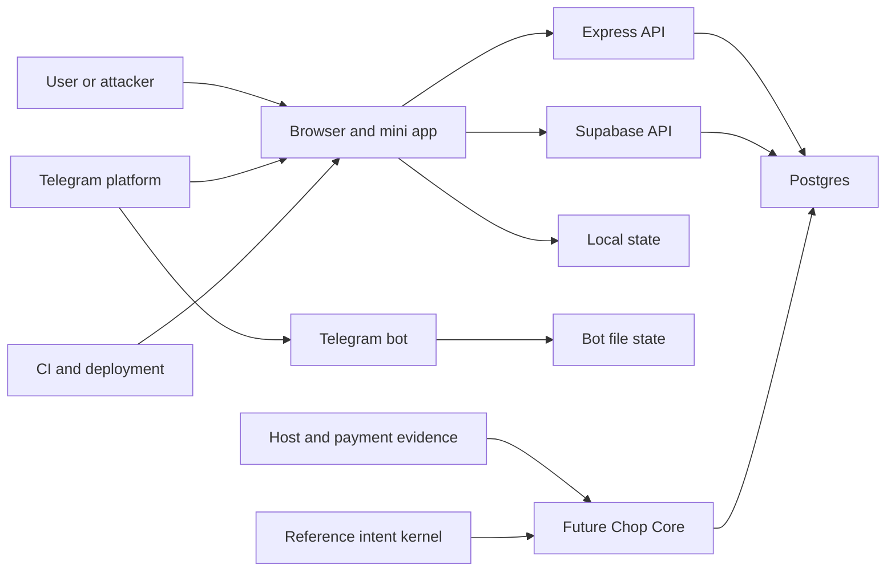

# P-025 Security Foundation Crosswalk

Date: 2026-07-14  
Change: `p025-security-foundation-crosswalk-v1`  
Owner: product/security  
Card: `P-025`  
Decision contract: `DC-025`  
Decision: `DEC-006`  
Assessment type: repository-grounded control crosswalk and threat model  
Runtime changes made by this assessment: none; implementation follow-up below

## Executive Verdict

ChopDot has a strong written target architecture and a useful executable
payment-intent reference kernel. It does **not** yet have one enforced Chop Core
at runtime.

The most important contradiction is at the actor boundary. The Express API
accepts a caller-controlled `x-user-id` header, permits mutations without that
header, and does not enforce payer-only or receiver-only transition authority.
The current browser sends a Supabase user id in that unsigned header rather than
a bearer token the server verifies. Consequently, the production-shaped API
does not satisfy the central P-025 invariant that the right authenticated actor
must perform each money-state command.

The repository also contains multiple independent authorities: browser-local
chapter state, the Express/Postgres settlement model, capture-link state,
Telegram file-backed chapter state, and the portable shell reducer. The portable
shell contract correctly labels itself as a prototype and its server kernel as
an in-memory reference. That work is valuable proof, but it does not make the
current network routes or guest-link paths safe.

**P-025 runtime conformance: FAIL.**  
**P-025 architecture and reference-kernel quality: PASS WITH LIMITATIONS.**  
**Real shared-money or cross-device launch: NO-GO until server-derived actor
identity and role authorization exist.**  
**Portable host proof with local-only state and bounded claims: acceptable as a
prototype, not as shared payment truth.**

## Implementation Update: Authenticated Actor Boundary

Implemented on 2026-07-14 as `p025-authenticated-actor-boundary-v1`.

The Express settlement, pot-event, pending-action, and AI routes now require a
server-verified Supabase bearer access token. The server resolves the principal
to an active pot member and enforces payer-only mark-paid, receiver-only
confirmation, self-only pending-action reads, and attributable audit events.
The browser sends the access token rather than `x-user-id`; forged identity
headers are ignored.

This closes the actor-impersonation path at the Express boundary. It does not
change the overall P-025 verdict because direct database authority, guest-link
confirmation, non-atomic commands, state-model drift, payment-intent
persistence, and multiple truth stores remain unresolved. The database-backed
proof now passes against the Prisma-projected schema but fails against the
migration-owned schema because its status constraint rejects `paid`.

## Product And Security Gate

User journey:

> I am a ChopDot participant, I need money actions attributed only to the real
> actor, so nobody else can change our payment truth.

One next action:

> Authenticate and authorize every money-state command.

| Dimension | Score | Reason |
| --- | ---: | --- |
| Friction | 3/3 | One trusted identity boundary removes host-specific security work. |
| Trust | 3/3 | Payment state cannot be trustworthy without actor binding. |
| Clarity | 3/3 | The server, not the client or host, decides who acted. |
| Language | 1/1 | No new internal language is introduced to normal UI. |
| Total | **10/10** | **PASS** |

## Scope

### In

- P-025, DC-025, and DEC-006 requirements;
- the Universal Chop Core security architecture;
- the main React data and chapter paths;
- Express settlement, pending-action, and AI routes;
- Prisma settlement/payment/event models;
- Supabase row-level policies and capture-link token schema;
- Telegram bot and Telegram Mini App identity boundaries;
- the portable shell payment-intent contract and reference kernel;
- host registry/deployment evidence;
- current tests and CI/build-to-audit controls.

### Out

- changing application behavior;
- changing the portable shell or the current `.dot` deployment;
- implementing authentication, payment processing, wallet signing, or storage;
- performing a live penetration test;
- claiming that an unverified deployment uses the exact local database policies.

## Current Truth To Preserve

1. `open`, `request_sent`, `marked_paid`, and `confirmed` remain distinct.
2. Sending a request does not reduce the receiver's net position.
3. The payer marking paid does not settle the obligation.
4. Only the bound receiver can confirm receipt.
5. Hosts, URLs, wallet events, and payment-provider evidence are inputs, not
   authority.
6. Finishing a group preserves open and exceptional items honestly.
7. Portable shell host proof remains explicitly local/prototype behavior until a
   shared backend exists.

## Source Authority

| Authority | What it establishes | Current status |
| --- | --- | --- |
| `product/cards.md` P-025 | Product gate and falsifier | Ready; evidence quality is partial |
| `product/decision-contracts.md` DC-025 | Required implementation evidence | Current acceptance contract |
| `product/decisions.md` DEC-006 | Surfaces submit scoped commands to one core | Provisional |
| `docs/security/universal-chop-core-security-architecture.md` | Target security architecture | Draft |
| Portable `PAYMENT_INTENT_CONTRACT.md` | API-ready payment-intent rules | Contract foundation only |
| Portable `server/payment-intents/` | Executable invariant reference | In-memory; not connected to runtime |
| Runtime source and migrations | What the product currently enforces | Multiple divergent paths |

## Status Definitions

| Status | Meaning |
| --- | --- |
| Enforced | Runtime control exists at the authoritative boundary and has negative tests. |
| Partial | Some relevant enforcement exists, but it is incomplete or applies to only one path. |
| Documented only | A correct rule exists in specifications/reference code but is not connected to runtime authority. |
| Missing | No material implementation was found. |
| Unsafe | Current behavior directly contradicts the control or permits a bypass. |

## P-025 / DC-025 Control Crosswalk

| ID | Required control | Runtime evidence | Grade | Security consequence |
| --- | --- | --- | --- | --- |
| C-01 | One canonical Chop state | Main app can default to `LocalStorageSource`; Express/Postgres, capture-link storage, Telegram file storage, and portable reducer remain separate authorities. | **Unsafe** | Hosts can present divergent payment truth and closeout state. |
| C-02 | Surfaces never own final truth | Architecture and portable host contract prohibit this, but browser reducers and chapter stores still perform final local transitions. | **Documented only** | UI/client compromise can become product truth within that surface. |
| C-03 | Server-derived authenticated actor | Express verifies a Supabase bearer token and derives an immutable principal; browser API calls send the access token. Other local/host stores remain outside one canonical authority. | **Partial** | Express impersonation is blocked; cross-surface identity and canonical-state work remain. |
| C-04 | Payer-only mark-paid authority | Express resolves active membership and requires `fromMemberId` to match the caller's member id; negative HTTP tests cover forged and wrong-role attempts. Direct table policies remain broad. | **Partial** | Route bypass is blocked, but direct database mutation must still be removed or role-scoped. |
| C-05 | Receiver-only confirmation authority | Express requires `toMemberId` to match the caller's member id and preserves paid-unconfirmed state on rejection. Capture links still substitute bearer possession for receiver identity. | **Partial** | Network route confirmation is bounded; guest-link confirmation remains unsafe. |
| C-06 | Complete state paths | Database proof confirms the mismatch: Prisma projection accepts `pending`, `paid`, `confirmed`, while the migration-owned constraint allows `pending`, `broadcast`, `finalised`, `failed`, `cancelled`; legitimate mark-paid returns `500`. | **Unsafe** | Route transitions fail against the migrated schema and cannot represent required exceptions. |
| C-07 | Backend-owned payment intent | Portable contract and reference kernel define it. Main Prisma schema has no PaymentIntent entity. | **Documented only** | Requests and evidence are not bound to immutable server scope. |
| C-08 | Full intent/evidence matching | Reference kernel checks split scope, payer, receiver, amount, currency, rail, reference, expiry, and source. Main runtime stores method/reference JSON on a settlement and has no full matcher. | **Documented only** | Same-amount, wrong-party, wrong-currency, stale, or duplicate evidence can be misapplied if integrated. |
| C-09 | Scoped, revocable guest capability | Architecture specifies allowed actions, expiry, revocation, and no confirm/close. Capture tokens lack an action list and revocation field; confirm links can invoke confirmation. | **Unsafe** | A bearer capability can exceed its permitted role. |
| C-10 | High-entropy, server-held link authority | Capture token generation uses `Math.random()` plus a timestamp and localStorage fallback. | **Unsafe** | Tokens are weaker than required and client storage can mint or alter local authority. |
| C-11 | Role-scoped privacy | Pending actions now require authentication and the path subject must equal the verified principal. Authenticated users can still select all capture-token rows under current policy. | **Unsafe** | Pending-action enumeration is fixed, but capture-token disclosure remains. |
| C-12 | Role-scoped database mutation | Supabase policies allow any authenticated pot member to insert, update, or delete settlement/payment rows. | **Unsafe** | Membership is treated as authority for every financial role. |
| C-13 | Replay-safe commands | Reference kernel has command replay and version checks. Express has a batch idempotency key, but the key is unique per settlement while one batch writes it to multiple rows. | **Unsafe** | Multi-leg idempotent writes can violate the unique constraint or behave inconsistently. |
| C-14 | Single-use evidence/token consumption | Local tests cover consumed and expired tokens. Remote consumption performs read then conditional update but does not verify that a row was updated. | **Partial** | Concurrent consumers may both receive a successful resolved result. |
| C-15 | Atomic mutation and audit event | Reference kernel is atomic in memory. Express updates settlement, creates payment, appends event, counts remaining legs, and closes pot in separate operations. | **Unsafe** | Failures/races can leave state, audit history, and closeout inconsistent. |
| C-16 | Append-only, attributable audit record | Express mutation events now always use the verified principal. Event append and money-state mutation are still separate operations, and other stores remain independent. | **Partial** | Actor attribution is fixed at the route, but atomicity and canonical audit history remain open. |
| C-17 | Declared adapter capabilities | Target architecture and host registry define boundaries. Runtime has no server-side adapter capability enforcement. | **Documented only** | A future host integration could gain undeclared mutation power. |
| C-18 | Verified Telegram identity | Live bot binds commands to Telegram `ctx.from.id` and has chat/mutation safety gates. Mini App uses `initDataUnsafe` only for display hints; server validation is explicitly missing. | **Partial** | Bot transport is better bounded, but Mini App identity cannot authorize money commands. |
| C-19 | Deployment/manifest audit record | Host registry and host matrix record profiles, proof, URLs, and open items. Full origin, monitoring owner, reviewed commit, capabilities, and rollback record are incomplete. | **Partial** | Operators cannot always prove the deployed capability set matches reviewed code. |
| C-20 | Visible, fail-closed degradation | Telegram bot defaults mutations off; portable shell labels local limits. AI receipt route silently substitutes mock members on DB failure and simulated expenses when no key exists. | **Unsafe** | Infrastructure failure can produce plausible but invented financial data. |
| C-21 | Bounded input, abuse, and error controls | Helmet/CORS exist. Express JSON has no explicit size limit, no rate limiting was found, AI chat input is unbounded, and raw error messages are returned. | **Partial** | Denial-of-service and information disclosure controls are incomplete. |
| C-22 | Build-to-audit gates | Gitleaks runs on pull requests; portable shell has a small dangerous-pattern scan. Seven scripts referenced by workflows are absent from the current root `package.json`. | **Unsafe** | CI can fail before meaningful checks or provide misleading assurance. |
| C-23 | Bounded public claims | Architecture and portable documents clearly distinguish prototype/reference behavior from production security. | **Documented only** | Claim discipline is strong if release copy continues to follow it. |

## System Model

### Primary Components

1. **Main browser application**: React UI, local/Supabase/API-selectable data
   sources, chapter engine, capture links, and an offline mutation queue.
2. **Express API**: settlement lifecycle, pending actions, AI parsing, Prisma.
3. **Postgres/Supabase**: pots, members, settlements, payments, events, and
   capture-link tokens with RLS policies.
4. **Telegram chat bot**: allowlisted bot commands backed by its own chapter
   store.
5. **Portable shell**: host-aware local reducer for web, Telegram, and `.dot`
   proof deployments.
6. **Payment-intent reference kernel**: server-only in-memory contract proof,
   not imported by the browser or Express API.
7. **CI and deployment tooling**: GitHub workflows, secret scanning, host proof
   matrix, Vercel/Telegram/`.dot` deployment evidence.

### Trust Boundaries And Data Flows

- User/browser -> React: names, amounts, links, route parameters, host launch
  data, and localStorage; attacker-controlled.
- React -> Express API: JSON plus `x-user-id`; CORS exists, but actor identity is
  not cryptographically verified.
- React -> Supabase: authenticated client queries subject to RLS; current
  financial and capture-token policies are broader than role authority.
- Express -> Postgres: direct `DATABASE_URL` connection; the effective DB role
  and whether RLS applies to this connection were not established.
- Telegram -> bot: Telegram transport identity and chat id; allowlist and
  mutation flag reduce exposure.
- Telegram Mini App -> portable shell: unverified `initDataUnsafe`, launch
  parameters, host storage, and UI capabilities; intentionally non-authoritative.
- Host/payment evidence -> future Chop Core: target boundary only; no production
  matcher is connected.
- Developer/CI -> release artifact: workflow scripts, tests, secret scanning,
  host proofs, and deploy configuration; current workflow/script drift weakens
  assurance.



The diagram intentionally separates the future Chop Core from current runtime:
the reference kernel demonstrates desired behavior but is not an enforcement
hop today.

## Assets And Security Objectives

| Asset | Why it matters | Objective |
| --- | --- | --- |
| Obligation and split state | Determines who owes whom and how much | Integrity, availability |
| Actor identity and role binding | Determines who may request, mark, confirm, or close | Integrity, confidentiality |
| Payment intents and references | Bind external payment activity to exact obligations | Integrity, confidentiality |
| Guest/capture capabilities | May expose or mutate participant-scoped data | Confidentiality, integrity |
| Receipts and notes | Can contain sensitive personal and financial data | Confidentiality, integrity |
| Audit events and closeout records | Explain who changed shared money truth | Integrity, availability |
| Deployment manifests and artifacts | Prove which code/capabilities are live | Integrity |
| Availability of command processing | Prevents groups from being stranded mid-settlement | Availability |

## Attacker Model

### Capabilities

- send arbitrary HTTP requests to any internet-exposed API route;
- set headers, path ids, JSON bodies, URLs, and localStorage values;
- open or share a bearer link and race duplicate requests;
- authenticate as an ordinary group member where registration is available;
- inspect client-side code and call Supabase APIs directly;
- replay offline or host-provided inputs;
- trigger partial failures or concurrency around multi-step commands.

### Non-Capabilities

- compromise Telegram's server-side bot update signature/transport;
- obtain Supabase service-role or database credentials without another flaw;
- alter the reviewed source repository or deployment signing keys;
- forge a correctly verified identity token once server verification exists.

## Entry Points And Attack Surfaces

| Surface | How reached | Trust boundary | Current control | Evidence |
| --- | --- | --- | --- | --- |
| Settlement lifecycle API | HTTP under `/api/pots/:potId/settlements` | Internet/client -> Express | Verified bearer principal, active membership, payer/receiver authorization, state-order checks | `backend/src/routes/settlements.ts` |
| Pending actions API | HTTP `/api/users/:userId/pending-actions` | Internet/client -> Express | Verified bearer principal; self-subject only; active membership query | `backend/src/routes/users.ts` |
| AI receipt parser | HTTP pot-scoped JSON | Internet/client -> Express/LLM | Verified bearer principal and active membership; input bounds and simulated fallback remain open | `backend/src/routes/ai.ts` |
| Supabase financial tables | Authenticated Supabase client | Browser -> Postgres RLS | Pot membership, not payer/receiver role | `supabase/migrations/20260101100000_member_policies_financial_tables.sql` |
| Capture and confirm links | URL token plus local/remote resolution | Bearer link -> browser/Supabase | Expiry and consumed flag; weak actor binding | `src/services/capture/CaptureLinkService.ts` |
| Telegram chat bot | Telegram update | Telegram -> bot process | Chat allowlist, mutation flag, Telegram sender id | `src/bot/telegramSafety.ts`, `src/bot/telegramBot.ts` |
| Telegram Mini App | WebView launch and `initDataUnsafe` | Telegram host -> browser | Display hint only; no server verification | Portable `src/environment/index.ts` |
| Portable request packet | URL query/base64 JSON | Browser/host -> local reducer/view | Bounded display parsing; unsigned and non-authoritative | Portable `src/requestLinks.ts` |
| Offline mutation queue | localStorage and reconnect | Prior browser state -> current session | Retry loop; no principal/intent binding | `src/services/data/repositories/SettlementRepository.ts` |
| CI/release workflows | Pull request, push, operator deploy | Developer input -> artifact | Gitleaks and tests; script drift exists | `.github/workflows/`, `package.json` |

## Ranked Abuse Paths

### TM-001: Forge or omit actor identity to mutate settlement state

Priority: **Critical**  
Likelihood: High if the Express routes are internet reachable.  
Impact: High; shared payment truth and closeout can be changed.

1. Attacker obtains or guesses a pot and settlement id.
2. Attacker calls `/pay` or `/confirm` with an arbitrary `x-user-id`, or no
   identity header.
3. Route checks the settlement status but not authenticated actor or role.
4. Attacker changes the leg and may trigger automatic pot closure.

Existing control: state-order checks reject invalid current statuses.  
Gap: no authentication and no payer/receiver authorization.  
Detection: alert on missing principal, actor/leg role mismatch, and unsigned
identity headers.  
Mitigation status: **implemented at the Express boundary**. Bearer verification,
active membership, payer/receiver checks, and negative no-side-effect tests now
block this route-level path. Direct database mutation and other state stores are
tracked separately.

### TM-002: Confirm as the receiver through a bearer capture link

Priority: **Critical**  
Likelihood: Medium to high when confirm links are reachable or client storage is
modifiable.  
Impact: High; unreceived payments can become confirmed.

1. Attacker obtains or injects a confirm token containing a receiver id.
2. Capture screen sets the acting/effective member to that receiver id.
3. The wrong-user condition is false by construction.
4. Client consumes the token and confirms using the token's receiver id.

Existing control: token expiry and local consumed state.  
Gap: token possession substitutes for receiver authentication, contradicting
the guest-link contract.  
Detection: log token subject, authenticated principal, command id, and mismatch
attempts at a server command boundary.  
Mitigation: remove confirm authority from bearer links; a link may open a
read-only projection and the authenticated receiver must issue confirmation.

### TM-003: Enumerate capture tokens or directly rewrite financial rows

Priority: **High**  
Likelihood: Medium; requires an authenticated Supabase user and deployed
policies.  
Impact: High; token payload confidentiality and financial integrity.

1. Ordinary authenticated user queries `capture_link_tokens` without a token
   predicate or targets another pot where policy permits.
2. Select policy uses `true`, exposing all rows to authenticated users.
3. Any pot member can also update/delete settlement and payment rows under the
   current membership-only policies.

Existing control: authentication and pot-membership helper on some mutations.  
Gap: no role or subject scope.  
Detection: monitor broad selects and direct table mutations outside command
procedures.  
Mitigation: revoke direct financial table mutation from clients and expose
role-checked transactional commands only.

### TM-004: Runtime fails because route states conflict with database constraint

Priority: **High**  
Likelihood: High if the listed migration history represents the target DB.  
Impact: Medium to high; payment progress can fail after external payment.

1. Payer legitimately invokes `/pay`.
2. Route writes status `paid`.
3. Database constraint only accepts `pending`, `broadcast`, `finalised`,
   `failed`, or `cancelled`.
4. Mutation fails or environments drift depending on schema history.

Existing control: route unit tests.  
Gap: mocked Prisma tests do not execute against the real migration schema.  
Detection: database contract tests in CI against migrated Postgres.  
Mitigation: choose one canonical state vocabulary and prove migrations, Prisma,
routes, and clients against it.

### TM-005: Partial failure or race creates contradictory closeout/audit state

Priority: **High**  
Likelihood: Medium under network/DB faults or concurrent confirmations.  
Impact: High; a leg, event, payment record, and pot status can disagree.

1. Route updates a settlement.
2. Payment/event creation fails, or another confirmation races the remaining
   count.
3. Pot may be closed separately from event append or payment persistence.
4. Users see a final state without a complete attributable history.

Existing control: some batch creation uses Prisma transactions.  
Gap: each command's mutation, audit event, version check, and closeout are not
atomic.  
Detection: invariants comparing pot status, open legs, payments, and events.  
Mitigation: one transactional command repository with optimistic versioning.

### TM-006: Cross-host state forks into multiple truths

Priority: **High**  
Likelihood: High by design in current local prototypes.  
Impact: Medium to high if users mistake local proof for shared coordination.

1. Web, Telegram, `.dot`, bot, or API accepts an action in its own store.
2. Other surfaces do not receive the same canonical event.
3. Each surface computes a different balance or closeout.

Existing control: portable documentation explicitly warns that state is local.  
Gap: no shared command/event authority.  
Detection: host proof should compare canonical server version and event ids once
available.  
Mitigation: do not promote local host actions to cross-device claims; connect
hosts only after a server-owned command boundary exists.

### TM-007: Replay or cross-account offline mutation

Priority: **Medium**  
Likelihood: Medium.  
Impact: Medium; duplicate or incorrectly attributed changes.

1. Browser queues a path/body in localStorage without binding it to a principal
   or immutable intent version.
2. Session changes or request is replayed later.
3. Queue flush sends the old command using the current session-derived header.

Existing control: batch idempotency cache and server key lookup.  
Gap: queue entries are not principal-, intent-, expiry-, or version-bound.  
Detection: compare command actor with creation actor and reject stale versions.  
Mitigation: queue signed/opaque command ids only after server intent creation;
clear or partition queue on session changes.

### TM-008: Enumerate another user's pending payment actions

Priority: **Medium**  
Likelihood: High if route is public and ids are discoverable.  
Impact: Medium; payment relationships and action timing leak.

1. Attacker calls `/api/users/:userId/pending-actions` for another user.
2. Route performs no identity or membership check.
3. Response reveals pot ids, counts, and payer/receiver role.

Existing control: response is summarized rather than full details.  
Gap: no authentication or self/admin authorization.  
Detection: log subject/principal mismatches and enumeration rate.  
Mitigation: derive subject from authenticated principal or enforce explicit
role-scoped access.

### TM-009: CI passes the wrong assurance surface

Priority: **Medium**  
Likelihood: High until workflow drift is repaired.  
Impact: Medium; security regressions or broken releases may escape review.

1. Workflow invokes a script absent from the current package manifest.
2. Job fails before intended checks, is bypassed, or operators rely on a
   different local command.
3. Reference-kernel and unit-test passes are mistaken for integrated security.

Existing control: secret scanning and multiple local proof scripts.  
Gap: no single current release gate covers authz, migrated DB contracts, host
identity, and deployment manifest integrity.  
Detection: lint workflow-to-package script references and require a green
protected-branch check set.  
Mitigation: repair script ownership and add database-backed negative security
tests.

### TM-010: Infrastructure failure returns invented financial interpretation

Priority: **Medium**  
Likelihood: Medium in an incompletely configured environment.  
Impact: Medium; users can act on fabricated participants or amounts.

1. AI route cannot reach the database or lacks an API key.
2. Route substitutes mock members and a simulated expense with HTTP 200.
3. Client may present the result as a successful parse.

Existing control: server logs warnings and memo includes `Simulation`.  
Gap: failure does not fail closed at the API contract.  
Detection: metric and alert on all fallback paths.  
Mitigation: return an explicit unavailable/error state and never synthesize
financial records from infrastructure failure.

## Threat Model Summary

| ID | Threat source | Prerequisite | Impacted asset | Existing control | Primary gap | Detection | Likelihood | Impact | Priority |
| --- | --- | --- | --- | --- | --- | --- | --- | --- | --- |
| TM-001 | Remote API caller | Settlement route reachable | Payment state, audit, closeout | State-order checks | No verified actor or role authorization | Missing principal and role-mismatch alerts | High | High | **Critical** |
| TM-002 | Bearer-link holder/client attacker | Confirm token or local storage access | Confirmation integrity | Expiry and consumed flag | Token subject becomes acting receiver | Principal/token-subject mismatch logs | Medium | High | **Critical** |
| TM-003 | Ordinary authenticated member | Supabase policies deployed | Financial rows and token privacy | Authentication and some membership checks | Broad select/update/delete privileges | Broad-query and direct-mutation audit | Medium | High | **High** |
| TM-004 | Normal user/system | Routes use migrated DB | Payment availability and consistency | Mocked route unit tests | State vocabulary/schema mismatch | Migrated-DB contract test and error metric | High | Medium | **High** |
| TM-005 | Concurrent caller or partial DB failure | Multi-step transition | State, events, closeout | Some create batching | No atomic command transaction/version check | Cross-table invariant monitor | Medium | High | **High** |
| TM-006 | Multi-host usage | Same group used across local stores | Canonical group truth | Honest prototype documentation | No shared command/event authority | Compare server versions and event ids | High | Medium | **High** |
| TM-007 | Browser/session change or replay | Queued mutation exists | Attribution and duplicate safety | Partial idempotency | Queue not bound to principal/intent/version | Rejected stale/cross-principal command metric | Medium | Medium | **Medium** |
| TM-008 | Remote API caller | User id known/guessable | Payment relationship privacy | Summarized response | No self/admin authorization | Subject/principal mismatch and enumeration rate | High | Medium | **Medium** |
| TM-009 | Repository/process drift | CI workflow executes | Release integrity | Gitleaks and local tests | Missing referenced scripts/integrated security gate | Workflow-manifest consistency job | High | Medium | **Medium** |
| TM-010 | Misconfigured or failing backend | DB/key unavailable | Parsed expense integrity | Warning logs and simulation memo | HTTP success with invented financial data | Fallback counter and alert | Medium | Medium | **Medium** |

## Criticality Calibration

| Level | ChopDot-specific meaning | Examples |
| --- | --- | --- |
| Critical | A plausible caller can falsify confirmation/closeout or act as another participant without control of that identity. | Forged `x-user-id`; bearer link confirming as receiver |
| High | A member or normal failure can broadly rewrite financial records, strand settlement, or create contradictory canonical history. | Broad member RLS; schema mismatch; non-atomic closeout; cross-host truth fork |
| Medium | Privacy, replay, availability, or release-assurance weakness requiring another condition and not directly settling an obligation alone. | Pending-action enumeration; cross-session queue; CI drift; simulated AI fallback |
| Low | Defense-in-depth issue with low realistic impact under the current prototype boundary. | Minor hardening issue on a non-authoritative local-only view |

## Evidence-Based Test Results

Run on 2026-07-14 from the current filesystem:

| Command | Result | What it proves | What it does not prove |
| --- | --- | --- | --- |
| `backend: npm run test:p025:database` against Prisma-projected PostgreSQL | Passed | Real rows enforce active membership, payer-only mark-paid, receiver-only confirm, no rejected-command side effects, unrelated-share preservation, and attributable events | Migration history or deployed RLS |
| `backend: npm run test:p025:database` against migrations through `20260416000001` | Failed at legitimate mark-paid | Negative actor checks work on migrated rows; migration status contract rejects route state `paid` | Confirmation on the migration-owned schema cannot run until state alignment |
| Clean Supabase migration replay | Failed at `20260617120000_capture_link_tokens.sql` | Repository migration chain contains a `text` to `uuid` foreign-key mismatch; policy also references absent `pots.members` | A real Supabase project may contain untracked manual drift, which would be a separate audit concern |
| `backend: npm test` | 46/46 tests passed | Production Supabase Auth request handling, bearer middleware, active membership, payer/receiver authorization, subject privacy, repeated rejection, and existing route behavior are deterministic with mocked HTTP/Prisma boundaries | Deployed database schema, RLS, a live Supabase Auth service, or atomic DB behavior |
| `backend: npm run type-check` | Passed | Backend authentication and authorization code typechecks | Runtime database and external Auth availability |
| Runtime `x-user-id` scan | No non-test matches | Current browser and backend runtime no longer use `x-user-id` as authority | Other identity and capability boundaries outside these routes |
| `backend: npm test -- --run src/__tests__/settlements.routes.test.ts src/__tests__/users.routes.test.ts` | 25/25 tests passed | Current route behavior is deterministic under mocked Prisma | Authentication, role authorization, RLS, migrations, or atomic DB behavior |
| `portable: npm run test:payment-intents` | 12/12 tests passed | Reference kernel enforces actor order, scope, version, idempotency, and evidence boundaries | Network authentication, persistence, cross-device sync, or integration with Express/browser |
| `npm run product:validate` | Cockpit: 0 errors/warnings; 12 journey reviews passed; overall command failed in wiki validation | Product/card/decision structure is coherent | Runtime P-025 conformance; wiki pages also have pre-existing freshness debt |
| Workflow-to-package script check | 7 referenced scripts missing | CI configuration and current package manifest have drifted | Whether a remote branch has a different manifest |

The earlier 25-test result is retained as audit history. The implementation
follow-up replaces anonymous route behavior with the 46-test authenticated
boundary above.

## Assumptions And Open Questions

1. **API exposure**: risk rankings assume the Express API is or may become
   internet reachable. If it is strictly unused local scaffolding, immediate
   exploitability is lower, but it must not be promoted without remediation.
2. **Database role**: Prisma uses `DATABASE_URL`; the effective Postgres role and
   RLS behavior are not established. The API is unsafe either way: bypassing RLS
   removes the only DB policy, while applying current RLS still lacks role checks.
3. **Migration deployment**: capture-token and settlement constraints are graded
   from repository migrations. A live database may differ, which is itself a
   deployment audit gap.
4. **Portable deployment**: web/Telegram/`.dot` are treated as local-state proof
   surfaces, consistent with their documentation, not as real payment systems.
5. **Secrets**: no secret values are included in this assessment. Credential
   rotation and repository history review remain separate operational tasks.

## Exactly One Recommended Next Implementation

### Change Name

`p025-authenticated-actor-boundary-v1`

### Problem

Money-state routes trust client-provided identity and do not enforce the
relationship between the authenticated actor and the payer/receiver stored on
the settlement. Every later payment-intent, evidence, guest-link, and host
control depends on fixing this boundary first.

### Scope In

1. Add Express authentication middleware that validates a Supabase access token
   server-side and creates an immutable `AuthenticatedPrincipal`.
2. Remove `x-user-id` as an authority source. It may be ignored or rejected; it
   must never select the actor.
3. Require authentication on settlement reads/writes, pot events, and pending
   actions.
4. Resolve the principal to an active pot member server-side.
5. Authorize:
   - propose: receiver/authorized organizer policy only;
   - mark paid: principal must equal the settlement payer;
   - confirm received: principal must equal the settlement receiver;
   - pending actions: principal may read only their own subject unless a later
     explicit admin policy is added.
6. Derive event actor id from the authenticated principal.
7. Add negative HTTP tests for missing, forged, wrong-role, removed-member, and
   cross-pot identities.

### Scope Out

- implementing durable PaymentIntent tables;
- redesigning capture/guest links;
- changing payment rails or wallet flows;
- changing product UI;
- solving all RLS, idempotency, transaction, monitoring, and retention gaps;
- connecting the portable shell to the backend.

These remain necessary, but combining them with the actor boundary would make
the first security patch too broad and harder to prove.

### Requirements

1. Every protected route **SHALL** reject a missing or invalid bearer token with
   `401` and no mutation.
2. The server **SHALL** derive actor identity from the verified token, never from
   request headers, body, path, URL, or host launch data.
3. Mark-paid **SHALL** require the authenticated principal to be the bound payer.
4. Confirm-received **SHALL** require the authenticated principal to be the bound
   receiver.
5. A wrong-role or inactive member **SHALL** receive `403` and produce no state,
   payment, event, or closeout mutation.
6. Audit events **SHALL** use the server-derived principal.
7. Repeating a rejected command **SHALL** remain side-effect free.
8. Existing positive payer and receiver scenarios **SHALL** continue to pass.

### Acceptance Scenarios

```text
GIVEN a request has no valid bearer token
WHEN it attempts to propose, mark paid, confirm, or read another user's actions
THEN the API returns 401
AND no database mutation or audit event occurs.

GIVEN Mallory sends x-user-id for Leo but authenticates as Mallory
WHEN Mallory attempts to mark Leo's settlement paid
THEN the server ignores the forged header
AND returns 403
AND the settlement remains unchanged.

GIVEN Leo is the authenticated payer for an open settlement
WHEN Leo marks paid
THEN the command succeeds
AND the event actor is Leo's server-derived identity.

GIVEN Leo is the payer and Mina is the receiver
WHEN Leo attempts to confirm received
THEN the API returns 403
AND the settlement remains paid but unconfirmed.

GIVEN Mina is the authenticated receiver for a paid settlement
WHEN Mina confirms received
THEN the command succeeds
AND only that matching settlement can advance.
```

### Required Proof

- HTTP integration tests with real authentication middleware;
- explicit assertions that Prisma mutation/event methods were not called on
  `401`/`403` paths;
- one database-backed test proving active membership and payer/receiver mapping;
- route scan showing no security decision reads `x-user-id`;
- updated API threat/authority ADR;
- `npx tsc --noEmit`, backend tests, and relevant build checks;
- no product UI or portable-host behavior changes.

### Why This Is First

Without a trusted principal, payment intents, guest capabilities, RLS, evidence
matching, idempotency, and audit records can all be bypassed or falsely
attributed. This change creates the choke point every subsequent P-025 control
can rely on.

## Launch And Claim Boundary

Until the next implementation and subsequent transactional intent/capability
work are complete:

- do not describe ChopDot as securely synchronized across hosts;
- do not treat a URL, host identity hint, wallet event, or payment evidence as
  confirmation;
- do not enable real shared-money mutation through the portable shell;
- keep `.dot`, Telegram Mini App, and web host deployments labeled internally as
  product/proof surfaces with local state;
- keep the Telegram chat bot mutation allowlist and explicit mutation flag;
- do not expose the current Express settlement routes as production payment
  authority.

## Documentation Impact

This assessment adds the required canonical crosswalk under `docs/security/`.
It does not change the target architecture, so no generated wiki refresh or ADR
change is part of this read-only pass.

The recommended implementation **will require**:

1. a source ADR defining authenticated principal derivation and route authority;
2. an update to the security architecture's implementation-status section;
3. a source wiki update for the real authentication/authorization boundary;
4. regenerated and validated wiki views;
5. P-025 evidence and checkpoint updates only after negative runtime proof exists.

## Focus Paths For Follow-Up Review

| Path | Reason |
| --- | --- |
| `backend/src/routes/settlements.ts` | Primary unauthenticated money-state mutations and non-atomic closeout |
| `backend/src/routes/users.ts` | User-subject privacy boundary |
| `backend/src/routes/ai.ts` | Unauthenticated input and simulated-success fallback |
| `backend/src/lib/prisma.ts` | Database role determines RLS applicability |
| `backend/prisma/schema.prisma` | State, idempotency, payment, and audit data model |
| `supabase/migrations/20260101100000_member_policies_financial_tables.sql` | Broad member mutation authority |
| `supabase/migrations/20260617120000_capture_link_tokens.sql` | Token disclosure and capability scope |
| `src/services/data/repositories/SettlementRepository.ts` | Unsigned actor header and offline queue |
| `src/services/capture/CaptureLinkService.ts` | Token entropy and replay behavior |
| `src/components/screens/CaptureConfirmScreen.tsx` | Bearer link substitutes for receiver identity |
| `src/chapter/chapterEngine.ts` | Correct local invariants that server behavior should reproduce |
| `src/bot/telegramBot.ts` | Bot identity-to-member mapping and separate store authority |
| `.worktrees/portable-shell-trial/PAYMENT_INTENT_CONTRACT.md` | Canonical future command contract |
| `.worktrees/portable-shell-trial/server/payment-intents/` | Reference tests to port to a real repository |
| `.worktrees/portable-shell-trial/HOSTS.md` | Host capability and claim boundaries |
| `.github/workflows/` | Release/security gate drift |

## Quality Check

- [x] P-025, DC-025, DEC-006, and the architecture document were mapped.
- [x] Browser, API, database, guest link, Telegram bot, Telegram Mini App,
      portable shell, deployment, and CI boundaries were reviewed.
- [x] Runtime enforcement was separated from documentation and reference code.
- [x] Positive tests were separated from missing negative security proof.
- [x] Assumptions affecting exploitability are explicit.
- [x] One, and only one, next implementation is recommended.
- [x] No application behavior or deployment lane was changed.
