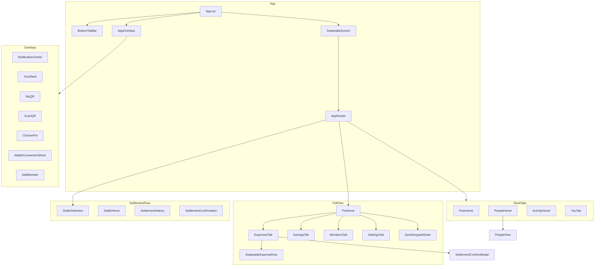
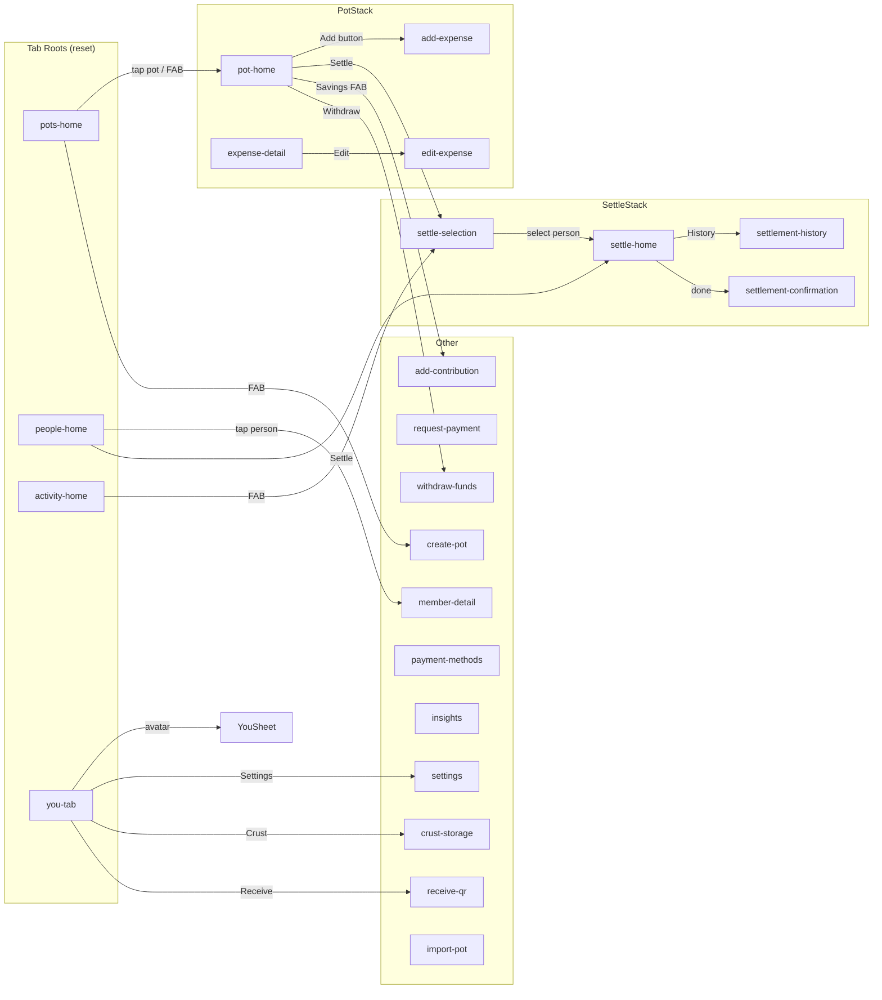
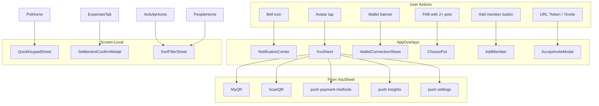

# ChopDot Component Catalog

**Last Updated:** March 2026  
**Purpose:** Single source of truth for what each component does, where it lives, how it's used, and when to use it. Prevents confusion between similar components.

---

## How to Use This Catalog

| Column | Meaning |
|--------|---------|
| **Component** | File name and export |
| **Purpose** | What it does in one sentence |
| **Presentation** | Modal, full screen, inline, etc. |
| **Entry Points** | How the user gets to it |
| **Used By** | Parent components that render it |
| **Related** | Similar components (don't confuse with) |

---

## Mermaid Diagrams

### Component Hierarchy (Key Paths)



### Navigation Graph (Screen Transitions)



### Overlay Trigger Graph



---

## Modularity Refactor: New Modules (March 2026)

New hooks, components, and service modules extracted during the modularity refactoring. Restructured files are now thin orchestrators/barrels.

### New Hooks

| Module | Purpose | Used By |
|--------|---------|---------|
| `useOverlayHandlers.ts` | Encapsulates overlay callback handlers (wallet, notifications, QR, payment methods, invites, IPFS) extracted from App.tsx | App.tsx |
| `useOverlayProps.ts` (`buildOverlayProps`) | Assembles the AppOverlays props object from overlay state + handlers | App.tsx |
| `useEnsureUserProfile.ts` | Ensures user profile exists in public.users table after auth | AuthContext |
| `usePotDataMerge.ts` | Merges local + Supabase pot data (extracted from PotHome) | PotHome |
| `usePotSummary.ts` | Computes summary stats for a pot (extracted from PotHome) | PotHome |
| `useCheckpointState.ts` | Manages pot checkpoint state (extracted from PotHome) | PotHome |
| `useSignInHandlers.ts` | Auth handler functions (OAuth, wallet, guest, extension) extracted from SignInScreen | SignInScreen |

### New Components (Auth)

| Component | Purpose | Used By |
|-----------|---------|---------|
| **ChopDotMark.tsx** | ChopDot logo/mark SVG (extracted from SignInComponents) | SignInComponents |
| **WalletOption.tsx** | WalletLogo, WalletPanel, WalletOption components (extracted from SignInComponents) | SignInComponents |
| **MobileWalletConnectPanel.tsx** | Mobile WalletConnect UI panel (extracted from SignInComponents) | SignInComponents |
| **DevToggles.tsx** | ViewModeToggle, LoginVariantToggle, WalletConnectModalToggle (extracted from SignInComponents) | SignInComponents |
| **wallet-options.ts** | Static wallet option configuration data | WalletOption, SignInComponents |

### New Data / Service Modules

| Module | Purpose | Used By |
|--------|---------|---------|
| `session-manager.ts` | Auth session management (storage, init, check) | AuthContext |
| `wallet-login.ts` | Wallet-specific login logic (Polkadot, Rainbow, EVM) | AuthContext |
| `oauth-login.ts` | OAuth redirect logic | AuthContext |
| `guest-login.ts` | Guest session login | AuthContext |
| `types/auth.ts` | Shared auth types (AuthMethod, OAuthProvider, User, LoginCredentials) | Auth services, SignInScreen |
| `auth-mapping.ts` | `mapSupabaseSessionUser` utility | AuthContext |
| `screen-props/types.ts` | AppRouterProps interface (shared between AppRouter and screen renderers) | AppRouter, tab/pot/settle/misc screens |
| `screen-props/tab-screens.tsx` | Render functions for tab root screens | AppRouter |
| `screen-props/pot-screens.tsx` | Render functions for pot-related screens | AppRouter |
| `screen-props/settle-screens.tsx` | Render functions for settlement screens | AppRouter |
| `screen-props/misc-screens.tsx` | Render functions for all other screens | AppRouter |

### Restructured Files (thin orchestrators / barrels)

| File | Purpose | Notes |
|------|---------|-------|
| **SignInComponents.tsx** | Barrel file re-exporting from ChopDotMark, WalletOption, MobileWalletConnectPanel, DevToggles | ~4 individual component files |
| **AppRouter.tsx** | Thin dispatcher using a lookup map | ~37 lines |
| **AuthContext.tsx** | Thin orchestrator delegating to auth services | ~254 lines; uses session-manager, wallet-login, oauth-login, guest-login |

---

## Router ↔ Screen Mapping

Every `Screen` type in `src/nav.ts` maps to a component via `AppRouter.tsx`. Root tabs use `reset()`; drill-down screens use `push()`.

| Screen Type | Component | Router Case | Notes |
|-------------|-----------|-------------|-------|
| `activity-home` | ActivityHome | ✅ | Activity tab |
| `pots-home` | PotsHome | ✅ | Pots tab |
| `settlements-home` | PeopleHome | ✅ | Alias for people-home |
| `people-home` | PeopleHome | ✅ | People tab |
| `you-tab` | YouTab | ✅ | You tab |
| `settings` | Settings | ✅ | Via YouTab |
| `payment-methods` | PaymentMethods | ✅ | Via YouSheet |
| `insights` | InsightsScreen | ✅ | Via YouSheet |
| `create-pot` | CreatePot | ✅ | FAB (Pots tab) or PotsHome |
| `pot-home` | PotHome | ✅ | Tap pot, FAB |
| `add-expense` | AddExpense | ✅ | **Unused in normal flow** – see Expense Forms |
| `edit-expense` | AddExpense | ✅ | ExpenseDetail → Edit |
| `expense-detail` | ExpenseDetail | ✅ | Tap expense |
| `settle-selection` | SettleSelection | ✅ | PotHome Settle, FAB (Activity) |
| `settle-home` | SettleHome | ✅ | From SettleSelection or PeopleHome |
| `settlement-history` | SettlementHistory | ✅ | From SettleHome |
| `settlement-confirmation` | SettlementConfirmation | ✅ | Post-settlement success |
| `member-detail` | MemberDetail | ✅ | PeopleHome → person |
| `add-contribution` | AddContribution | ✅ | Savings pot FAB |
| `withdraw-funds` | WithdrawFunds | ✅ | Savings pot |
| `request-payment` | RequestPayment | ✅ | FAB (Pots) or PeopleHome |
| `crust-storage` | CrustStorage | ✅ | Via YouSheet |
| `crust-auth-setup` | CrustAuthSetup | ✅ | IPFS onboarding |
| `receive-qr` | ReceiveQR | ✅ | Via YouSheet |
| `import-pot` | ImportPot | ✅ | URL deep link |
| `checkpoint-status` | *(none)* | ❌ **Missing** | Pushed from PotHome; falls through to `default` → null |
| `settle-cash` | — | Redirect | Deep link → redirect to settle-selection |
| `settle-bank` | — | Redirect | Same |
| `settle-dot` | — | Redirect | Same |

---

## Expense Forms (Critical Distinction)

These two components are often confused. They serve different flows.

| | QuickKeypadSheet | AddExpense |
|---|------------------|------------|
| **File** | `src/components/QuickKeypadSheet.tsx` | `src/components/screens/AddExpense.tsx` |
| **Purpose** | Add a **new** expense (quick flow) | **Edit** an existing expense (full flow) |
| **Presentation** | Bottom sheet modal | Full-screen form |
| **Title** | "Quick add (USD)" | "Edit expense" / "Add expense" |
| **Entry Points** | 1. Add button in Expenses tab (inside a pot)<br>2. FAB when viewing a pot<br>3. Dashboard Add → Choose pot → auto-opens | Expense detail → Edit button |
| **Used By** | PotHome | AppRouter (edit-expense screen) |
| **Key Fields** | Amount (32px), Title, Paid by, Date, Split | Amount, Description, Paid by, Date, Split, **Receipt upload** |
| **Pot Type** | Expense pots only | Expense pots only |
| **Related** | AddExpense (edit flow) | QuickKeypadSheet (add flow) |

**Important:** The `add-expense` route exists in the router and renders `AddExpense`, but standard in-pot "Add Expense" interactions use `QuickKeypadSheet`. In normal usage, full-screen `AddExpense` is primarily for edit-style/full-form flows; quick add is the default add UX.

**Rule of thumb:** Adding from within a pot → QuickKeypadSheet. Editing an existing expense → AddExpense.

---

## Confusion Pairs

Components that look or sound similar but serve different roles.

### Auth: AuthScreen vs SignInScreen vs SignUpScreen

| Component | Purpose | Used By |
|-----------|---------|---------|
| **AuthScreen** | Wrapper when unauthenticated | App.tsx (when `!isAuthenticated`) |
| **SignInScreen** | Login UI (email, wallet) | AuthScreen |
| **SignUpScreen** | Registration form | Not used in main flow (AuthScreen → SignInScreen) |

**Flow:** `App` → `AuthScreen` → `SignInScreen` → `onLoginSuccess` → `reset({ type: "pots-home" })`

### People: PeopleHome vs PeopleView

| Component | Purpose | Used By |
|-----------|---------|---------|
| **PeopleHome** | People tab container (balances, tabs, header) | AppRouter |
| **PeopleView** | Person list / cards | PeopleHome |

PeopleHome has tabs "People" | "Balances" and renders PeopleView for the list.

### Settlement: SettleSheet vs SettlementConfirmModal vs SettlementConfirmation

| Component | Purpose | Used By |
|-----------|---------|---------|
| **SettleSheet** | Quick settle modal (Bank/PayPal/DOT/Cash) | ActivityHome *(unused – `topPersonToSettle` is always undefined)* |
| **SettlementConfirmModal** | Confirm on-chain settlement (DOT/USDC) before submit | ExpensesTab |
| **SettlementConfirmation** | Full-screen post-settlement success | AppRouter (settlement-confirmation) |

**Flow:** User settles via SettleHome → completes payment → navigates to SettlementConfirmation. SettlementConfirmModal is a pre-submit confirmation inside ExpensesTab when attesting/settling an expense.

---

## Screen Components (Full List)

| Component | Purpose | Entry Points | Used By |
|-----------|---------|--------------|---------|
| **ActivityHome** | Activity feed tab | Bottom tab "Activity" | AppRouter |
| **PotsHome** | Pots tab – list of pots | Bottom tab "Pots" | AppRouter |
| **PeopleHome** | People tab – balances, settlements | Bottom tab "People" | AppRouter |
| **YouTab** | You tab – profile, settings | Bottom tab "You" | AppRouter |
| **PotHome** | Single pot (tabs: Expenses/Members/Settings) | Tap pot, FAB (pot context) | AppRouter |
| **ExpensesTab** | Expenses list + Add (inside PotHome) | Tab within PotHome | PotHome |
| **SavingsTab** | Savings list (inside PotHome) | Tab within PotHome (savings pots) | PotHome |
| **MembersTab** | Members list (inside PotHome) | Tab within PotHome | PotHome |
| **SettingsTab** | Pot settings (inside PotHome) | Tab within PotHome | PotHome |
| **ExpenseDetail** | View single expense | Tap expense | AppRouter |
| **AddExpense** | Edit expense form (full screen) | ExpenseDetail → Edit | AppRouter |
| **CreatePot** | Create new pot form | FAB (Pots), Create pot button | AppRouter |
| **SettleSelection** | Choose person to settle with | PotHome Settle, FAB (Activity) | AppRouter |
| **SettleHome** | Settlement flow (method, amount, confirm) | SettleSelection → person | AppRouter |
| **SettlementHistory** | Past settlements list | SettleHome → History | AppRouter |
| **SettlementConfirmation** | Post-settlement success screen | After settlement complete | AppRouter |
| **MemberDetail** | Person profile / balances | PeopleHome → person | AppRouter |
| **AddMember** | Add/invite member (modal) | PotHome → Add member | AppOverlays |
| **RequestPayment** | Request payment from debtors | FAB (Pots), PeopleHome | AppRouter |
| **AddContribution** | Add to savings pot | Savings pot FAB | AppRouter |
| **WithdrawFunds** | Withdraw from savings pot | Savings pot | AppRouter |
| **Settings** | App settings | YouTab → Settings | AppRouter |
| **PaymentMethods** | Payment methods | YouSheet → Payment methods | AppRouter |
| **InsightsScreen** | Spending insights | YouSheet → Insights | AppRouter |
| **CrustStorage** | IPFS storage | YouSheet | AppRouter |
| **CrustAuthSetup** | IPFS auth setup | Onboarding | AppRouter |
| **ReceiveQR** | Your QR for receiving | YouSheet → Show QR | AppRouter |
| **ImportPot** | Import pot from backup | URL deep link | AppRouter |

---

## Overlay / Modal Components

### AppOverlays (central overlay layer)

Rendered by `App.tsx`, controlled via props. All shown conditionally.

| Component | Purpose | Trigger |
|-----------|---------|---------|
| **inviteModal** | Accept/decline pot invite | URL token (AcceptInviteModal) |
| **WalletConnectionSheet** | Connect wallet | Wallet banner / YouSheet |
| **NotificationCenter** | Notifications drawer | Bell icon |
| **YouSheet** | You tab action sheet | Avatar tap (You tab) |
| **MyQR** | Your QR code | YouSheet → Show QR |
| **ScanQR** | QR scanner | YouSheet → Scan |
| **ChoosePot** | Pick pot (e.g. quick add) | FAB when 2+ pots |
| **AddPaymentMethod** | Add payment method | YouSheet |
| **ViewPaymentMethod** | View payment method | YouSheet (when selected) |
| **AddMember** | Add/invite member | PotHome → Add member |
| **IPFSAuthOnboarding** | IPFS auth setup | Post-wallet connect |

### Other overlays (screen-local)

| Component | Purpose | Used By |
|-----------|---------|---------|
| **QuickKeypadSheet** | Add expense modal | PotHome |
| **BottomSheet** | Generic bottom sheet | QuickKeypadSheet, AddExpense |
| **SettleSheet** | Quick settle modal | ActivityHome *(currently dead – topPersonToSettle undefined)* |
| **SettlementConfirmModal** | Pre-submit settlement confirmation | ExpensesTab |
| **SortFilterSheet** | Sort/filter options | ActivityHome, PeopleHome |
| **HelpSheet** | Help/tutorial | Various |
| **SharePotSheet** | Share pot | PotHome (export/share) |
| **ConfirmModal** | Generic confirm dialog | Various |
| **EditMemberModal** | Edit member | MembersTab |
| **PasswordModal** | Password entry | Auth flow |
| **HyperbridgeBridgeSheet** | Bridge UI | Settlement flow |

---

## Tab Composition

### PotHome tabs (dynamic by pot type)

- **Expense pot:** Expenses | Members | Settings  
- **Savings pot:** Savings | Members | Settings  

`ExpensesTab` / `SavingsTab` / `MembersTab` / `SettingsTab` are rendered by PotHome based on `activeTab`.

### PeopleHome tabs

- **People** | **Balances**  
  PeopleView renders the person list; Balances shows youOwe / owedToYou breakdown.

### Bottom tab bar

Pots | People | Activity | You  
FAB behaviour: context-sensitive (create pot, quick add, settle, etc.).

---

## Flow Diagrams

### Auth flow

```
App (!isAuthenticated)
  └─ AuthScreen
       └─ SignInScreen (email / wallet)
            └─ onLoginSuccess → reset({ type: "pots-home" })
```

### Expense add flow

```
PotsHome / PotHome
  └─ Add (FAB or Expenses tab)
       ├─ 0 pots: Toast "Create a pot first"
       ├─ 1 pot: push(pot-home) + openQuickAdd
       └─ 2+ pots: ChoosePot → onSelect → push(pot-home) + openQuickAdd

PotHome (openQuickAdd or Add button)
  └─ QuickKeypadSheet (modal)
       └─ onSave → addExpenseToPot, close
```

### Expense edit flow

```
PotHome → ExpensesTab → Tap expense
  └─ push(expense-detail)

ExpenseDetail → Edit button
  └─ push(edit-expense)

AppRouter (edit-expense)
  └─ AddExpense (full screen)
       └─ onSave → updateExpense, back
```

### Settlement flow

```
PeopleHome → Settle on person
  └─ push(settle-home, personId)

PotHome → Settle
  └─ push(settle-selection)

SettleSelection → Choose person
  └─ push(settle-home)

SettleHome → Confirm
  └─ confirmSettlement() → replace(settlement-confirmation) or reset(pots-home)

FAB (Activity tab) → Settle
  └─ push(settle-selection)
```

### Pot creation flow

```
PotsHome → Create pot (FAB or button)
  └─ push(create-pot)

CreatePot → onSubmit
  └─ createPot() → replace(pot-home, newPotId)
```

---

## Auth Sub-Components

`SignInScreen` composes several panels. `AuthScreen` is a thin wrapper; the main login UI lives in SignInScreen.

| Component | Purpose | Reachable | Used By |
|-----------|---------|-----------|---------|
| **WalletLoginPanel** | Desktop: wallet options (Polkadot.js, SubWallet, Talisman, WalletConnect, Email), Guest | ✅ Default view | SignInScreen |
| **EmailLoginPanel** | Email/password form | ✅ Via Drawer (Email option or "Need an account? Create one") | SignInScreen (Drawer) |
| **SignupPanel** | Sign-up form | ✅ When `authPanelView === 'signup'` (from Drawer → "Need an account? Create one") | SignInScreen |
| **MobileWalletConnectPanel** | Mobile: WalletConnect + Email + Guest | ✅ When `isMobileWalletFlow` (mobile device or "Switch to mobile wallets") | SignInScreen |
| **ResetPasswordScreen** | Password reset form | ✅ Standalone route `/reset-password` (main.tsx) – separate from main app | main.tsx |
| **ConnectWalletScreen** | Wallet connection screen | ❌ **Orphan** – exported but never imported/used | — |

**Flow:** AuthScreen → SignInScreen → (WalletLoginPanel | MobileWalletConnectPanel) | Drawer(EmailLoginPanel) | SignupPanel when authPanelView switches.

---

## Pot-Type Branching

Expense vs savings pots affect FAB, tabs, and add/contribute flows.

| Aspect | Expense pot | Savings pot |
|--------|-------------|-------------|
| **PotHome tabs** | Expenses \| Members \| Settings | Savings \| Members \| Settings |
| **FAB (when viewing pot)** | Receipt icon → QuickKeypadSheet (add expense) | CheckCircle icon → push(add-contribution) |
| **Add flow** | QuickKeypadSheet | AddContribution screen |
| **Primary action** | Add expense, Settle | Add contribution, Withdraw |
| **Checkpoint section** | Shown when `checkpointEnabled && walletConnected && (auditable \|\| dev)` | Same |

---

## URL Sync & Deep Linking

`useUrlSync` (App.tsx) and `getInitialScreenFromLocation` (main boot):

| URL / Param | Screen | Notes |
|-------------|--------|-------|
| `/` | pots-home | Redirects to `/pots` |
| `/pots` | pots-home | |
| `/activity` | activity-home | |
| `/people` | people-home | |
| `/you` | you-tab | |
| `?cid=...` | import-pot | Resets to import-pot; clears param after import |
| `?token=...` or `?invite=...` | — | Handled by useInviteFlow; opens AcceptInviteModal (not a screen) |

**Note:** No URL mapping for drill-down screens (pot-home, expense-detail, settle-home, etc.). Only tab roots + cid are synced.

---

## Invite Flow

| Step | What happens |
|------|--------------|
| 1. User opens `/join?token=XXX` or `?invite=XXX` | useInviteFlow useEffect detects token, sets `pendingInviteToken`, `showInviteModal = true` |
| 2. AcceptInviteModal shown | AppOverlays renders it when `showInviteModal` |
| 3. User accepts | `acceptInvite(token)` → API → on success: `reset({ type: "pot-home", potId })`, `cleanInviteParams()`, `setShowInviteModal(false)` |
| 4. User declines | `declineInvite(token)` → API → `cleanInviteParams()`, `setShowInviteModal(false)` |
| 5. User cancels | `cancelPendingInvite()` → `setPendingInviteToken(null)`, `setShowInviteModal(false)`, `cleanInviteParams()` |

**PotsHome** also receives `pendingInvites` and `onAcceptInvite` / `onDeclineInvite` for invite cards in the UI (separate from modal).

---

## Notification Flow

| Aspect | Detail |
|--------|--------|
| **Storage** | Notifications in React state; persisted to `localStorage` key `chopdot_notifications` |
| **Creation** | RequestPayment creates "settlement" notification on send. Other types (attestation, reminder, invite) from other flows. |
| **Display** | NotificationCenter overlay (AppOverlays). Bell icon in TopBar (PotsHome, PeopleHome, ActivityHome, YouTab) calls `setShowNotifications(true)` |
| **onNotificationClick** | Marks notification read; calls `notification.onAction?.()` if present. RequestPayment notifications do **not** set `onAction` – click only marks read. |
| **Types** | attestation, settlement, reminder, invite |

---

## ReceiptViewer & AttestationDetail

| Component | Where used | Trigger |
|-----------|------------|---------|
| **ReceiptViewer** | ExpenseDetail | `expense.hasReceipt` → tap "Receipt" → `setShowReceiptViewer(true)`. Full-screen overlay with share/copy. |
| **AttestationDetail** | ❌ **Never rendered** | ExpenseDetail has `showAttestationDetail` state and sets it after attestation, but never imports or renders `<AttestationDetail />`. Component exists, effectively orphaned. |

---

## Context Usage

| Context | Components using it | Effect |
|---------|---------------------|--------|
| **AccountContext** | SignInScreen, SettleHome, PotHome, ExpensesTab, CrustStorage, CrustAuthSetup, WalletBanner, AccountMenu, SharePotSheet, HyperbridgeBridgeSheet, useWalletAuth | Wallet status, connect methods, balance. Used for DOT flows, checkpoint, IPFS. |
| **FeatureFlagsContext** | App, AppRouter, SettleHome, PotHome | `POLKADOT_APP_ENABLED`: gates wallet UI, checkpoint section, DOT settlement. `DEMO_MODE`: disables wallet actions. |
| **DataContext** | PotHome (usePot, useData), App | Data layer reads when flag enabled. |

---

## ExpensesTab ↔ SettlementConfirmModal

SettlementConfirmModal is used for **on-chain settlement between two members from within an expense context** (ExpensesTab).

| Step | What happens |
|------|--------------|
| 1. Trigger | User taps "Settle" next to a member in expense split (ExpensesTab). Button appears when `fromMember.address` and `toMember.address` exist. |
| 2. setSettlementModal | `{ fromMemberId, toMemberId, fromAddress, toAddress, fromName, toName, amountDot?, amountUsdc? }` |
| 3. Modal | SettlementConfirmModal shows fee, from/to, amount. User confirms. |
| 4. onConfirm | `handleSettleConfirm` → `chain.sendDot` or `chain.sendUsdc` → on success: append to `potHistory`, `onUpdatePot({ history })`, `setSettlementModal(null)` |
| 5. onCancel | `setSettlementModal(null)` |

**Distinction:** SettleHome is the main settlement flow (choose person, method, confirm). SettlementConfirmModal is an **inline** confirmation when settling from an expense’s split breakdown (member-to-member on-chain).

---

## YouSheet & YouTab Sub-Flows

**YouSheet** (from YouTab avatar tap) – actions and targets:

| Action | Handler | Result |
|--------|---------|--------|
| My QR | onShowQR | Close YouSheet, open MyQR overlay |
| Scan | onScanQR | Close YouSheet, open ScanQR overlay |
| View detailed insights | onViewInsights | Close YouSheet, `push(insights)` |
| Payment methods | onPaymentMethods | Close YouSheet, `push(payment-methods)` |
| Settings | onSettings | Close YouSheet, `push(settings)` |

**YouTab** (the You tab content, not the sheet) has additional actions:

| Action | Target |
|--------|--------|
| Show QR | `onShowQR` → MyQR overlay (same as YouSheet’s My QR) |
| Scan | `onScanQR` → ScanQR overlay |
| Receive | `onReceive` → `push(receive-qr)` (ReceiveQR screen; requires wallet) |
| Crust Storage | `push(crust-storage)` – from YouTab menu and Settings |

**Note:** CrustStorage is reached from **YouTab** and **Settings**, not from YouSheet. MyQR (overlay) ≠ ReceiveQR (full screen); Receive is the receive-qr screen.

---

## BottomTabBar Visibility

Tab bar is shown when `screen.type` is in:

```ts
tabBarScreens = [
  "activity-home", "pots-home", "settlements-home", "people-home", "you-tab",
  "pot-home", "expense-detail", "settle-selection", "settle-home"
]
```

Hidden for: settings, payment-methods, insights, create-pot, add-expense, edit-expense, settlement-history, settlement-confirmation, member-detail, add-contribution, withdraw-funds, checkpoint-status, request-payment, crust-storage, crust-auth-setup, receive-qr, import-pot.

---

## Polkadot / Wallet-Dependent Flows

| Screen / Component | Wallet requirement | When |
|--------------------|--------------------|------|
| **SettleHome** | DOT method needs `walletConnected` | Selecting "DOT" shows connect prompt if disconnected. Fee estimation when `selectedMethod === 'dot' && walletConnected`. |
| **ExpensesTab** | SettlementConfirmModal (DOT/USDC) | Members need addresses; chain sends require wallet. |
| **PotHome** | Checkpoint section | `POLKADOT_APP_ENABLED && checkpointEnabled && isWalletConnected && (auditable \|\| dev)` |
| **ExpenseDetail** | Attest/anchor | `onConnectWallet` when attesting without wallet. |
| **CrustStorage** | Connection for IPFS | Uses AccountContext; connect on mount if needed. |
| **CrustAuthSetup** | Wallet for Crust token | Uses AccountContext. |

**Feature flag:** When `POLKADOT_APP_ENABLED` is false, wallet buttons show "Wallet feature disabled" toast.

---

## Legacy / Unused / Gaps

| Item | Status |
|------|--------|
| **checkpoint-status** | Pushed from PotHome (`onViewCheckpoint`) but no router case – falls through to `default` → null. Effectively broken. |
| **settle-cash, settle-bank, settle-dot** | In `nav.ts` but not routed. Deep links redirect to settle-selection or people-home. |
| **add-expense** | Route exists; PotHome uses QuickKeypadSheet instead. No URL or UI path leads to it. |
| **BatchConfirmSheet** | Removed (per spec). File does not exist. |
| **CheckpointStatusScreen** | File does not exist. Never implemented. |
| **SettleSheet in ActivityHome** | Rendered only when `topPersonToSettle` is set; AppRouter passes `undefined`. Never shown. |
| **ConnectWalletScreen** | Exported but never imported. Orphan component. |
| **AttestationDetail** | Exists, intended for ExpenseDetail; never imported or rendered. `showAttestationDetail` state in ExpenseDetail is unused. |

---

## Shared / Reusable Components

| Component | Purpose | Used By |
|-----------|---------|---------|
| **BottomTabBar** | Main nav + FAB | App |
| **TopBar** | Screen header with back | Most screens |
| **SwipeableScreen** | Swipe-to-go-back | App |
| **SwipeableExpenseRow** | Expense row with swipe actions | ExpensesTab |
| **PrimaryButton** / **SecondaryButton** | CTAs | Various |
| **InputField** / **SelectField** | Form fields | AddExpense, CreatePot, etc. |
| **EmptyState** | Empty state illustration | Various |
| **WalletBanner** | Wallet connection prompt | PotsHome, PeopleHome |
| **Toast** / **Sonner** | Notifications | App-wide |
| **TxToast** | Transaction toasts | AppOverlays |

---

## Naming Convention Addendum

### Expense Forms

- **QuickKeypadSheet** – Name reflects "quick" add flow. Alias: "Add Expense Sheet" or "Quick Add Modal".
- **AddExpense** – Misleading (sounds like add). Used for **edit** flow. Router: `edit-expense`.

### When Adding New Components

1. Add to this catalog with Purpose, Entry Points, Used By, Related.
2. If it overlaps with an existing component, document the distinction.
3. Update `FILE_STRUCTURE.md` if it's a new file.
4. Add router case in `AppRouter.tsx` if it's a new screen type.

---

## Quick Reference: "Where is X?"

| I need to… | Component | File |
|------------|-----------|------|
| Change the add-expense modal | QuickKeypadSheet | `components/QuickKeypadSheet.tsx` |
| Change the edit-expense screen | AddExpense | `components/screens/AddExpense.tsx` |
| Change expense list layout | ExpensesTab | `components/screens/ExpensesTab.tsx` |
| Change expense detail view | ExpenseDetail | `components/screens/ExpenseDetail.tsx` |
| Change pot list / dashboard | PotsHome | `components/screens/PotsHome.tsx` |
| Change single pot view | PotHome | `components/screens/PotHome.tsx` |
| Change settlement flow | SettleHome, SettleSelection | `components/screens/SettleHome.tsx`, `SettleSelection.tsx` |
| Change people/balances tab | PeopleHome, PeopleView | `components/screens/PeopleHome.tsx`, `PeopleView.tsx` |
| Change auth / login | AuthScreen, SignInScreen | `components/screens/AuthScreen.tsx`, `SignInScreen.tsx` |
| Change overlay layer | AppOverlays | `components/app/AppOverlays.tsx` |
| Change navigation routing | AppRouter | `components/AppRouter.tsx` |
